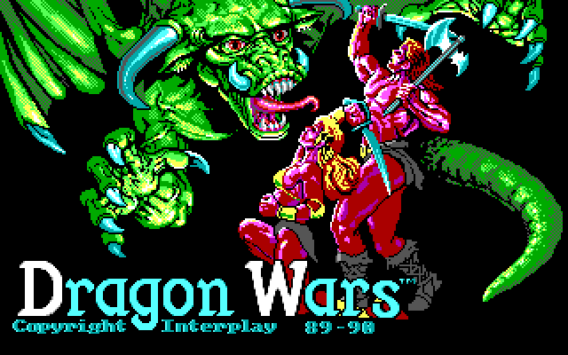
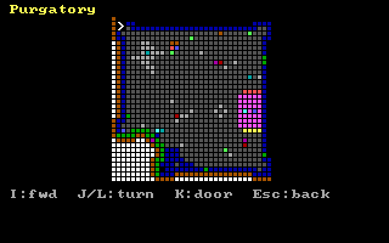
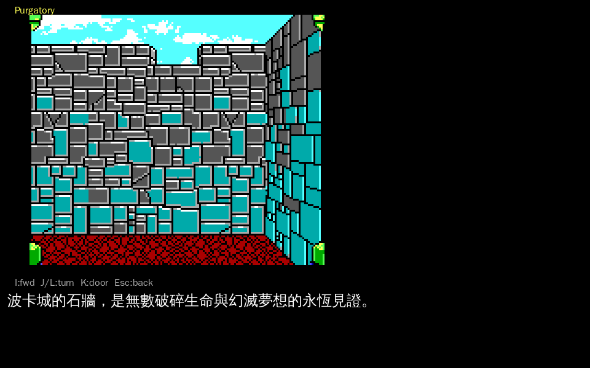
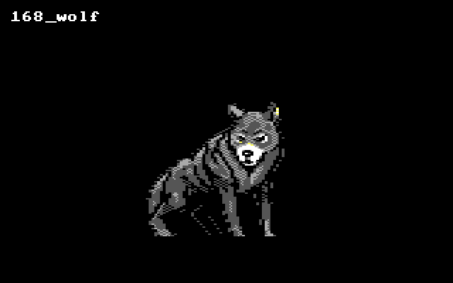
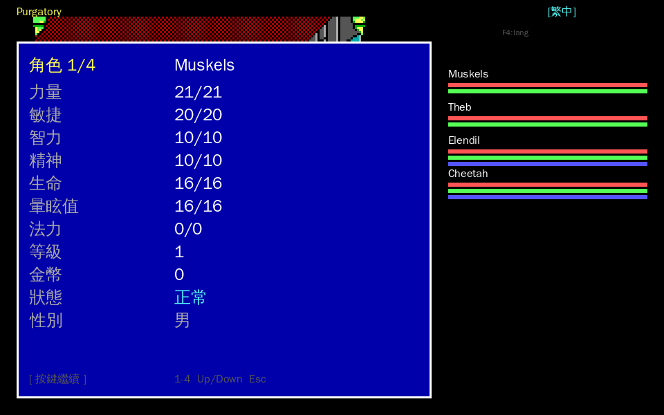
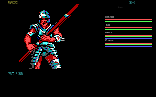
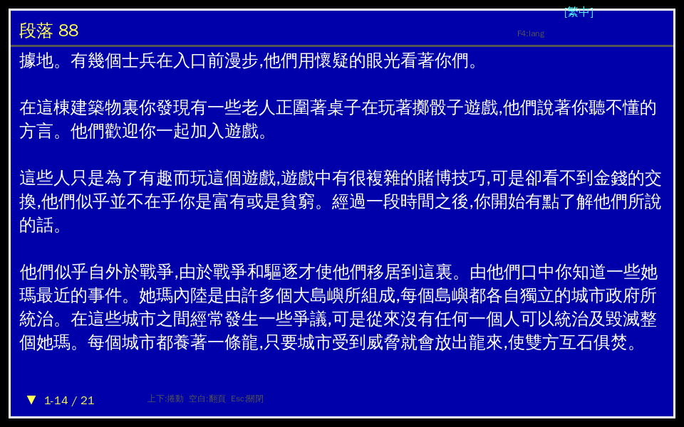

# OpenDW Dragon Wars 中文化專案

OpenDW 是 Interplay 1989/1990 年遊戲 **Dragon Wars** 的開源重製版。
本專案旨在將 OpenDW 中文化（繁體中文），並整合 SDL2 顯示層。

**Repo URL**: https://github.com/wicanr2/opendw_dragon_wars_cht

## 重點文件 / 設計筆記

- 📐 [**為什麼原始火龍之戰要拆 DATA1 / DATA2?**](docs/42_WHY_DATA1_DATA2.md) — 1989 硬體環境下的設計推理(軟碟容量 / 多卷目錄 / 換片 / RAM)。
- 🏗️ [**opendw_remake/**](opendw_remake/README.md) — 以 C++20 + SDL2 重寫的執行環境(VM + 渲染 + 自包含資產),以 opendw 為正確性 oracle。
- 📋 [ADR 0001:Asset Bundle 與 ResourceProvider](docs/adr/0001-asset-bundle-and-resource-provider.md) — resource 脫離 DATA1/DATA2、可編輯/可替換。
- 📖 [docs 索引](docs/README.md) · [術語表 CONTEXT.md](CONTEXT.md) · [opcode 雙語參考](docs/OPCODE_REFERENCE.md)

## 🐉 重製的第一步(Our First Steps in Dragon Wars)

`opendw_remake/`(C++20 + SDL2,以 opendw 為逐位元正確性 oracle、資產自包含)目前能跑出的**真實遊戲畫面**——讓中文玩家重溫經典的第一步:

| 在地化主選單 | 標題畫面 | 真實波卡城地圖 |
|:---:|:---:|:---:|
|  |  |  |
| VM 跑 bundle bytecode → i18n 繁中(B 開始/C 繼續,操作對齊原版說明書) | `decode_fullscreen`(title_adjust 去交錯)**逐位元 == 原版** | 從原版抽出的 **40 關真實地圖**(關卡名 100% 對應《軟體世界》攻略) |

| **第一人稱 + 繁中事件**(進入遊戲) | 怪物 sprite |
|:---:|:---:|
|  |  |
| 第一人稱透視走廊 +**踩到事件格顯示在地化繁中事件文字**;**雙層渲染**:像素層整數放大 + SDL2_ttf 文字層(中文 24px 恆銳利) | 從 asset bundle 載入,對拍 opendw byte-for-byte |

| 角色屬性表 | 遭遇/戰鬥畫面 | 段落捲動檢視器 |
|:---:|:---:|:---:|
|  |  |  |
| `V`/1-4 看完整屬性(力量/敏捷/智力/精神/生命/法力/狀態…),i18n 三語 | 怪物圖 @ (16,8) **對齊原版 `draw_random_encounter_graphic` 佈局**(golden byte-for-byte)+ 隊伍面板 + F戰鬥/R逃跑 | **Read Paragraph** 防拷段落以捲動 overlay 顯示完整繁中譯文,不截斷不切字 |

**目前已落地(均經 opendw 對拍或攻略對照驗證;戰鬥結算除外,見下)**:
- ✅ SDL2 視窗 + DOS 16 色 framebuffer;操作鍵對齊原版說明書(`B`/`C` 選單、`I/J/L/K` 移動、`Esc`/`Q`)。
- ✅ VM(含 op_58 跨資源 call、角色資料 primitive op_5D/5E/5F/60/61、乘除 op_33-36、op_89 選單跳轉)跑 bundle bytecode;**多國語系**架構(`--locale`,日文 ready);**diff_trace 逐指令 == opendw**。
- ✅ **40 關真實地圖**從 DATA1/DATA2 抽出(關卡名與攻略地區 100% 對應);**地圖區域切換**(踩出入口→換 area,`verify_areaswitch`);事件腳本 emit 訊息與攻略「訊息 N」吻合。
- ✅ 標題/場景圖、sprite 渲染 **byte-for-byte == 原版**(`verify_scene_golden.sh`、`verify_viewport` 3/3)。
- ✅ **第一人稱 viewport** FOV→牆面元件→sprite blit→framebuffer 全鏈,**全 40 關像素對拍 opendw PASS**(`verify_fp`/`fov`/`compose`/`sweep`)。
- ✅ **踩到事件格 → 顯示在地化繁中事件文字**;**Read Paragraph 段落捲動檢視器**(完整譯文不截斷);**角色屬性表**;**存檔/讀檔**(`S` 存、選單 `C` 繼續,round-trip byte-for-byte);**遭遇畫面**(怪物圖佈局對拍 oracle golden)。**全自包含,執行期不依賴 DATA1**。
- ⚠️ **戰鬥結算**:opendw 的 C 反編譯**本身未實作**命中/傷害結算(公式在原版未逆出的 bytecode);遭遇畫面 + 怪物資料 + RNG(op_4D)已 **byte-for-byte 對拍 oracle**,但 to-hit/傷害目前是**乾淨室模型(placeholder,非原版真值)**,已於程式碼與 `docs/42` 誠實標示。原版戰鬥 bytecode 已能在 VM 上執行(攻擊迴圈跑滿無 halt),HP-vs-oracle 對拍待 roster pipeline 完整逆向。

> 本機執行:`cd opendw_remake && cmake -S . -B build && cmake --build build --target opendw_remake`,再 `./build/opendw_remake`(選單)、`--map 1 --fp`(進波卡城第一人稱)、`--scene 29`(標題)、`--read-para 88`(段落檢視器)、`--encounter 12`(遭遇畫面)。回歸:`cd build && ctest`(8/8)。

## 專案結構

```
opendw_dragon_wars_cht/
├── docs/                           # 文件
│   ├── PLAN.md                     # 中文化規劃
│   ├── ANALYSIS.md                 # 反組譯還原分析
│   ├── TRANSLATION.md              # 翻譯對照表（100+ 條目）
│   ├── ALL_TEXT_FROM_DATA1.txt     # DATA1 提取的所有文字（3926 條）
│   ├── SDL2_IMPLEMENTATION.md      # SDL2 實作計畫
│   ├── SKILL.md                    # Skill 文件（完整經驗記錄）
│   ├── Dragon-Wars_Manual_DOS_EN.pdf # 英文手冊（48 頁掃描）
│   ├── dragon.asm                  # 原始 DOS 反組譯（參考）
│   └── README.md                   # 本說明
├── src/                            # OpenDW 原始碼
│   ├── fe/                         # 前端（SDL2 輸出層）
│   │   ├── main.c                  # 程式進入點
│   │   ├── vga_sdl.c               # SDL2 顯示驅動
│   │   ├── vga_dos.c               # DOS VGA 驅動
│   │   └── vga_null.c              # 空驅動
│   ├── lib/                        # 核心引擎
│   │   ├── engine.c                # 虛擬 CPU + 115 個 opcode
│   │   ├── ui.c                    # UI 繪製
│   │   ├── resource.c              # 資源載入
│   │   ├── tables.c                # 字型表
│   │   ├── state.c                 # 遊戲狀態
│   │   ├── player.c                # 角色資料
│   │   └── ...
│   ├── tools/                      # 輔助工具
│   └── tests/                      # 單元測試
├── CMakeLists.txt                  # CMake 建置
└── Makefile                        # Make 建置
```

## 原始 OpenDW 資訊

Original game engine by [Rebecca Ann Heineman](https://www.burgerbecky.com/).

This game can be purchased at [GOG](https://www.gog.com/game/dragon_wars).

## 遊戲資料檔案

| 檔案 | 大小 | 用途 |
|------|------|------|
| `DRAGON.COM` | 55 KB | 主程式（DOS COM 格式） |
| `DATA1` | 296 KB | 遊戲資源（script、圖片、字型）- 24 個 section |
| `DATA2` | 352 KB | 地圖/戰鬥/音效資源 |
| `DWTRAN.COM` | 4 KB | 角色轉移工具（Bard's Tale I/II） |

### DATA1 Section 結構

| Section | 大小 | 內容 |
|---------|------|------|
| 0x00 | 1,148 B | 初始遊戲腳本（主選單、對話） |
| 0x01 | 208 B | UI 文字 |
| 0x02 | 336 B | 遊戲文字 |
| 0x03 | 5,390 B | 大量對話和故事文字 |
| 0x04-0x06 | 3.9 KB | 遊戲文字 |
| 0x07 | 5,632 B | 角色資料（character data） |
| 0x08-0x0F | 8.9 KB | 對話、物品、技能名稱 |
| 0x10 | 8,192 B | 字型資料 |
| 0x11-0x16 | 5.3 KB | 更多遊戲文字 |

## 快速開始

### 建置

```bash
mkdir build && cd build
cmake ..
make
```

### 執行

需要原始遊戲檔案（dragon.com, data1, data2）：

```bash
./src/fe/sdldragon
```

## 中文化狀態

- [x] 反組譯還原（52 個 unnamed 函式）
- [x] DATA1 文字提取（3926 條）
- [x] 翻譯對照表（100+ 條目）
- [ ] 640×480 + 24×24 CJK 顯示
- [ ] 外部字型載入
- [ ] Big5 編碼支援
- [ ] UI 佈局調整

## 快速開始

### 建置

```bash
mkdir build && cd build
cmake ..
make
```

### 執行

需要原始遊戲檔案（dragon.com, data1, data2）：

```bash
./src/fe/sdldragon
```

## 中文化狀態

- [ ] 640×480 + 24×24 CJK 顯示
- [ ] 外部字型載入
- [ ] Big5 編碼支援
- [ ] 字串萃取工具
- [ ] UI 佈局調整

## SDL2 實作計畫

未實作功能的 SDL2 取代方案，請參考 [docs/05_SDL2_IMPLEMENTATION.md](docs/05_SDL2_IMPLEMENTATION.md)。

### 未實作功能的 SDL2 取代

| 原始功能 | 狀態 | SDL2 取代方案 |
|----------|------|---------------|
| DOS 設定選單 (`0x627-0963`) | 未實作 | `config.h/c` - 現代設定系統 |
| PC Speaker 音樂 (`0x5C3B-0x5D1D`) | 未實作 | `audio.h/c` - SDL2 Audio |
| 圖形模式選擇 (CGA/EGA/Tandy) | 不需要 | SDL2 自動處理 |
| ~85 個未實作 opcode | 部分完成 | 分類後實作/標記為 unused |

## 反組譯還原進度

### ✅ 已成功還原的函式（50+）

| 原名稱 | 新名稱 | 功能 | Description |
|--------|--------|------|-------------|
| `sub_CF8` | `decode_viewport_data` | 視埠資料解碼 | Decode viewport data from dragon.com |
| `sub_37C8` | `init_viewport_for_map` | 地圖視埠初始化 | Initialize viewport for map display |
| `sub_28B0` | `wait_for_event` | 等待鍵盤/滑鼠事件 | Wait for keyboard/mouse event |
| `sub_2D0B` | `get_key_from_buffer` | 從緩衝區取得按鍵 | Get key from input buffer |
| `sub_54D8` | `get_map_tile_data` | 取得地圖圖塊資料 | Get map tile data at position |
| `sub_536B` | `move_player_on_map` | 移動玩家 | Move player on map |
| `sub_176A` | `handle_minimap_input` | 處理小地圖輸入 | Handle minimap navigation input |
| `sub_19C7` | `plot_minimap_resource` | 繪製小地圖資源 | Plot resource on minimap |
| `sub_1A10` | `draw_minimap_from_data6820` | 從 DATA6820 繪製小地圖 | Draw minimap from DATA6820 |
| `sub_1A72` | `draw_player_status_panel` | 繪製玩家狀態面板 | Draw player status panel |
| `sub_1E49` | `read_string_input` | 讀取字串輸入 | Read string input from user |
| `sub_1DCA` | `convert_number_to_string` | 數字轉字串 | Convert number to string |
| `sub_1DBB` | `print_number` | 印出數字 | Print number to screen |
| `sub_1DC8` | `print_number_9_digits` | 印出 9 位數字 | Print 9-digit number |
| `sub_194A` | `calc_minimap_position` | 計算小地圖位置 | Calculate minimap position |
| `sub_1A13` | `draw_minimap_segment` | 繪製小地圖段 | Draw minimap segment |
| `sub_1861` | `draw_minimap_row` | 繪製小地圖行 | Draw minimap row |
| `sub_1967` | `set_viewport_size` | 設定視埠大小 | Set viewport size |
| `sub_17F7` | `draw_minimap` | 繪製小地圖 | Draw minimap |
| `sub_1750` | `process_minimap_commands` | 處理小地圖指令 | Process minimap commands |
| `sub_280E` | `flush_ui_header` | 刷新 UI 標題 | Flush UI header to screen |
| `sub_11A0` | `multiply_16bit` | 16-bit 乘法 | 16-bit multiplication |
| `sub_11CE` | `divide_16bit` | 16-bit 除法 | 16-bit division |
| `sub_2CF5` | `update_random_seed` | 更新隨機種子 | Update random seed |
| `sub_4A79` | `get_bit_mask_from_table` | 取得位元遮罩 | Get bit mask from table |
| `sub_4C07` | `check_and_update_direction` | 檢查方向圖示 | Check and update direction icon |
| `sub_46A1` | `run_level_script` | 執行關卡腳本 | Run level script |
| `sub_4FD9` | `init_map_events` | 初始化地圖事件 | Initialize map events |
| `sub_5764` | `load_level_resources` | 載入關卡資源 | Load level resources |
| `sub_5868` | `cache_level_components` | 快取關卡元件 | Cache level components |
| `sub_5523` | `check_map_boundary_x` | 檢查地圖 X 邊界 | Check map X boundary |
| `sub_5559` | `check_map_boundary_y` | 檢查地圖 Y 邊界 | Check map Y boundary |
| `sub_504B` | `set_map_event_flag` | 設定地圖事件旗標 | Set map event flag |
| `sub_3F23` | `compute_division_vars` | 計算除法變數 | Compute division variables |
| `sub_3F2F` | `save_gamestate_vars` | 儲存遊戲狀態變數 | Save game state variables |
| `sub_3F7E` | `divide_and_save_results` | 除法並儲存結果 | Divide and save results |
| `sub_50B2` | `play_sound_effect_B2` | 播放音效 | Play sound effect B2 |
| `sub_5088` | `play_sound_effect_88` | 播放音效 | Play sound effect 88 |
| `sub_5080` | `play_sound_door_open` | 播放開門音效 | Play door open sound |
| `sub_5090` | `play_sound_wall_bump` | 播放撞牆音效 | Play wall bump sound |
| `sub_5096` | `check_and_play_sound` | 檢查並播放音效 | Check and play sound |
| `sub_5076` | `dispatch_sound_effect` | 分派音效 | Dispatch sound effect |
| `sub_2C00` | `wait_for_escape_key` | 等待 ESC 鍵 | Wait for escape key |
| `sub_1C70` | `extract_and_draw_string` | 提取字串並繪製 | Extract string and draw |
| `sub_1EBF` | `draw_input_box_with_flag` | 繪製輸入框 | Draw input box with flag |
| `sub_1EBB` | `draw_input_box_clear` | 清除輸入框 | Clear input box |
| `sub_1EBE` | `draw_input_box_carry` | 進位輸入框 | Draw input box with carry |
| `sub_587E` | `release_flagged_resources` | 釋放標記的資源 | Release flagged resources |
| `sub_2ADC` | `clear_event_flag` | 清除事件旗標 | Clear event flag |
| `sub_2A4C` | `handle_key_event` | 處理按鍵事件 | Handle key event |
| `sub_2BD9` | `check_timer_events` | 檢查計時器事件 | Check timer events |
| `sub_4C40` | `trigger_random_encounter` | 觸發隨機遭遇 | Trigger random encounter |
| `sub_4D82` | `release_flagged_resource` | 釋放標記資源 | Release flagged resource |
| `sub_4D37` | `init_monster_animation` | 初始化怪物動畫 | Initialize monster animation |
| `sub_4D97` | `update_monster_animation` | 更新怪物動畫 | Update monster animation |
| `sub_4D5C` | `check_random_encounter_timer` | 檢查隨機遭遇計時 | Check random encounter timer |
| `sub_27CC` | `draw_right_pillar` | 繪製右側支柱 | Draw right pillar UI |
| `sub_35A0` | `draw_ui_piece_by_index` | 繪製 UI 元件 | Draw UI piece by index |
| `sub_4EF4` | `draw_minimap_cell` | 繪製小地圖單格 | Draw minimap cell |
| `sub_4CB2` | `draw_random_encounter_graphic` | 繪製隨機遭遇圖形 | Draw random encounter graphic |
| `sub_4C95` | `show_random_encounter` | 顯示隨機遭遇 | Show random encounter |
| `sub_4DE3` | `draw_graphic_to_viewport` | 繪製圖形到視埠 | Draw graphic to viewport |
| `sub_4D26` | `clear_viewport_save` | 清除視埠儲存 | Clear viewport save |
| `sub_2AEE` | `check_mouse_in_bounds` | 檢查滑鼠邊界 | Check mouse in bounds |
| `sub_2061` | `draw_mouse_cursor` | 繪製滑鼠游標 | Draw mouse cursor |
| `sub_CE7` | `draw_sprite_to_viewport` | 繪製 sprite 到視埠 | Draw sprite to viewport |
| `sub_DEB` | `draw_viewport_word_mode` | 視埠繪製（word 模式） | Draw viewport word mode |
| `sub_EC5` | `draw_viewport_neg_x_alt` | 視埠繪製（負 X 變體） | Draw viewport neg X alt |
| `sub_E6D` | `draw_viewport_neg_x` | 視埠繪製（負 X） | Draw viewport neg X |
| `sub_F3D` | `draw_viewport_flip_y` | 視埠繪製（Y 翻轉） | Draw viewport flip Y |
### ⚠️ 無法判斷 / 未實作的函式

| 位址 | 狀態 | 說明 |
|------|------|------|
| `0x627-0x963` | 未實作 | DOS 設定選單（CGA/EGA/VGA/Tandy 設定） |
| `0x5C3B-0x5D1D` | 未實作 | PC speaker 音樂播放（PIT timer） |
| `op_02` | 未實作 | 未知功能 |
| `op_1B` | 未實作 | 未知功能 |
| `op_1E` | 未實作 | 未知功能 |
| `op_29` | 未實作 | 未知功能 |
| `op_2C` | 未實作 | 未知功能 |
| `op_37` | 未實作 | 未知功能 |
| `op_46` | 未實作 | 未知功能 |
| `op_64-6B` | 未實作 | 未知功能 |
| `op_6E-70` | 未實作 | 未知功能 |
| `op_79` | 未實作 | 未知功能 |
| `op_7E` | 未實作 | 未知功能 |
| `op_8E-8F` | 未實作 | 未知功能 |
| `op_9C` | 未實作 | 未知功能 |
| `op_9F` | 未實作 | 未知功能 |
| `op_A0-FF` (大部分) | 未實作 | 未知功能（可能是未使用的 opcode） |

### 📊 統計

| 項目 | 數量 |
|------|------|
| 已還原的 `sub_XXX` 函式 | 52 |
| 已命名的 `op_XX` opcode | 143 |
| 未實作的 opcode | ~85 |
| 未實作的系統功能 | 2（音樂、設定選單） |

## 授權

OpenDW 原始碼採用 BSD 授權。
Dragon Wars 是 Interplay 的商標，原始遊戲檔案僅供個人使用。

## 貢獻者

- Chun-Yu Wang
