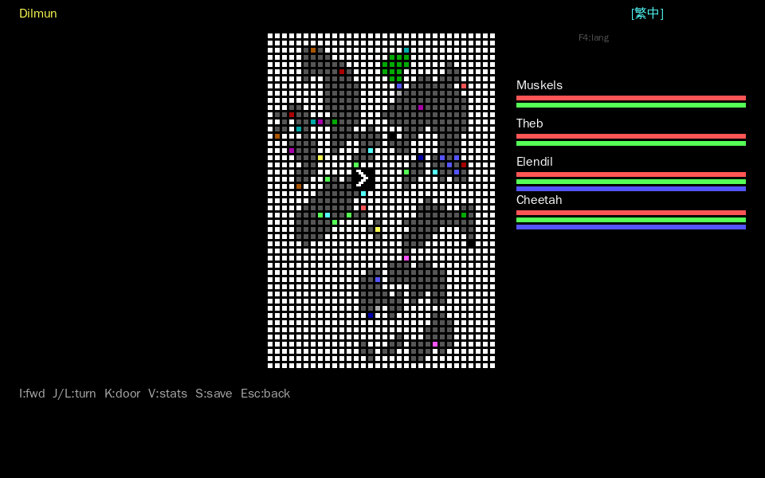

# OpenDW Dragon Wars 中文化專案

[](https://github.com/wicanr2/opendw_dragon_wars_cht/actions/workflows/ci.yml)

OpenDW 是 Interplay 1989/1990 年遊戲 **Dragon Wars** 的開源重製版。
本專案旨在將 OpenDW 中文化（繁體中文），並整合 SDL2 顯示層。

**Repo URL**: https://github.com/wicanr2/opendw_dragon_wars_cht

## 重點文件 / 設計筆記

- 📐 [**為什麼原始火龍之戰要拆 DATA1 / DATA2?**](docs/42_WHY_DATA1_DATA2.md) — 1989 硬體環境下的設計推理(軟碟容量 / 多卷目錄 / 換片 / RAM)。
- 🏗️ [**opendw_remake/**](opendw_remake/README.md) — 以 C++20 + SDL2 重寫的執行環境(VM + 渲染 + 自包含資產),以 opendw 為正確性 oracle。
- 📋 [ADR 0001:Asset Bundle 與 ResourceProvider](docs/adr/0001-asset-bundle-and-resource-provider.md) — resource 脫離 DATA1/DATA2、可編輯/可替換。
- 📖 [docs 索引](docs/README.md) · [術語表 CONTEXT.md](CONTEXT.md) · [opcode 雙語參考](docs/OPCODE_REFERENCE.md)

## 🐉 可從頭玩到結局(A Complete Playthrough in Traditional Chinese)

`opendw_remake/`(C++20 + SDL2,以 opendw 為逐位元正確性 oracle、資產自包含)現在能跑出**完整一輪**:**建立人物 → 探索 38/40 連通世界 → 主線繁中事件 → 終戰 Namtar → 結局 → 全劇終**,全程繁體中文、24×24 銳利 CJK,可選 640×480 視窗。

| 在地化主選單 | 第一人稱 + 繁中事件 | Dilmun 世界圖(進城) |
|:---:|:---:|:---:|
|  |  |  |
| VM 跑 bundle bytecode → i18n 繁中(操作對齊原版說明書) | 透視走廊 + **踩格顯繁中事件**;雙層渲染(像素層整數放大 + SDL2_ttf 24px CJK 恆銳利) | wrap 樞紐世界圖;**走到城鎮格→切入該城 area**(進城對映反組譯 DRAGON.COM 逆出) |

| 建立人物 | 終戰 Namtar | 結局・全劇終 |
|:---:|:---:|:---:|
|  |  |  |
| `B` 建角:命名 + 50 點屬性配點 + 性別 → 合法 fraterrisus 512B record | 回合制戰鬥:**命中/傷害公式 = 原版 bytecode 真值**;受祝福的自由之劍 vs 深淵之獸 | 戰勝 → 結局序列(area27 敘事 + 結局段落 + 全劇終),繁中可捲動 |

**已落地(均經 opendw 對拍 / DOS 實機 / 攻略交叉驗證,誠實標示真值 vs remake 設計)**:
- ✅ **渲染逐位元對拍 opendw**:第一人稱 viewport(全 40 關像素 PASS)、標題/場景圖、sprite、俯視地圖(fog of war)、wrap 樞紐;雙層 CJK;`--win640`(真 640×480 + 固定 24/16px CJK)。
- ✅ **VM ~119 opcode,`diff_trace` 逐指令 == opendw**;反組譯原始 DRAGON.COM 補出 opendw 從未逆向的 op_68/op_79/op_5B 等。
- ✅ **戰鬥公式 = 原版 bytecode 真值**(端到端執行 res3 驗證):命中 `roll ≤ 13+AV−(DV+AC)`(1d16+3 roll-under)、徒手傷害 `骰 + floor(STR/5)`、武器傷害骰、RNG(op_4D);DOS 實機交叉驗證命中率吻合(`docs/42`/`43`)。
- ✅ **連通 38/40 area**:世界圖進城 + 子區 relocate + `1A 02` 直寫機制全逆出(`<10%→38/40`);可玩回合制戰鬥(4 人 vs 怪群、勝利 +80XP)+ 61 條法術(傷害/治療/buff/控制)。
- ✅ **可玩流程**:建角 / 存讀檔(round-trip byte-for-byte) / 角色表 / 背包 / Read Paragraph 捲動檢視器 / 地圖區域切換 / **主線事件繁中 200+ 鍵 + 147 段落 + 結局**;日文 events/怪名(破解 X68000 nibble-swap SJIS)。**全自包含,執行期不依賴 DATA1**。
- ⚠️ **誠實邊界**:Namtar Boss 屬性(原版 op_8A 怪物 id 無乾淨 res31 record)、自由之劍祝福加成、結局序列 = **remake 平衡/組合設計**(原版勝利畫面 script 逆不出);終戰用 remake `combat_loop`(同 bytecode 真值公式),非 res3 全戰鬥閉環(後者卡遊戲層 context,`docs/42`);area 6/33(Phoebus)為隔離分量。全部標於程式碼 / `docs/42`–`56` / `verify_*`,從不謊稱 oracle。

> 本機執行:`cd opendw_remake && cmake -S . -B build && cmake --build build --target opendw_remake`,再 `./build/opendw_remake`(選單,`B` 建角)、`--map 0 --fp`(Dilmun 世界圖)、`--win640`(640×480)、`--read-para 88`(段落)、`--fight-namtar`(終戰→結局)。回歸:`cd build && ctest`(**27/27**)+ GitHub Actions CI。

## 專案結構

```
opendw_dragon_wars_cht/
├── opendw_remake/         # ★ 主產物:C++20 + SDL2 乾淨重寫的 runtime(可玩)
│   ├── src/               #   resource / vm / render / game / i18n
│   ├── tools/verify/      #   對拍/驗證工具(ctest 22 項)
│   ├── tools/extract/     #   DATA1/DATA2 → 自包含 bundle 萃取
│   ├── assets/bundle/     #   自包含資產(maps/sprites/scenes/scripts/monsters/items/…)
│   ├── assets/i18n/       #   zh-TW / en / ja 在地化 TSV
│   └── docs/              #   remake 專屬截圖/設計筆記
├── src/                   # opendw(Devin Smith C 反組譯)— 唯讀,當逐位元正確性 oracle
├── docs/                  # 設計筆記 + 逆向報告(00 索引;42-58 戰鬥/連通/評估/審查)
└── CONTEXT.md             # 術語表(ubiquitous language)
```

> opendw_remake 不依賴原始磁碟檔(資產已萃取成自包含 bundle);`src/`(opendw)僅作為差異測試的對照 oracle。

## 原始 OpenDW 資訊

Original game engine by [Rebecca Ann Heineman](https://www.burgerbecky.com/).

This game can be purchased at [GOG](https://www.gog.com/game/dragon_wars).

## 遊戲資料檔案

| 檔案 | 大小 | 用途 |
|------|------|------|
| `DRAGON.COM` | 55 KB | 主程式（DOS COM 格式） |
| `DATA1` | 296 KB | 遊戲資源（script、圖片、字型）- 24 個 section |
| `DATA2` | 352 KB | 地圖/戰鬥/音效資源 |
| `DWTRAN.COM` | 4 KB | 角色轉移工具（Bard's Tale I/II） |

### DATA1 Section 結構

| Section | 大小 | 內容 |
|---------|------|------|
| 0x00 | 1,148 B | 初始遊戲腳本（主選單、對話） |
| 0x01 | 208 B | UI 文字 |
| 0x02 | 336 B | 遊戲文字 |
| 0x03 | 5,390 B | 大量對話和故事文字 |
| 0x04-0x06 | 3.9 KB | 遊戲文字 |
| 0x07 | 5,632 B | 角色資料（character data） |
| 0x08-0x0F | 8.9 KB | 對話、物品、技能名稱 |
| 0x10 | 8,192 B | 字型資料 |
| 0x11-0x16 | 5.3 KB | 更多遊戲文字 |

## 建置與執行(opendw_remake)

```bash
cd opendw_remake
cmake -S . -B build && cmake --build build --target opendw_remake
./build/opendw_remake                 # 選單(B 建立人物 / C 繼續)
./build/opendw_remake --map 0 --fp    # Dilmun 世界圖第一人稱
./build/opendw_remake --win640        # 640×480 視窗
./build/opendw_remake --read-para 88  # 段落檢視器
./build/opendw_remake --fight-namtar  # 終戰 → 結局
cd build && ctest                     # 回歸(30 項;GitHub Actions CI 亦跑)
```

> 自包含,執行期不需原始 DATA1/DATA2(資產已萃取成 `assets/bundle/`)。需 `libsdl2-dev`、`libsdl2-ttf-dev`、`fonts-wqy-zenhei`。建置以 docker `dwsdl` 為準(`tools_build/`)。

### 打包與發佈

產生可攜發佈包(引擎 binary + 啟動器 + 自包含 `assets/`,**不含原始遊戲檔**):

```bash
cd opendw_remake
bash tools/package/build_package.sh        # → dist/opendw-remake-<版本>-Linux-x86_64.tar.gz
# 內含 build + cpack 產包 + 解開 + headless 執行驗證(全綠才產出)
```

解開後直接執行啟動器(會自動切到資產目錄、找系統 CJK 字型):

```bash
tar xzf opendw-remake-*.tar.gz
./opendw-remake-*/bin/opendw-remake.sh             # 選單(B 建角)
./opendw-remake-*/bin/opendw-remake.sh --win640    # 640×480
```

字型:不打包(授權考量),啟動時自動搜尋系統中/日字型(wqy-zenhei / Noto CJK /
PingFang / 微軟正黑等);找不到可用 `DWR_FONT=/path/to/cjk.ttf` 指定。

**取得與遊玩**:玩家自備合法原版《火龍之戰》;本專案資產已自包含,執行期不需原始
`DRAGON.COM` / `DATA1` / `DATA2`。下載對應平台發佈包 → 解開 → 跑 `bin/opendw-remake.sh`
即可,預設繁體中文(遊戲中 `F4` 可切 繁中 / EN / 日)。

### 跨平台

GitHub Actions CI(`.github/workflows/ci.yml`)涵蓋三平台:

| 平台 | 取得 SDL2 | 狀態 |
|---|---|---|
| Linux (x86_64) | apt `libsdl2-dev` `libsdl2-ttf-dev` | ✅ 已在 docker `dwsdl` 實機驗證:build + ctest 30/30 + 產包 + headless 執行 |
| Windows (x64) | vcpkg `sdl2` `sdl2-ttf` (MSVC) | ⏳ CI 設定已備,**未在本環境實機驗證**;待 CI 實跑產出 `.exe` |
| macOS | Homebrew `sdl2` `sdl2_ttf` | ⏳ CI 設定已備,**未在本環境實機驗證**;待 CI 實跑產出 binary |

> Windows/macOS 產物只提供 CI 設定 + 文件;本地為 Linux 環境,無法實機產出/驗證 Win/Mac
> binary,故誠實標示「待 CI 跑」。Linux tarball 流程則已在 docker 內完整跑通。

## 目前狀態(2026-06)

可從**建角 → 探索 38/40 連通世界 → 主線繁中 → 終戰 Namtar → 結局**走完一輪。詳見:

- [docs/57 PM 產品 review](docs/57_PM_REVIEW.md) — vs 1990 原版還原度量化(技術保真 ~75%、玩家內容 ~35-40%)。
- [docs/49 缺口稽核](docs/49_GAP_AUDIT.md) · [docs/48 可通關 roadmap](docs/48_COMPLETABILITY_ROADMAP.md)
- [docs/42 戰鬥 bytecode 逆向](opendw_remake/docs/42_COMBAT_BYTECODE.md)(命中/傷害公式 = 原版 bytecode 真值) · [docs/44 資料格式](docs/44_DATA_FORMATS_AND_MECHANICS.md)

> 誠實標示貫穿全專案:**bytecode 真值 / remake 設計 / 受阻或暫定** 三級分明,從不謊稱 oracle(見 `combat.hpp` 檔頭與各 `docs/42`–`58`)。

## 反組譯還原進度(歷史紀錄,opendw 反組譯期)

### ✅ 已成功還原的函式（50+）

| 原名稱 | 新名稱 | 功能 | Description |
|--------|--------|------|-------------|
| `sub_CF8` | `decode_viewport_data` | 視埠資料解碼 | Decode viewport data from dragon.com |
| `sub_37C8` | `init_viewport_for_map` | 地圖視埠初始化 | Initialize viewport for map display |
| `sub_28B0` | `wait_for_event` | 等待鍵盤/滑鼠事件 | Wait for keyboard/mouse event |
| `sub_2D0B` | `get_key_from_buffer` | 從緩衝區取得按鍵 | Get key from input buffer |
| `sub_54D8` | `get_map_tile_data` | 取得地圖圖塊資料 | Get map tile data at position |
| `sub_536B` | `move_player_on_map` | 移動玩家 | Move player on map |
| `sub_176A` | `handle_minimap_input` | 處理小地圖輸入 | Handle minimap navigation input |
| `sub_19C7` | `plot_minimap_resource` | 繪製小地圖資源 | Plot resource on minimap |
| `sub_1A10` | `draw_minimap_from_data6820` | 從 DATA6820 繪製小地圖 | Draw minimap from DATA6820 |
| `sub_1A72` | `draw_player_status_panel` | 繪製玩家狀態面板 | Draw player status panel |
| `sub_1E49` | `read_string_input` | 讀取字串輸入 | Read string input from user |
| `sub_1DCA` | `convert_number_to_string` | 數字轉字串 | Convert number to string |
| `sub_1DBB` | `print_number` | 印出數字 | Print number to screen |
| `sub_1DC8` | `print_number_9_digits` | 印出 9 位數字 | Print 9-digit number |
| `sub_194A` | `calc_minimap_position` | 計算小地圖位置 | Calculate minimap position |
| `sub_1A13` | `draw_minimap_segment` | 繪製小地圖段 | Draw minimap segment |
| `sub_1861` | `draw_minimap_row` | 繪製小地圖行 | Draw minimap row |
| `sub_1967` | `set_viewport_size` | 設定視埠大小 | Set viewport size |
| `sub_17F7` | `draw_minimap` | 繪製小地圖 | Draw minimap |
| `sub_1750` | `process_minimap_commands` | 處理小地圖指令 | Process minimap commands |
| `sub_280E` | `flush_ui_header` | 刷新 UI 標題 | Flush UI header to screen |
| `sub_11A0` | `multiply_16bit` | 16-bit 乘法 | 16-bit multiplication |
| `sub_11CE` | `divide_16bit` | 16-bit 除法 | 16-bit division |
| `sub_2CF5` | `update_random_seed` | 更新隨機種子 | Update random seed |
| `sub_4A79` | `get_bit_mask_from_table` | 取得位元遮罩 | Get bit mask from table |
| `sub_4C07` | `check_and_update_direction` | 檢查方向圖示 | Check and update direction icon |
| `sub_46A1` | `run_level_script` | 執行關卡腳本 | Run level script |
| `sub_4FD9` | `init_map_events` | 初始化地圖事件 | Initialize map events |
| `sub_5764` | `load_level_resources` | 載入關卡資源 | Load level resources |
| `sub_5868` | `cache_level_components` | 快取關卡元件 | Cache level components |
| `sub_5523` | `check_map_boundary_x` | 檢查地圖 X 邊界 | Check map X boundary |
| `sub_5559` | `check_map_boundary_y` | 檢查地圖 Y 邊界 | Check map Y boundary |
| `sub_504B` | `set_map_event_flag` | 設定地圖事件旗標 | Set map event flag |
| `sub_3F23` | `compute_division_vars` | 計算除法變數 | Compute division variables |
| `sub_3F2F` | `save_gamestate_vars` | 儲存遊戲狀態變數 | Save game state variables |
| `sub_3F7E` | `divide_and_save_results` | 除法並儲存結果 | Divide and save results |
| `sub_50B2` | `play_sound_effect_B2` | 播放音效 | Play sound effect B2 |
| `sub_5088` | `play_sound_effect_88` | 播放音效 | Play sound effect 88 |
| `sub_5080` | `play_sound_door_open` | 播放開門音效 | Play door open sound |
| `sub_5090` | `play_sound_wall_bump` | 播放撞牆音效 | Play wall bump sound |
| `sub_5096` | `check_and_play_sound` | 檢查並播放音效 | Check and play sound |
| `sub_5076` | `dispatch_sound_effect` | 分派音效 | Dispatch sound effect |
| `sub_2C00` | `wait_for_escape_key` | 等待 ESC 鍵 | Wait for escape key |
| `sub_1C70` | `extract_and_draw_string` | 提取字串並繪製 | Extract string and draw |
| `sub_1EBF` | `draw_input_box_with_flag` | 繪製輸入框 | Draw input box with flag |
| `sub_1EBB` | `draw_input_box_clear` | 清除輸入框 | Clear input box |
| `sub_1EBE` | `draw_input_box_carry` | 進位輸入框 | Draw input box with carry |
| `sub_587E` | `release_flagged_resources` | 釋放標記的資源 | Release flagged resources |
| `sub_2ADC` | `clear_event_flag` | 清除事件旗標 | Clear event flag |
| `sub_2A4C` | `handle_key_event` | 處理按鍵事件 | Handle key event |
| `sub_2BD9` | `check_timer_events` | 檢查計時器事件 | Check timer events |
| `sub_4C40` | `trigger_random_encounter` | 觸發隨機遭遇 | Trigger random encounter |
| `sub_4D82` | `release_flagged_resource` | 釋放標記資源 | Release flagged resource |
| `sub_4D37` | `init_monster_animation` | 初始化怪物動畫 | Initialize monster animation |
| `sub_4D97` | `update_monster_animation` | 更新怪物動畫 | Update monster animation |
| `sub_4D5C` | `check_random_encounter_timer` | 檢查隨機遭遇計時 | Check random encounter timer |
| `sub_27CC` | `draw_right_pillar` | 繪製右側支柱 | Draw right pillar UI |
| `sub_35A0` | `draw_ui_piece_by_index` | 繪製 UI 元件 | Draw UI piece by index |
| `sub_4EF4` | `draw_minimap_cell` | 繪製小地圖單格 | Draw minimap cell |
| `sub_4CB2` | `draw_random_encounter_graphic` | 繪製隨機遭遇圖形 | Draw random encounter graphic |
| `sub_4C95` | `show_random_encounter` | 顯示隨機遭遇 | Show random encounter |
| `sub_4DE3` | `draw_graphic_to_viewport` | 繪製圖形到視埠 | Draw graphic to viewport |
| `sub_4D26` | `clear_viewport_save` | 清除視埠儲存 | Clear viewport save |
| `sub_2AEE` | `check_mouse_in_bounds` | 檢查滑鼠邊界 | Check mouse in bounds |
| `sub_2061` | `draw_mouse_cursor` | 繪製滑鼠游標 | Draw mouse cursor |
| `sub_CE7` | `draw_sprite_to_viewport` | 繪製 sprite 到視埠 | Draw sprite to viewport |
| `sub_DEB` | `draw_viewport_word_mode` | 視埠繪製（word 模式） | Draw viewport word mode |
| `sub_EC5` | `draw_viewport_neg_x_alt` | 視埠繪製（負 X 變體） | Draw viewport neg X alt |
| `sub_E6D` | `draw_viewport_neg_x` | 視埠繪製（負 X） | Draw viewport neg X |
| `sub_F3D` | `draw_viewport_flip_y` | 視埠繪製（Y 翻轉） | Draw viewport flip Y |
### ⚠️ 無法判斷 / 未實作的函式

> 下表為 opendw(C 反組譯)階段的歷史快照。**狀態欄已於 2026-06-16 對 `opendw_remake/src/vm/interpreter.cpp` 的 `kImpl` 重新核對**:後續 PR 已從原始 DRAGON.COM 反組譯補出當年 opendw 標 NULL / 未知的數個 opcode(✅ 標記者)。

| 位址 | 狀態 | 說明 |
|------|------|------|
| `0x627-0x963` | 未實作 | DOS 設定選單（CGA/EGA/VGA/Tandy 設定） |
| `0x5C3B-0x5D1D` | 未實作 | PC speaker 音樂播放（PIT timer）；remake 無音訊子系統，op_90 忠實 no-op |
| `op_02` | 未實作 | 未知功能 |
| `op_1B` | 未實作 | 未知功能 |
| `op_1E` | 未實作 | 未知功能 |
| `op_29` | 未實作 | 未知功能 |
| `op_2C` | 未實作 | 未知功能 |
| `op_37` | 未實作 | 未知功能 |
| `op_46` | ✅ 已實作 | `op46_js`:sign flag 條件跳轉(remake 已補) |
| `op_64/65/67/6A/6B` | 未實作 | 未知功能 |
| `op_66/68/69` | ✅ 已實作 | `op66_test_gs` / `op68_get_char_ext` / `op69_set_char_ext`(角色資料延伸存取,關聯武器傷害骰;從 DRAGON.COM 反組譯補出) |
| `op_6E-70` | 未實作 | 未知功能 |
| `op_79` / `op_7A` | ✅ 已實作 | `op79_draw_and_emit_data` / `op7A_emit_data_string`(@0x47FA 反組譯,對稱 op_77/78;PR #119 補出,opendw 原標 NULL) |
| `op_7E` | 未實作 | 未知功能 |
| `op_8E-8F` | 未實作 | 未知功能 |
| `op_9C` | 未實作 | 未知功能 |
| `op_9F` | 未實作 | 未知功能 |
| `op_A0-FF` (大部分) | 未實作 | 未知功能（可能是未使用的 opcode） |

### 📊 統計(opendw 反組譯期快照)

| 項目 | 數量 |
|------|------|
| 已還原的 `sub_XXX` 函式 | 52 |
| 已命名的 `op_XX` opcode | 143 |

> 上表為 opendw(C 反組譯)階段的歷史數字。**opendw_remake 目前實作 ~119/256 opcode**(`interpreter.cpp` kImpl;含反組譯原始 DRAGON.COM 補出 opendw 從未逆向的 op_68/79/5B 等),`diff_trace` 逐指令 == opendw。完整可玩鏈與保真度見上方「目前狀態」+ docs/57。

## 授權

OpenDW 原始碼採用 BSD 授權。
Dragon Wars 是 Interplay 的商標，原始遊戲檔案僅供個人使用。

## 貢獻者

- Chun-Yu Wang
