# 火龍之戰 Dragon Wars — 繁體中文化 + C++20/SDL2 乾淨重製

> *Dragon Wars*（Interplay, 1989/90）— 一套**從建角玩到結局**的繁體中文化重製
> C++20 + SDL2 乾淨重寫 ✦ 以 opendw（C 反組譯）為逐位元正確性 oracle ✦ 24px 銳利 CJK ✦ 繁中／英文／日文三語

[](https://github.com/wicanr2/opendw_dragon_wars_cht/actions/workflows/ci.yml)


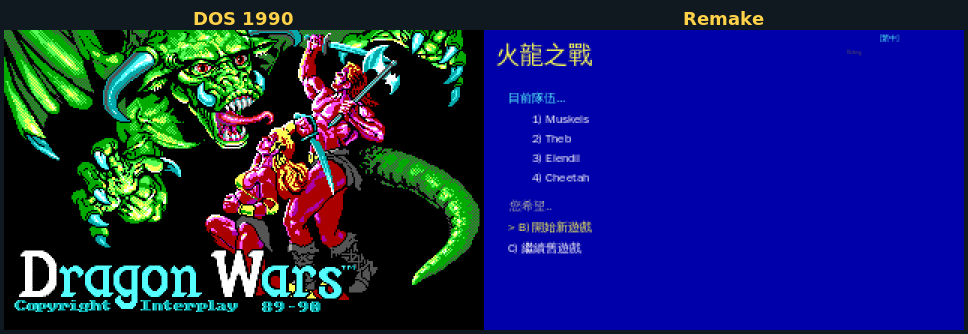

*左：DOS 原版（Interplay 1989/90，DOSBox 擷取）／右：本專案 remake — 並排同一段遊玩。*

---

## 目錄

1. [這是什麼](#what)
2. [快速開始](#quick-start)
3. [實機畫面](#screenshots)
4. [多版本美術主題（F8 切換）](#themes)
5. [世界地圖與結局](#world-ending)
6. [亮點](#highlights)
7. [DOS 原版 vs Remake — 視覺保真](#fidelity)
8. [操作](#controls)
9. [方法論：反組譯當 oracle，乾淨室重寫](#method)
10. [誠實邊界：真值 vs 受阻](#honesty)
11. [專案結構](#layout)
12. [授權與致謝](#credits)

---

<a name="what"></a>
## 🐉 這是什麼

### 一段藏在改名背後的血緣

1989 年，Interplay 推出《火龍之戰》（*Dragon Wars*）——一款以「被剝奪所有裝備、赤身丟進罪惡之城地牢」開場的第一人稱迷宮 CRPG。但它一開始並不叫這個名字。

直到發行前一個月，這款遊戲都還叫**《吟遊詩人傳說 IV》（Bard's Tale IV）**。問題出在商標：Interplay 握有引擎程式碼與劇本，但「Bard's Tale」這塊招牌的商標權屬於發行商美商藝電（EA）。為了不付授權費，團隊在最後關頭把遊戲改名、重寫故事硬塞進一條龍（成品裡龍的戲份其實很少），改由 Activision（當時品牌 Mediagenic）發行。Interplay 的廣告仍直接喊話「Bard's Tale Fans Rejoice!」，並主打可從《吟遊詩人傳說》三部曲匯入角色——血緣寫在臺面上。

把這兩條線縫在一起的人是 **Rebecca "Burger Becky" Heineman**：她從初代《吟遊詩人傳說》就在寫資料壓縮常式與開發工具，到第三作《Thief of Fate》與《火龍之戰》更直接擔任主程式。所以《火龍之戰》不是另起爐灶的重寫，而是同一條技術脈絡在 Heineman 手下走到的成熟末端——它融合了《吟遊詩人傳說》的第一人稱地城骨架，與《廢土》（Wasteland, 1988）的開放敘事與「段落書」（paragraph book）防拷劇情。

這條血緣與本專案直接相關：本 remake 的反組譯基準 [opendw](https://github.com/dswban/opendw) 由 Devin Smith 製作，對應的正是 **Heineman 1989 年《火龍之戰》原版 16-bit x86 引擎**。逐指令研究這套引擎，等於在研究 Bard's Tale 技術脈絡的成熟形態。

> #### 🐉 那為什麼它叫《火龍之戰》，而不是《吟遊詩人傳說 IV》？
>
> 這背後是一段被商標律師改寫的家族史——一款做到最後一個月才被迫改名的遊戲、一條從 1985 年初代《吟遊詩人傳說》一路長到 1989 年的技術血脈、以及一個橫跨兩個系列當主程式的傳奇程式設計師。三部曲（BT1/BT2/BT3）究竟和《火龍之戰》是什麼關係？「精神續作」的說法有幾分是史實、幾分是浪漫化？
>
> ### 👉 [這條被改名抹掉的血緣，完整時間線一次講清楚 →](docs/reference/66_BARDS_TALE_LINEAGE.md)
>
> *內含：三部曲繼承關係 · Heineman 在每一作的角色 · 「Bard's Tale IV」改名始末 · 受訪佐證與信心標示*

> 誠實邊界：法律與品牌意義上，《火龍之戰》是獨立 IP，**不是官方第四部 Bard's Tale**——商標問題使它無法掛上舊招牌。「精神續作」一說有 Heineman 本人受訪佐證（本來就是 BT IV、同一批人、可匯入角色、共用設計語彙），不只是後人的浪漫化標籤。

### 這個專案做兩件事

- **乾淨室重製**。不是把組合語言再翻一次，而是理解後的現代重寫——手寫的 script VM + 渲染器 + 資產層，**執行原始（已萃取並驗證）的 bytecode**。正確性靠 [opendw](https://github.com/dswban/opendw)（Devin Smith 的 C 反組譯，對應上文那套 Heineman 1989 原版引擎）當 **oracle**：每個模組以「與 opendw 逐位元 / 逐指令一致」為驗收。
- **繁體中文化**。menu、角色、戰鬥、法術、物品全繁中，主線事件 200+ 鍵 + 147 段落 + 結局譯成繁中；遊戲中 `F4` 可即時切 繁中 / EN / 日，24×24 點陣與 SDL2_ttf 雙層渲染讓 CJK 永遠銳利。

成果：`opendw_remake/`（C++20 + SDL2）現在能跑出**完整一輪**——**建立人物 → 探索 40/40 連通世界 → 主線繁中事件 → 終戰 Namtar → 結局 → 全劇終**。資產已萃取成自包含 bundle（`assets/bundle/`），**執行期不需要原始 `DRAGON.COM` / `DATA1` / `DATA2`**。

> 想看誠實的完成度數字？技術 / 引擎保真度約 **75%**，玩家可玩內容約 **45–50%**（[docs/gameplay/57 PM review](docs/assessment/57_PM_REVIEW.md)）。這份 README 不會把它說成「完整復刻」——能玩完一條主線、戰鬥核心數值對拍原版、全程繁中，但部分 RPG 養成深度與互動仍在補。詳見[誠實邊界](#honesty)。

---

<a name="quick-start"></a>
## ⚡ 快速開始

### 你需要準備

- **編譯工具**：`g++`（C++20）、`cmake`，以及 `libsdl2-dev`、`libsdl2-ttf-dev`、一份系統 CJK 字型（如 `fonts-wqy-zenhei` / Noto CJK）。
- **（玩家自備）合法的原版《火龍之戰》**：可於 [GOG](https://www.gog.com/game/dragon_wars) 購得。**執行 remake 並不需要原始遊戲檔**（資產已自包含）；保留正版是對原作的尊重，也是萃取資產的合法前提。

### 從原始碼建置

建議走 docker（環境乾淨、與 CI 一致）：

```bash
cd opendw_remake

# docker first（與 GitHub Actions CI 同一條路）
docker build -t dwr -f - . <<'EOF'
FROM ubuntu:22.04
RUN apt-get update && apt-get install -y g++ cmake libsdl2-dev libsdl2-ttf-dev && rm -rf /var/lib/apt/lists/*
EOF
docker run --rm -v "$PWD":/app -w /app dwr bash -c \
  "cmake -S . -B build && cmake --build build -j --target opendw_remake"
```

或直接在本機：

```bash
cd opendw_remake
cmake -S . -B build && cmake --build build --target opendw_remake
```

### 跑起來

```bash
./build/opendw_remake                 # 主選單（B 建立人物 / C 繼續）
./build/opendw_remake --map 0 --fp    # Dilmun 世界圖，第一人稱
./build/opendw_remake --win640        # 640×480 視窗（固定 24/16px CJK）
./build/opendw_remake --read-para 88  # Read Paragraph 段落檢視器
./build/opendw_remake --fight-namtar  # 終戰 Namtar → 結局
cd build && ctest                     # 回歸測試（37/37；CI 亦跑）
```

預設繁體中文，遊戲中 `F4` 循環切 繁中 / EN / 日。

### 拿一個可攜發佈包

```bash
cd opendw_remake
bash tools/package/build_package.sh   # → dist/opendw-remake-<版本>-Linux-x86_64.tar.gz
```

腳本會 build → cpack 產包 → 解開 → headless 執行驗證，**全綠才產出**。解開後直接跑啟動器（會自動切到資產目錄、搜尋系統 CJK 字型）：

```bash
tar xzf opendw-remake-*.tar.gz
./opendw-remake-*/bin/opendw-remake.sh             # 選單
./opendw-remake-*/bin/opendw-remake.sh --win640    # 640×480
```

> 字型不打包（授權考量）；啟動時自動搜尋系統中／日字型（wqy-zenhei / Noto CJK / PingFang / 微軟正黑等），找不到可用 `DWR_FONT=/path/to/cjk.ttf` 指定。

---

<a name="screenshots"></a>
## 📸 實機畫面

| 在地化主選單 | 第一人稱 + 踩格繁中事件 | Dilmun 世界圖 |
|:---:|:---:|:---:|
|  |  |  |
| VM 跑 bundle bytecode → 繁中（操作對齊原版說明書） | 透視走廊 + 踩格顯事件；雙層渲染（像素層整數放大 + SDL2_ttf 24px CJK 恆銳利） | wrap 樞紐世界圖；走到城鎮格 → 切入該城 area |

| 建立人物 | 終戰 Namtar | 結局・全劇終 |
|:---:|:---:|:---:|
| 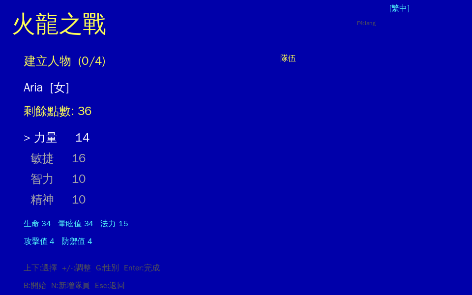 | 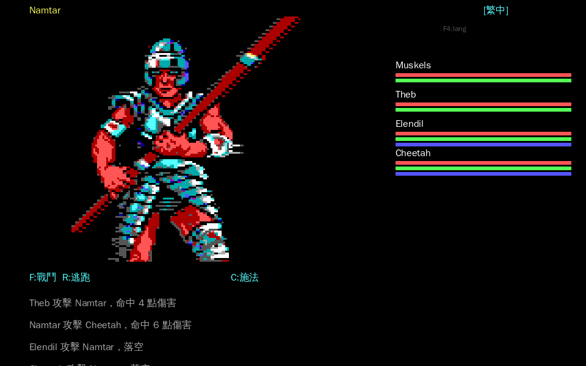 | 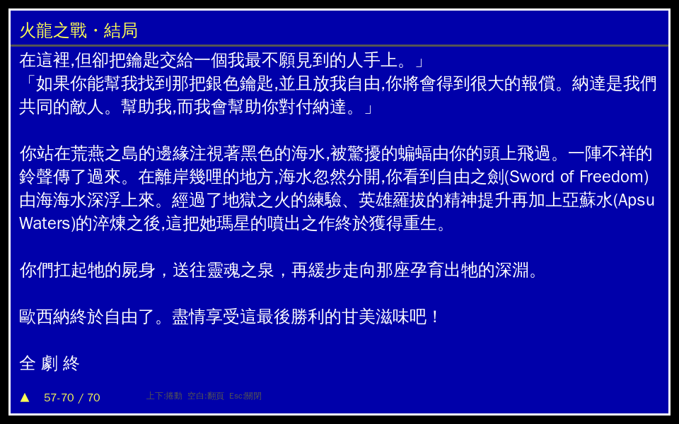 |
| `B` 建角：命名 + 50 點屬性配點 + 性別 → 合法 512B 角色 record | 回合制戰鬥：命中 / 傷害公式 = 原版 bytecode 真值 | 戰勝 → 結局序列（敘事 + 結局段落 + 全劇終），繁中可捲動 |

### F4 三語即時切換（同一畫面）

| 繁體中文 | English | 日本語 |
|:---:|:---:|:---:|
| 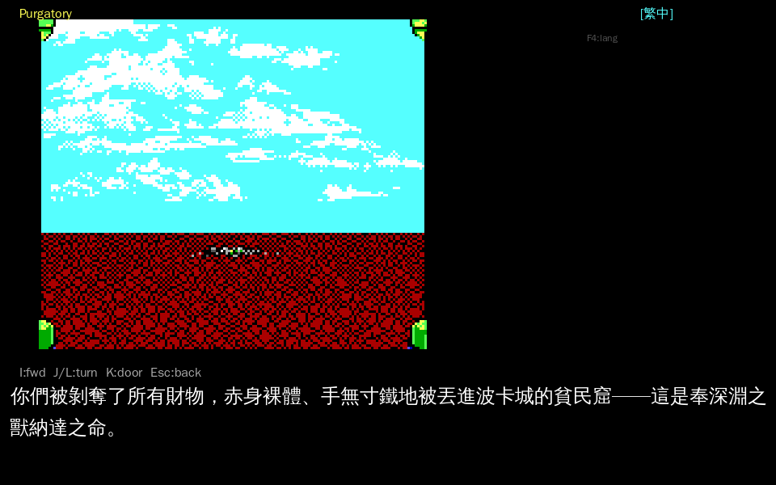 |  | 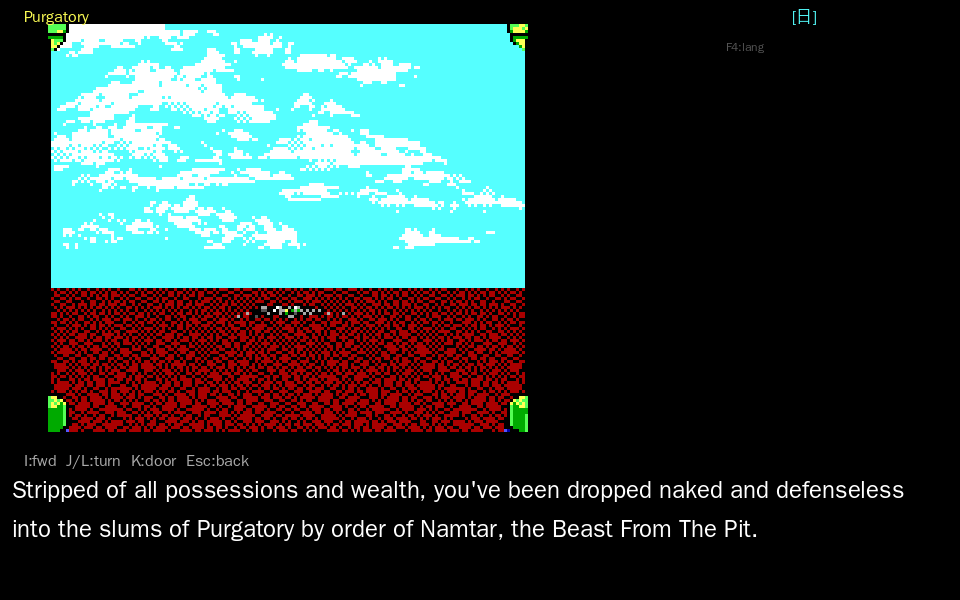 |
| 主線事件繁中 | 原文英文 | 日語介面（此格事件無日譯 → 回退英文）；events 212/283 等具 X68000 原版日文者直接顯日文（破解 nibble-swap SJIS） |

### 半透明對話框（踩格事件訊息）

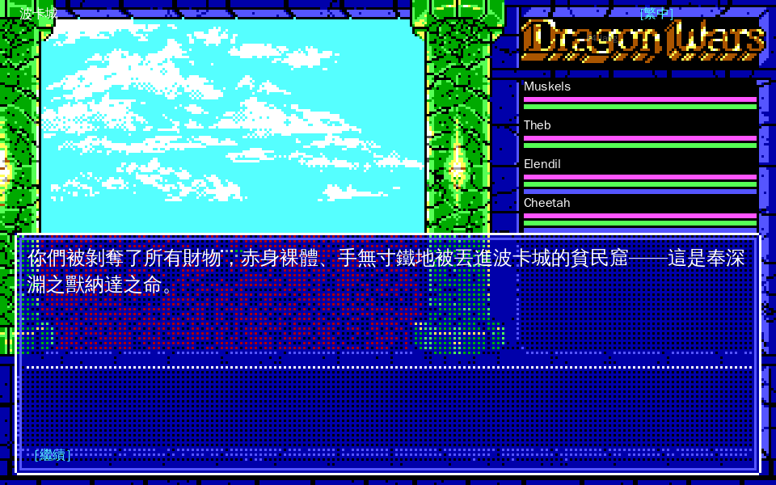

*踩到事件格 → 跑該關事件 script → 畫面下半彈出**半透明訊息框**（深藍 dither 半透明，底下地圖隱約透出 + 白外框 + 亮藍內框雙線；文字層 24px CJK 恆銳利，自動換行分頁）。配色 theme-aware。*

### 📱 Android 版（GitHub Actions 建置 + 模擬器實機驗證 + 觸控浮動按鈕）

| Android 標題（系統字型 CJK） | Android 主選單（觸控：建角 / 載入） |
|:---:|:---:|
| 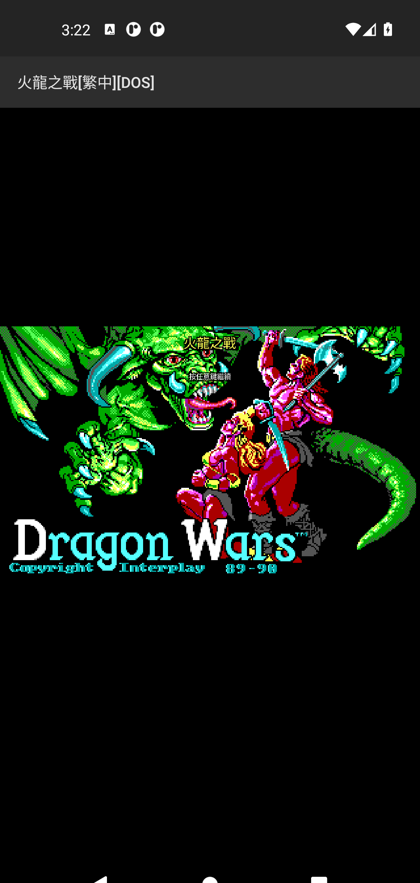 | 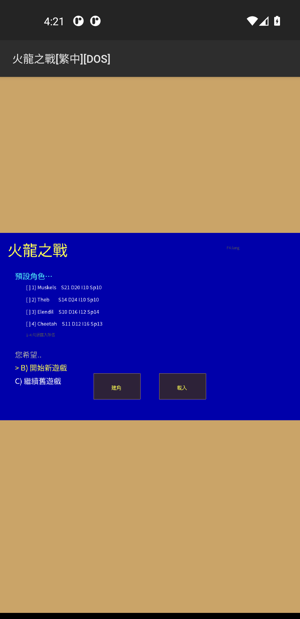 |

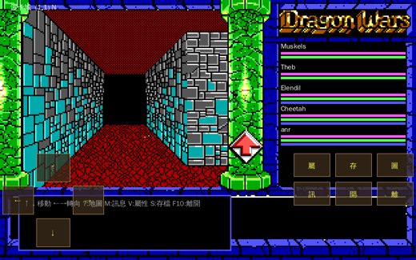

*同一份 C++20 + SDL2 引擎跑在 **Android**（標題列 `火龍之戰[繁中][DOS]`，中文正常）。APK 由 **GitHub Actions** 建置（NDK 從原始碼編 SDL2 / SDL2_ttf → `libmain.so`），並在 CI 的 **x86_64 模擬器**自動裝 APK → 啟動 → 操作 → 截圖驗證。**觸控浮動按鈕**（探索：↑前進 ↓後退 ←→轉向 + 屬/存/圖/訊/開/離 動作鈕；選單、戰鬥、子畫面各有對應鈕）只填既有 `render::Input`、與鍵盤同路徑，**引擎邏輯零改動**。設計見 `opendw_remake/docs/61_ANDROID_TOUCH_UI_DESIGN.md`。*

---

<a name="themes"></a>
## 🎨 多版本美術主題（F8 切換）

《火龍之戰》在不同平台用了不同的美術。本 remake 把「介面外觀隨平台版本而不同」收斂成一組可循環的 UI 主題，遊戲中按 `F8` 即可即時切換、畫面下幀重繪並彈出主題名 toast。同一隻引擎、同一份在地化文字，換的是 title 立繪、16 色調色盤、戰鬥背景與對話框配色。

| DOS（綠龍） | Amiga（金龍） |
|:---:|:---:|
| 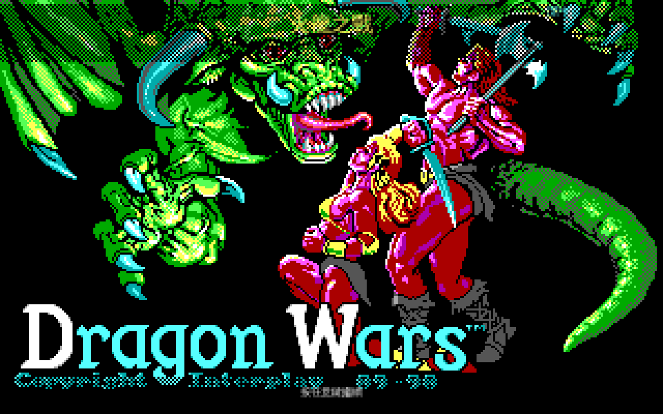 |  |
| 預設主題：原生 dragon art（res29）+ DOS 16 色標準盤 | `F8` 切到 Amiga：原生金龍標題 + Amiga 自己的 16 色 palette（讀自 `themes/amiga/title.pic` 檔頭） |

F8 循環順序為 **DOS → Amiga → X68000 → VGA-256 → DOS**，四套主題：

| 主題 | 完整度 | 內容 |
|---|---|---|
| **DOS** | 完整 | 原生綠龍標題（res29）、DOS 16 色標準盤、res 24–28 結局五場景、第一人稱 viewport 對 oracle byte-for-byte |
| **Amiga** | **接近完整** | 原生金龍標題、結局圖、**50 隻怪物 sprite**（data4 4-bitplane，全偶數資源，權威 `sprite_res()=(attr[0x0B]<<1)+0x8A` 對映接進戰鬥）、**第一人稱地牢**（DOS byte-for-byte 精確透視幾何 + **校準自真機官方截圖的土黃磚牆配色**：土黃磚牆 + 金黃高光 + 棕地板 + 青柱）。全程 planar 解碼 |
| **X68000** | **partial** | 目前只有怪物 / 場景 contact sheet（未切圖），**無原生標題 → 回退 DOS res29**，**palette 為 DOS placeholder**（原生 X68000 盤尚未萃取，`.PKH` 壓縮未破解）。誠實標示,toast 也標 partial |
| **VGA-256** | 增強 | DOS 版面演算法化擴成 256 色「真 VGA」增強盤（remake 加值,原版無此版本;非逐像素手繪重畫,誠實標示） |

**Amiga 第一人稱地牢 vs DOS 對照**

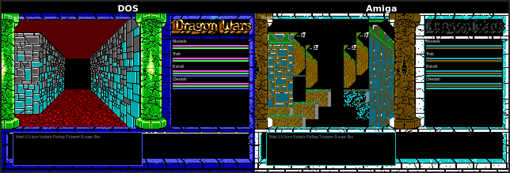

兩側是**同一條 byte-for-byte 對拍的 DOS 精確透視幾何**——側牆完美收斂、近大遠小一致。差別在配色：左為 DOS 標準 16 色盤（灰／青石牆 + 紅地板天花 + 藍磚框），右套**校準自真機官方截圖**的 Amiga 配色（土黃磚牆 + 金黃高光 + 棕地板 + 青柱），呈現 Amiga 起始區地城氛圍而透視 100% 收斂、不破碎。

**配色校準佐證：remake vs 真機官方截圖**

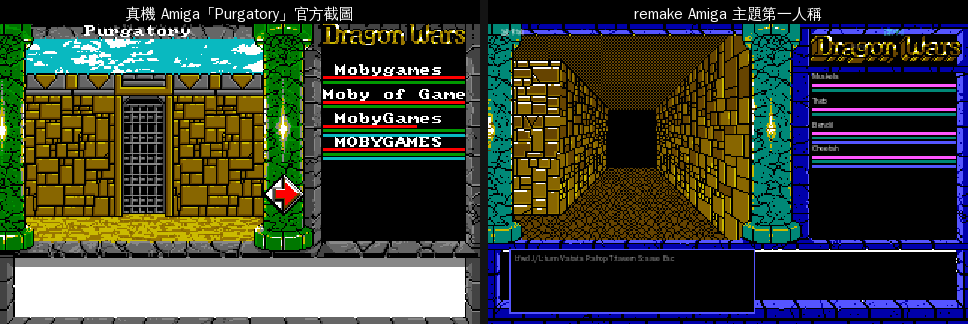

左為真機 Amiga 版「Purgatory」起始地牢第一人稱官方截圖（玩家開局第一印象的土黃磚牆），右為 remake 的 Amiga 主題。土黃磚牆、金黃高光、青柱的色調**直接取樣自左圖**（直方圖實測：磚牆 136,102,0、高光 203,187,0、磚縫棕 102,68,0、柱青）——不是憑空調色，而是對著真機畫面校準。

> 受阻誠實標示：Amiga 原生 viewport 圖塊（data3，已抽出並按尺寸/角色辨識存於 `themes/amiga/components`：正面牆 96/64/32/16 隨距離縮 + 側牆 trapezoid）的**重組落點**需逆出 Amiga 引擎 blit 錨點演算法；且官方截圖**無「長走廊」**可作側牆遞遠的對位真值，三種啟發式（slot 對映 / size-match＋置中 / 寬度優先）皆未收斂 → 原生圖塊組裝暫擱置。第一人稱因此採「DOS byte-faithful 透視幾何 + **校準自真機**的 Amiga 土黃磚牆配色」——配色忠於真機起始區，幾何 100% 收斂（remake 加值,非原生圖塊重繪）。

**Amiga 戰鬥怪物（原生 sprite + 土黃地牢牆背景）**

| Amiga 藍蜘蛛遭遇 |
|:---:|
| 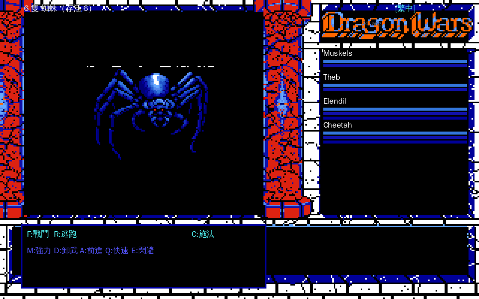 |
| 鮮豔藍蜘蛛（Amiga 原生 4-bitplane 立繪，自帶盤）站在**當前區域的土黃地牢牆**前，對齊真機 Amiga 戰鬥構圖（`dragon-wars_7.png`）。**打破 16 色單盤隔閡**：牆/UI 用 viewport 盤、怪物用自帶盤，各自轉 RGB 後在 viewport 區合成（`SdlVideo::set_region_rgb`）——原版受單盤所限只能二選一，remake 不必。下方亮黃特殊招式列 + 繁中指令 |

> 誠實邊界
> - **Amiga**（接近完整,仍有受阻項）：第一人稱地牢採「DOS byte-faithful 透視幾何 + **校準自真機官方截圖**的 Amiga 土黃磚牆配色」（透視 100% 收斂、配色忠於真機起始區；原生 viewport 圖塊已抽出辨識但**重組落點受阻**——需逆出 Amiga 引擎 blit 錨點演算法,且官方截圖無長走廊可作對位真值,暫擱置）；怪物 sprite 只切**主格**,多動畫格因無可靠 frame 邊界表未切。
> - **X68000** 是 partial（無原生標題、palette 為 placeholder、sprite 未切;`.PKH` 壓縮未破解）。日版《火龍之戰》當年只在 **X68000** 發行,**沒有 PC-98 版本**——本專案不會憑空生出一套不存在的 PC-98 美術。

### VGA-256：把 16 色版面演算法化擴成「真 VGA」

原版 DOS 是 16 色 EGA/MCGA。1990 年那批 256 色 VGA 大作（《創世紀 VI》《魔法門》）的畫面，《火龍之戰》沒趕上。VGA-256 是 remake 的「如果它當年做了 256 色版會怎樣」加值主題——**不是逐像素手繪重畫 tile**，而是把引擎照常畫出的 16 色 framebuffer，在輸出前做一道演算法化後製：非線性 gamma ramp 拉開層次、同色區直向漸層（天空愈上愈亮、地面愈近愈深）、色塊交界壓暗描邊、Bayer ordered dither 柔化。同一份 16 色像素資料，換上一層 256 色的光影。

| VGA-256 第一人稱地牢 | VGA-256 世界地圖 |
|:---:|:---:|
| 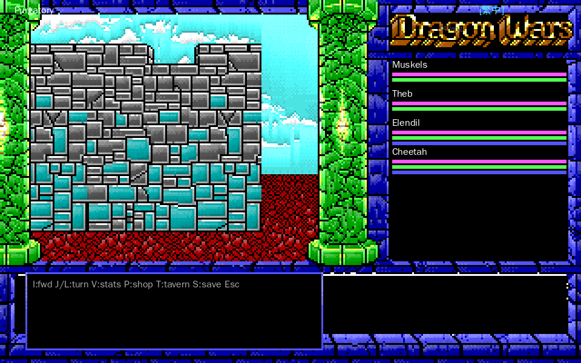 | 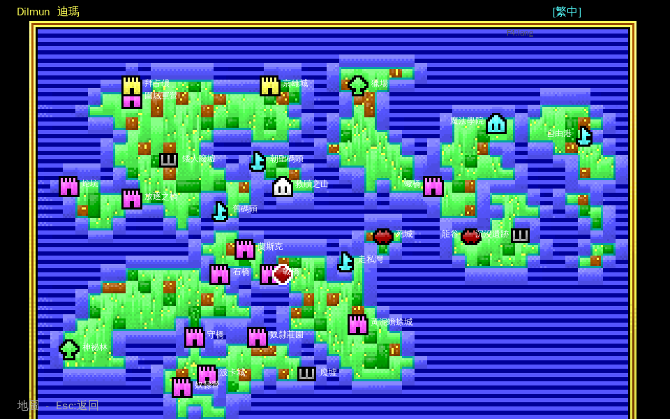 |
| 漸層天空 + 立體石牆 + 紅熔岩地板，綠石華麗邊框（原版 UI piece）+ 金色立繪 logo | 漸層海洋（橫向藍階）+ 綠地塊立體化 + 各色地點圖示，24 個繁中地名 |

`F8` 循環到 VGA-256 時，畫面下緣彈出 `主題：vga (256色)` toast；只有此主題走 256 色後製路徑，DOS/Amiga/X68000 維持 16 色（golden 對拍不破）。

> 誠實邊界：VGA-256 是**演算法化增強**，非考古抽取的原生美術（原版根本沒有 256 色版）。底層仍是同一份 16 色 framebuffer，256 色只加在 present/dump 前的後製層；關掉後製即回到原生 16 色,逐像素資料一致。

---

<a name="world-ending"></a>
## 🗺️ 世界地圖與結局

**Dilmun 世界地圖**（按 `?` 開平面地圖）。area 0 是 wrap 樞紐世界區，重畫成橫向美化圖，**24 個地點全繁中標記**（拜占庭、京雄城、凌火魔城、救贖之山、自由港、波卡城、石橋、奴隸莊園…）；走到城鎮格即切入該城 area。

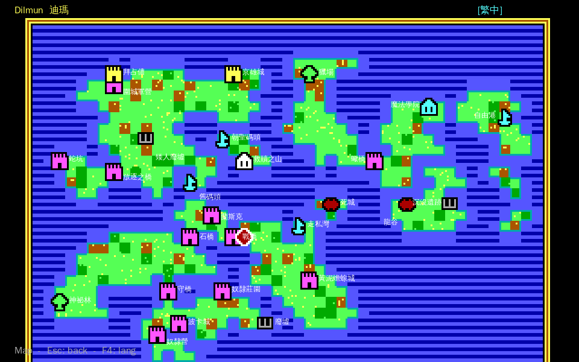

**結局過場：Namtar 被擲回深淵。** 戰勝終戰 Boss 後跑結局序列——DOS 主題為 res **24–28** 五張全螢幕場景（Namtar 墜淵 → 慘叫 → 焚城 → 和平新時代 → 全劇終）。繁中採「**換字不換版**」：把原版烤進圖裡的英文敘事**實心擦除**（那塊本就是黑底），在**原位**用銳利向量文字層畫繁中——不再是底部小字幕條，中文落在原版英文的構圖位置、英文不再透出。英文語系則維持原版 art 原樣呈現。

| Namtar 墜淵（結局首場・換字不換版） |
|:---:|
| 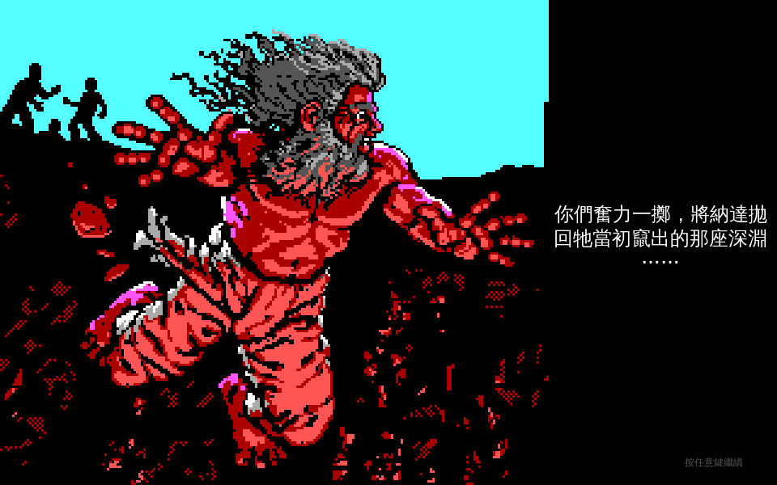 |
| 右側原本的英文敘事被擦除，原位畫上「你們奮力一擲，將納達拋回牠當初竄出的那座深淵……」——構圖不動、字隨語系換 |

---

<a name="highlights"></a>
## ✨ 亮點

**一條能走完的主線**
建角 → 探索 40/40 連通區（第一人稱 viewport）→ 主線繁中事件 → 終戰 Namtar → 結局。存讀檔 byte-for-byte round-trip，Read Paragraph 防拷段落有專屬捲動檢視器。

**戰鬥核心 = 原版 bytecode 真值**
不是憑感覺調的數字。命中、傷害、RNG 都從 res3 + DRAGON.COM 反組譯逆出，端到端執行驗證：

- 命中：`roll ≤ 13 + AV − (DV + AC)`（1d16+3，roll-under）
- 徒手傷害：`骰 + floor(STR/5)`；武器傷害骰解碼自角色資料延伸位（武器無 STR bonus）
- RNG：`op_4D`；DOS 實機交叉驗證，命中率與原版吻合（[docs/reverse-engineering/42](docs/reverse-engineering/42_COMBAT_BYTECODE.md)）

**繁中 + 日文雙在地化**
menu / 角色 / 戰鬥 / 法術 / 物品 + 序盤事件繁中；events 212/283 採 X68000 原版日文原文。`F4` 切 繁中 / EN / 日，24px 銳利 CJK 雙層渲染。

**對 DOS 原版的視覺保真**
第一人稱 viewport 全 40 關逐像素對拍 opendw（`render_sweep` 154 case byte-for-byte）。整體版面、配色貼著原版 DOS，標題畫面幾乎逐像素還原（刻意保留英文 logo）。詳見[下節對照](#fidelity)與 [docs/assessment/60](docs/assessment/60_DOS_VS_REMAKE_VISUAL.md)。

**自包含，工程化**
資產萃取成 `assets/bundle/`，執行期不依賴原始磁碟檔；docker-first 建置；ctest **37/37**；GitHub Actions CI；Linux 可攜包已實機驗證，Windows / macOS CI 設定已備。

---

<a name="fidelity"></a>
## 🖼️ DOS 原版 vs Remake — 視覺保真

下列並排圖**左為真 DOSBox 擷取**（Interplay 1989/90），**右為 remake** headless dump。第一人稱 pipeline 已對 opendw 全 40 關逐位元一致，其餘畫面為人工視覺稽核（[docs/assessment/60](docs/assessment/60_DOS_VS_REMAKE_VISUAL.md)）。

| 標題畫面 | 第一人稱走廊 |
|:---:|:---:|
|  | 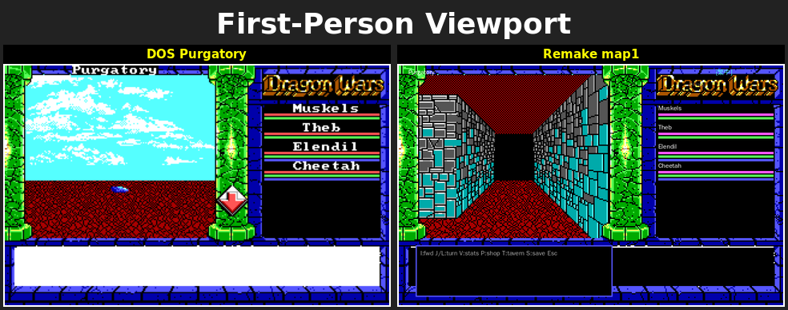 |
| 龍頭 + 紅膚戰士 + 「Dragon Wars / Copyright Interplay 89-90」逐像素還原 | 區名銀幕、右側隊伍面板 + 血條、藍磚邊框、綠柱火炬、透視走廊一致 |

| 戰鬥遭遇 | 世界圖（三方對照） |
|:---:|:---:|
| 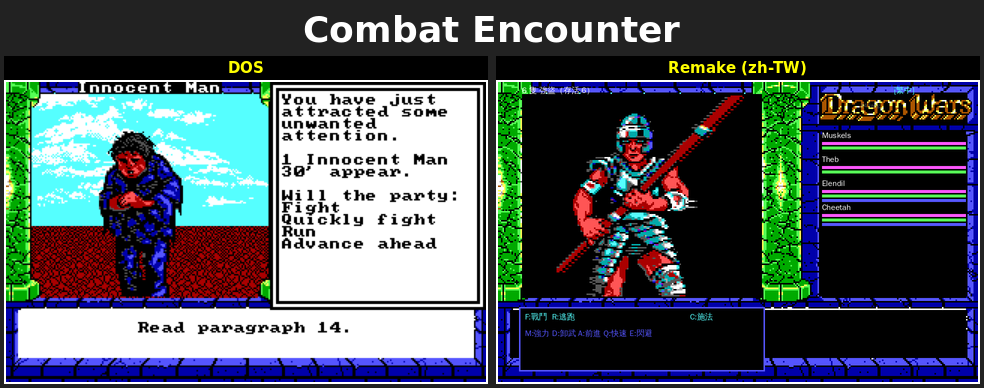 |  |
| 怪物圖佈局對齊原版（golden byte-for-byte） | 權威 Dilmun 設計圖 / DOS / remake 三方並排 |

整體視覺保真度高。多數差異是**刻意的在地化（繁中）或現代化輔助**（底部操作提示列、新／續遊戲選單），不是缺口。已知真缺口集中在主選單語意（remake 是「新／續」二選一、DOS 是隊伍管理選單）與 area 0 世界區 automap 全圖渲染——皆載於 [docs/assessment/60](docs/assessment/60_DOS_VS_REMAKE_VISUAL.md)，誠實標示。

---

<a name="controls"></a>
## 🎮 操作

操作以臺灣中文版《火龍之戰》操作手冊為準（[CONTROLS.md](docs/engine/CONTROLS.md)）。啟動先顯示**火龍之戰 dragon art 標題畫面**（金色「Dragon Wars」立繪 + 在地化標題「火龍之戰」+ 閃爍「按任意鍵」），按任意鍵進主選單。

| 鍵 | 動作 | | 鍵 | 動作 |
|---|---|-|---|---|
| `B` | 開始新遊戲（建角） | | `C` | 施法 |
| `C` | 繼續舊遊戲 | | `U` | 使用物品 / 技能 |
| `I` / ↑ | 往前 | | `X` | 屬性配點 |
| `J` / ← | 左轉 | | `O` | 重排隊伍 |
| `L` / → | 右轉 | | `P` | 商店 |
| `K` | 開門 / 破密門 | | `T` | 招募隊員 |
| `V` | 查看人物 | | `?` | 平面地圖 |
| `S` | 儲存遊戲 | | `F4` | 切語言（繁／英／日） |

**全域熱鍵**（任意畫面）：

| 鍵 | 動作 |
|---|---|
| `F1` | Help 覆蓋層：半透明框列目前可用操作鍵（i18n 三語）；`Esc` 或再按 `F1` 關閉 |
| `F8` | 循環切換 UI 主題（DOS → Amiga → X68000），即時重繪 + 主題名 toast |
| `F10` | 離開遊戲：先**自動存檔**，再彈 yes/no 確認視窗（`Y`/`Enter` 離開、`N`/`Esc` 回遊戲） |
| `Esc` | 子畫面 = 返回 / 關閉；頂層（選單 / 探索）= 觸發同一離開確認流程（自動存檔 + yes/no），避免誤觸直接掉出 |

> 選單採快捷字母（與手冊一致），remake 額外提供 ↑↓ + Enter 作為現代輔助。完整鍵表與 headless 測試旗標見 [CONTROLS.md](docs/engine/CONTROLS.md)。

---

<a name="method"></a>
## 🔧 方法論：反組譯當 oracle，乾淨室重寫

核心策略不是「照抄組語」，而是把反組譯當成**正確性的裁判**，自己手寫可維護的引擎，再用差異測試逼兩邊一致。

1. **逆向破解資料格式**。DATA1/DATA2 的 5-bit 文字編碼、Huffman 樹解壓（res31/res168）、sprite 去交錯、場景圖——全部破解並 round-trip 對拍 opendw byte-for-byte。
2. **手寫 script VM**。目前實作 **129/256 opcode**（模式 / 算術 / 旗標 / 邏輯 / 比較 / 跳轉 / loop / game_state / bit / 字串輸出）。差異測試 harness（`diff_trace`）逐指令比對 remake VM trace 與 opendw oracle trace。
3. **補出 opendw 從未逆向的 opcode**。op_43/5F/60/63、op_68/79/5B 等在 opendw 標 NULL 或無 C oracle 的指令，直接從原始 DRAGON.COM ASM 反組譯補出並驗。
4. **資產脫離磁碟**。ResourceProvider 抽象（oracle 用 Data1Provider / 執行期用 BundleProvider），BundleProvider 載入 == DATA1 byte-for-byte，但執行期不依賴原始檔——換檔即換美術（未來 X68000 / PC-9801 素材）。
5. **每個宣稱都可驗證**。`tools/verify/` 下 35 個 ctest 對拍渲染、存讀檔、戰鬥、連通、i18n…，全綠才算數。

延伸閱讀：
- 🏗️ [opendw_remake/ARCHITECTURE.md](opendw_remake/ARCHITECTURE.md) — VM / 渲染 / 資產層設計與階段表
- ⚔️ [docs/reverse-engineering/42 戰鬥 bytecode 逆向](docs/reverse-engineering/42_COMBAT_BYTECODE.md) — 命中 / 傷害公式真值推導
- 📐 [docs/reverse-engineering/42 為什麼原版要拆 DATA1/DATA2](docs/reverse-engineering/42_WHY_DATA1_DATA2.md) — 1989 硬體環境下的設計推理
- 📋 [ADR 0001：Asset Bundle 與 ResourceProvider](docs/adr/0001-asset-bundle-and-resource-provider.md)
- 📖 [docs 索引](docs/README.md) · [術語表 CONTEXT.md](CONTEXT.md) · [opcode 雙語參考](docs/reverse-engineering/OPCODE_REFERENCE.md)

---

<a name="honesty"></a>
## ⚖️ 誠實邊界：真值 vs 受阻

整個專案貫穿一個原則：**bytecode 真值 / remake 設計 / 受阻** 三級分明，從不謊稱 oracle（見 `combat.hpp` 檔頭與各 `docs/reverse-engineering/42`–`60`）。

**已落地（均經 opendw 對拍 / DOS 實機 / 攻略交叉驗證）**

- ✅ 渲染逐位元對拍 opendw：第一人稱 viewport（全 40 關像素 PASS）、標題 / 場景圖、sprite、俯視地圖、wrap 樞紐
- ✅ VM 129 opcode，`diff_trace` 逐指令 == opendw（含本輪首逆的 op_64/65/67 物品 CRUD + 0x4754 簽章比對，opendw 原標 NULL）
- ✅ 戰鬥三大公式（命中 / 徒手 / 武器骰）= 原版 bytecode 真值，端到端執行驗證
- ✅ 連通 **40/40** area（含還原菲巴斯入口）、61 條法術、特殊攻擊、商店、招募、升級、技能檢定、開門 / 陷阱、戰鬥外施法、**物品給予/祝福端到端持久化**、存讀檔
- ✅ 主線事件繁中 200+ 鍵 + 147 段落 + 結局；共享 script 旁白（戰鬥/法術/裝備/建角）繁中 0 未譯；日文 events / 怪名
- ✅ **音效**：SDL2 音訊 — PC speaker 風格方波（門 / 撞牆 / effect 頻率由 opendw `dx/bx` bytecode 推導）+ 原版平台真實 8-bit PCM 取樣（**Amiga `data5/6`、X68000 `DW.SND`** 抽出,SFX 截短播放）。接上開門 / 撞牆 / 命中 / 施法 / `op_90` 腳本音效;`--mute` 可關

**誠實受阻（架構或 oracle 所阻，照實說）**

- ⚠️ **怪物逐回合 HP 無法 byte-diff**：opendw 沒有獨立戰鬥入口，無法對拍怪物每回合具體 HP。終戰用 remake `combat_loop`（同 bytecode 真值公式），非 res3 全戰鬥閉環（後者卡 op_89 動作指派的遊戲層 context）。怪物 HP / AC 為暫定值。
- ✅ **上鎖寶箱開箱已實作並端到端驗證**：踩寶箱格（全 40 關 18 處）→ K 開鎖檢定（失敗可重試）→ 給一件真實 Dragon Wars 物品 → `Party::add_item` 進 512B record 背包，`verify_chest_acquire` 證存檔 round-trip 後仍在；**商店購買**（`verify_shop`）、**NPC 入隊招募**（`verify_recruit`）亦持久。grounded：物品取自真實 DW 物品池，非該箱原版 byte-exact 內容（lock 機率與物品 id 在 script 11 共用 `gs[0x41]` 深層糾纏）。
- ✅ **劇情物 grounded 給予（攻略驅動編目）已實作並驗證**：取得邏輯藏在 op_8C 確認 + 未完整逆出的共享 script（op_68/op_70 在 opendw 為 NULL，控制流未逆出），實測 40 關 tile script 頂層無 op_64 直接給物品 → **無法可靠自動抽取**，故依《軟體世界》攻略人工編目「地點→物品」（`assets/bundle/quest/grants.tsv`）。首次進該區且未持有 → 給真實 quest 物品（朝聖者之袍 / 光譜眼鏡 / 龍石 / 國王戒指 / 護身符…）並持久（中文名走 `items.tsv`），`party_has_item` 判重 → 存讀檔不重給；`verify_quest_grant` 證端到端。誠實標示：時機簡化為「進區即得」（原版多需先完成該區子任務），gate flag 因落在 game_state 低位元組（與位置欄重疊）暫不連動。
- ✅ **給物品機制本身已逆出並打通**：op_64/65/67 物品 CRUD + 0x4754 簽章比對、`verify_item_persist` 證 `run_event` 事件給物品同步進 512B record 背包持久。
- ⚠️ **Namtar Boss 屬性、自由之劍祝福加成、結局序列** = remake 平衡 / 組合設計（原版勝利畫面 script 逆不出）。
- ✅ **~~Phoebus（area 6）/ area 33 隔離~~ 已解**：原版 DATA1 漏放菲巴斯的世界圖入口 tile（0x07→area 6，唯一未放置的城市 tile，bundle==DATA1 byte-for-byte 確認），remake 依權威 Dilmun 地圖在太陽島原位還原該入口落點 → 連通 **40/40**、菲巴斯內部事件繁中 24/24（誠實標示：remake 還原，非原版資料原狀；見 docs/gameplay/54 §F）。
- ✅/©️ **背景音樂：已用 UADE 渲染、循環播放**（音檔屬著作,不入庫）。**音效**見上「已落地」。背景音樂取自 Amiga `.tune`（"Music by MANIACS of NOISE"，68k 機械碼播放器 + 內嵌曲目），用 **UADE**（不需 Kickstart ROM）渲染成 WAV，引擎依遊戲狀態循環切 title/game/combat/end 四曲（`sound.cpp` music 頻道;`verify_audio` 已驗 4 曲載入 + 切曲）。**渲染後音檔屬 MANIACS of NOISE / Interplay 著作 → gitignore 不散布**;自備 Amiga 版合法副本後跑 [`tools_build/render_music.sh`](tools_build/render_music.sh)（recipe 見 [`bundle/audio/music/README.md`](opendw_remake/assets/bundle/audio/music/README.md)）即生成並自動播放。（DOS 版原本無背景音樂——`0x5C3B` 為 PC speaker 音效碼,非音樂。）

完整分級量化見 [docs/gameplay/57 PM review](docs/assessment/57_PM_REVIEW.md)（技術 ~75% / 玩家內容 ~45–50%）、[docs/assessment/49 缺口稽核](docs/assessment/49_GAP_AUDIT.md)、[docs/assessment/48 可通關 roadmap](docs/assessment/48_COMPLETABILITY_ROADMAP.md)。

### 跨平台狀態

打包與各平台產物狀態見上方 [Build 與開發](#build) 的五 job 對照表（Linux tarball/AppImage ✅ 本機驗證、Windows/macOS CI 完整、Android scaffold）。Linux 已 docker 實機驗證 build + **ctest 37/37** + 產包 + headless 執行。

---

<a name="layout"></a>
## 📁 專案結構

```
opendw_dragon_wars_cht/
├── opendw_remake/         # ★ 主產物：C++20 + SDL2 乾淨重寫的 runtime（可玩）
│   ├── src/               #   resource / vm / render / game / i18n
│   ├── tools/verify/      #   對拍 / 驗證工具（ctest 37 項）
│   ├── tools/extract/     #   DATA1/DATA2 → 自包含 bundle 萃取
│   ├── assets/bundle/     #   自包含資產（maps/sprites/scenes/scripts/monsters/items/…）
│   ├── assets/i18n/       #   zh-TW / en / ja 在地化 TSV
│   └── docs/              #   remake 專屬截圖 / 設計筆記
├── src/                   # opendw（C 反組譯）— 唯讀，當逐位元正確性 oracle
├── docs/                  # 設計筆記 + 逆向報告（00 索引；42-60 戰鬥/連通/評估/視覺稽核）
└── CONTEXT.md             # 術語表（ubiquitous language）
```

> opendw_remake 不依賴原始磁碟檔（資產已萃取成自包含 bundle）；`src/`（opendw）僅作為差異測試的對照 oracle。

---

<a name="credits"></a>
## 🙏 授權與致謝

**重寫程式碼**（`opendw_remake/`）為原創，採 **BSD** 授權。

**opendw**（C 反組譯，本專案的正確性 oracle）由 **Devin Smith** 製作、採 BSD 授權；它反組譯的**原版遊戲引擎**出自 [Rebecca Ann Heineman](https://www.burgerbecky.com/)（1989 原作程式）。

**《火龍之戰》(Dragon Wars)** 是 **Interplay** 的商標與著作。本專案的執行所需資產衍生自原版（1989/90），屬保存 / 中文化範疇——**本 repo 不散布任何原始遊戲檔**（`DRAGON.COM` / `DATA1` / `DATA2`）。請於 [GOG](https://www.gog.com/game/dragon_wars) 取得合法原版。

| 致謝 | 貢獻 |
|---|---|
| **Interplay** | 《火龍之戰》原作（1989/90） |
| **Rebecca Ann Heineman** | 原版遊戲引擎程式（1989） |
| **Devin Smith / opendw** | C 反組譯——本專案的正確性 oracle |
| **WenQuanYi 文泉驛 / Noto CJK** | 中日文字型 |
| **Chun-Yu Wang**（wicanr2） | 本專案發起人 |

---

*火龍之戰 Dragon Wars 繁體中文化專案 — [wicanr2/opendw_dragon_wars_cht](https://github.com/wicanr2/opendw_dragon_wars_cht)*

> 人生總該做點事情留下紀念。
> 希望這份繁中重製，能讓後來的人更容易認識那些經典 CRPG，知道它們曾經有多迷人。
