# 火龍之戰(Dragon Wars)— 《軟體世界》三期連載攻略 · 圖文整合版

> **導讀**
>
> 本文件整合《軟體世界》月刊 **第 25、26、27 期**(1991 年 4 / 5 / 6 月號)連載的《火龍之戰》(Dragon Wars, Interplay 1989)完全攻略,把三期(攻略一/二/三完結篇)的掃描頁、地圖圖例與流程敘述,按遊戲進程**合一重編**為一份圖文並茂的繁體中文文件。
>
> **用途**:
> 1. **遊戲文化保存** —— 保留 1991 年臺灣電玩雜誌的本土攻略原貌(地圖、譯名、行文)。
> 2. **中文化研究** —— 把攻略地圖上的「訊息 N」對應回遊戲防拷段落書(Read Paragraph N),並**整段引用**手冊段落原文,作為《火龍之戰》中文化專案的對照語料。
>
> 遊戲地名/人名/物品/法術一律**保留英文原名 + CONTEXT 中譯**;譯名衝突一律以 `CONTEXT.md` 為準,衝突處標「待確認」不擅自定案。掃描不清處保留原轉寫的 `〔?〕`。
>
> **姊妹檔**:[`39_SOFTWORLD_FULLTEXT_AND_MAPS.md`](39_SOFTWORLD_FULLTEXT_AND_MAPS.md) —— 逐頁**全文逐字轉寫**(可複製)+ 每張地圖**純方格切圖(像素複製、無中文)+ potrace 臨摹高畫質向量圖**並列。本檔(38)重可讀導讀,39 重忠實存檔與素材。

---

## 1. 出處與版權聲明

| 項目 | 內容 |
|---|---|
| 刊物 | 《軟體世界》月刊(Software World) |
| 期數 / 出版年月 | 第 **25** 期(1991-04)、第 **26** 期(1991-05)、第 **27** 期(1991-06) |
| 作者署名 | **/Lotus**(攻略標題列作者代號;文中 LOTUS 同時作敘事者/玩家存檔代稱) |
| 第 25 期頁碼 | 攻略 PDF p.34–39 = 雜誌印刷頁 **32–37**(offset +2) |
| 第 26 期頁碼 | 攻略 PDF p.36–39 = 雜誌印刷頁 **34–37**(offset +2) |
| 第 27 期頁碼 | 攻略 PDF p.44–54 = 雜誌印刷頁 **42–52**(offset +2) |

**版權與用途聲明**:原攻略文字與掃描圖之著作權,屬《軟體世界》月刊及原作者(/Lotus)所有。本文件之整合、轉寫與重編,純為**非商業性的歷史保存、研究與中文化用途**;所引用之雜誌掃描圖一律以**低解析度(150 DPI)**保存,僅供對照辨識之用,不作任何商業散布。手冊段落書原文之引用,同屬中文化研究對照語料,著作權歸原中文版發行商所有。若權利人有疑義,請告知以便處理。

---

## 2. 核心對應規則:「訊息 N」=「Read Paragraph N」=「手冊段落 N」

《火龍之戰》採用「**編號段落書防拷機制**」:遊戲進行到特定地點/事件時,畫面顯示「Read paragraph N」,玩家須翻開隨遊戲附贈的「旅行指南第二冊 · 編號段落書」,閱讀**第 N 段**才能取得劇情/線索。

《軟體世界》攻略的分區地圖上,把這些觸發點標為「**訊息 N**」。本文件據此建立對應:

> **訊息 N(攻略地圖)= Read Paragraph N(遊戲指令)= 手冊段落書第 N 段(同號)**

**對應依據(抽樣比對吻合)**:

- **訊息 9 = 段落 9** —— 攻略波卡城圖例第 4 點「Irkalla 的雕像」鄰近、行動清單對應;段落 9 內容正是「**一個納達(Namtar)的雕像站立在廣場中央……婦人走過向它吐口水**」。✓ 吻合。
- **訊息 6 = 段落 6** —— 攻略神祕林(第 26 期)圖例第 7 點「訊息 6」、第 8 點「安奇度神像(Enkidu)」相鄰;段落 6 內容正是「**你發現一座簡陋的神廟,由一位寂寞的得魯依教士守著……所祭奉的神祇是半人半獸的安奇度(Enkidu)**」。✓ 吻合。

> **編號一致性註記**:本對應已抽樣核實,但攻略為**掃描 OCR**、段落書為**另一份掃描轉寫**,少數編號可能不完全一致。本文件逐項以**內容語境**核對;凡內容與所在地點語境明顯不符者,於 §6 對照總表與文末「編號對應疑點」逐項標註。

**已知 OCR 修正**:第 25 期波卡城地圖圖例第 5 點原轉寫作「**Apeu Waters**」,經與手冊段落 94 比對(「**亞蘇水(Apsu Waters)……連接現實世界和地底世界**」),確認應為 **Apsu Waters**(由此進入 Magan 瑪根地底世界)。本文件統一更正為 **Apsu Waters**。

---

## 3. 全流程地點進程總覽

三期連載大致對應遊戲三段進程:**前期(25)→ 中期(26)→ 後期 / 結局(27)**。以下為串成一條的流程鏈(地點以「英文原名 中譯」標示):

**【前期 · 第 25 期 攻略(一)】**

> Purgatory 波卡城(起始城)→ Slave Camp 奴隸營 → Slave Mines 礦場 → Mog's Slave Estate 莫格的宅院 → Tars Ruins 塔斯廢墟(含地下室)→ Guarded Bridge 守橋 → Yellow Mud Toad 黃泥蟾蜍城(前導)→ Phoebus 菲巴斯城 → Phoebus Dungeon 菲巴斯地牢

**【中期 · 第 26 期 攻略(二)】**

> Mystic Wood 神祕林 → War Bridge / 重兵守橋 → Lansk 蘭斯克 → Lansk Undercity 蘭斯克地下城 → Yellow Mud Toad 黃泥蟾蜍城 → Lanac'toor's Lab 拉娜的實驗室

**【後期 / 結局 · 第 27 期 攻略(三)完結篇】**

> Smuggler's Cove 海盜竊穴 → The Necropolis 奈羅波裡(陳屍所)→ Magan Underworld 瑪根地底世界 → Old Dock 老碼頭 → Bridge of Exiles 放逐橋 & Snakepit 蛇窟 → Dwarf Ruins & Clanhall 矮人廢墟與城堡 → Siege Camp 軍營 → Byzanople 拜占儂市 & 地下指揮部(救 Prince Jordan 喬丹王子)→ Kingshome 京雄城 & 地牢 → Freeport 自由港 → Royal Game Preserve 皇家專有獵區 → Scorpion Bridge 蠍橋 → College of Magic 魔法學院(七道測驗)→ Dragon Valley 龍谷 → Sunken Ruins 沉沒之城 → Pilgrim Dock 朝聖者碼頭 → Nisir 尼塞山 → **Depth of Nisir 尼塞山腹 → 決戰 Namtar 納達 → 結局**

主線核心目標:鑄造 **Sword of Freedom 自由之劍**(跨 Nisir、Sunken Ruins、Dwarf Forge 矮人鑄爐多地)→ 取得 **Dragon Gem 龍寶石**(召喚 Dragon Queen 龍后)→ 於 Depth of Nisir 深處以自由之劍劈死 Namtar(深淵之獸)。

---

## 4. 玩法總覽(取自第 25 期開場)

第 25 期開場以作者 LOTUS 的引言帶出基本玩法,整理重點如下:

- **敘事定位**:LOTUS 自稱精通各種魔法的巫師,曾與同伴把邪惡法師 **Namtar(納達)**踢入深淵,如今住在 **Purgatory(波卡城)**。最大專長是繪製地圖,願與讀者分享經驗。本作較前作(冰城傳奇系列)輕鬆:怪物少、謎題淺,但人物升級慢;很多難關可用魔法解決,有些地方甚至不必打殺。
- **物品變賣**:可把物品賣到特定商店,價格越高表示越珍貴(武器/護甲賣價較高)。重要物品一旦被城裡扒手偷走就找不回,除非用魔法召回。
- **技能養成**:**Bandage 包紮**最重要(可恢復生命,點數會隨之增加);**Climb 攀爬**、**Lockpick 開鎖**、**Weapon Skill 武器技能**、**Tracker 追蹤**、**Hide 隱藏**等需累積使用才會提升。
- **通行物品**:Pilgrim's Garb 朝聖者之袍、Citizen Papers 市民證、Governer's Pass 總督通行證、Enkidu Totem 恩奇杜圖騰〔?〕。
- **關鍵一次性道具**:Golden Boots 黃金之靴、King's Signet Ring 國王戒指、Dragon Gem 龍寶石、Spectacles 眼鏡;部分(如 mushrooms、Soul Bowl)用過一次即可丟棄。

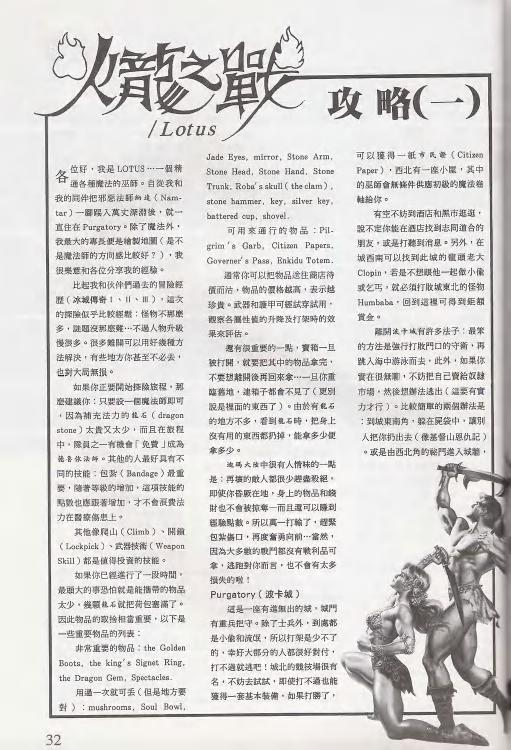

---

## 5. 逐地點圖文攻略

> 各節含:該地點所在掃描頁圖、地點簡介(取自轉寫流程敘述,通順重述)、**事件/圖例表**(來自各期地圖圖例)、以及 **📖 此處觸發的手冊段落**(把該地點出現的「訊息 N」對應段落 N 原文整段引用)。
> 段落原文忠實照抄 `34_READ_PARAGRAPHS.md`,含其 `〔?〕` 與「需人工複核」註記。

---

### 5.1 Purgatory 波卡城(起始城)

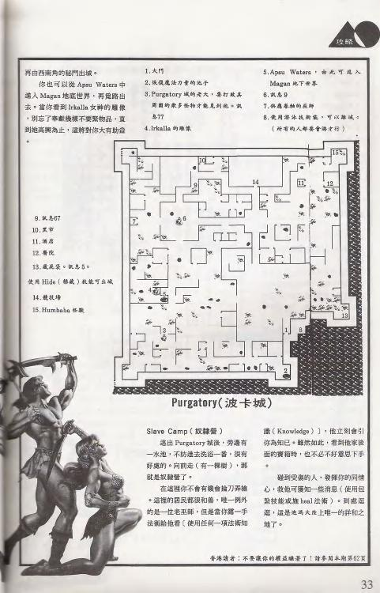

**簡介**:這是一座有進無出的城,城門有重兵把守。除上兵外,城內盡是小偷與流氓,打架在所難免,最好打到對手不堪一擊。城北有巫師 **Humbaba(胡姆巴巴)**,必須打敗。可由西南角祕門出城,或從 **Apsu Waters**(更正自 Apeu Waters)進入 **Magan(瑪根)地底世界**再覓路出去。前往 **Irkalla(伊爾卡拉)**女神雕像前,記得把能拿的都拿盡。

**事件/圖例表(行動清單 1–15)**

| 編號 | 內容/事件 |
|---|---|
| 1 | 入門 |
| 2 | 恢復魔法力量的地方 |
| 3 | 波卡城的老大,要打敗他(周圍若干怪物先清掉才能克他)。**訊息 77** |
| 4 | Irkalla(伊爾卡拉)的雕像 |
| 5 | **Apsu Waters**(原轉寫 Apeu,已更正);由北可進入 Magan 瑪根地下世界 |
| 6 | **訊息 9** |
| 7 | 供應墓地的巫師 |
| 8 | 使用游泳技能前進,可以跳水(所有人都要會游泳) |
| 9 | **訊息 67** |
| 10 | 黑市 |
| 11 | 酒店 |
| 12 | 醫院 |
| 13 | 藏寶室。**訊息 5** |
| 14 | 競技場(使用 Hide 隱藏技能可出城) |
| 15 | Humbaba(胡姆巴巴)怪歌〔?〕 |

**📖 此處觸發的手冊段落**

> **段落 5**
>
> 搗著鼻子,你終於發現這惡臭的來源。在你的面前是一座低矮的建築,一連串奇怪的石板一塊靠著一塊地擺著。早先的石匠在石頭上雕刻著「陳屍所」(Morgue),近代則有人在上面加註了新的意思「出去之路,笨蛋們」(The way out, chumps!)。

> **段落 9**
>
> 一個納達的雕像站立在廣場的中央。你沿著雕像的四周行走,想要把這個將你放逐至波卡城的惡棍的形象牢牢記住。事實上,波卡城的居民和你一樣討厭納達,因此他的雕像也已是殘缺不全。
>
> 你發現有位婦人走過雕像並向它吐口水,同時口中還不停地咒罵著。你心中深有同感。

> **段落 67**
>
> (前段續至此頁頂端:)
> 長得像什麼樣子。
> 「我是美斯達(Mystalvision)太陽神廟的最高法師。」法師用一種很可笑的聲音說:「我不管你們是如何逃出波卡城的,可是你們闖入我的城市的行為卻令人無法忍受,進來一些看起來很殘酷的黑衣人……「納達的秘密部隊將會聞你哼一聲,你們最好不要發出聲音了……」
>
> ⚠ **編號疑點**:訊息 67 標在波卡城圖例第 9 點,但段落 67 內容屬 **Mystalvision(美斯達/太陽神廟,即 Phoebus 菲巴斯)**語境,與波卡城不符。詳見文末「編號對應疑點」。

> **段落 77**
>
> 在這座廢墟之中,你看到一個難忘的景色。一堆營火照亮著破碎的廣場,許多人聚集在火邊跳躍。這是自從你到達波卡城(Purgatory)以後所離得這群人聚會。
>
> 在廣場上有來自各個階層的市民,從瞎眼的乞丐、瘋狂的詩人、頑皮的小孩和醉酒的教士們都聚集在營火旁狂歡。在這些人之中,你看到一個人坐在由泥馬礫做成的寶座上,你推測他可能就是這群人的領袖,或許正是盜賊之王。
>
> 忽然間,你發現自己被一群惡棍圍住。你被帶到火前,寶座上的目光注視著你說:「外地人!你進雜了我家鄉,可是在這偏無拘無束的法術區,這些人聚集在這裡以對波卡城國王——也就是我克羅潘(Clopin Trouillefou)表示效忠。」

---

### 5.2 Slave Camp 奴隸營 + Slave Mines 礦場

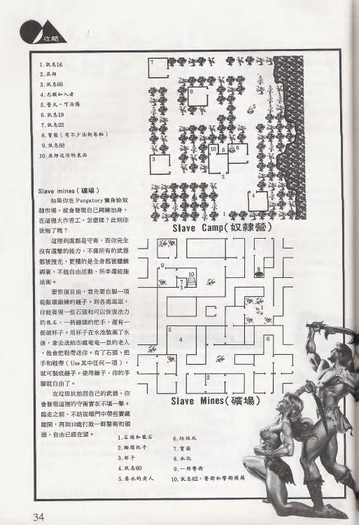

**簡介**:若在 Purgatory 賣身奴隸營,會發現自己鋼鏈加身、不能自由活動,但仍能施法術。要恢復自由,須先製作能驅退鋼鏈的工具(以龍石/錘子等取得自由),再從暗門帶走寶藏離開,並在礦場第 10 處打敗一群警衛與頭頭。

**事件/圖例表 — Slave Camp 奴隸營**

| 編號 | 內容/事件 |
|---|---|
| 1 | **訊息 16** |
| 2 | 巫師 |
| 3 | **訊息 68** |
| 4 | 志願加入者 |
| 5 | 營火,可治傷 |
| 6 | **訊息 19** |
| 7 | **訊息 22** |
| 8 | 寶箱(有不少法術卷軸) |
| 9 | **訊息 88** |
| 10 | 巫師送你的東西 |

**事件/圖例表 — Slave Mines 礦場**

| 編號 | 內容/事件 |
|---|---|
| 1 | 石頭和龍石 |
| 2 | 鋤頭把手 |
| 3 | 杯子 |
| 4 | **訊息 60** |
| 5 | 要水的老人 |
| 6 | 垃圾坑 |
| 7 | 寶箱 |
| 8 | 水池 |
| 9 | 一群警〔衛〕 |
| 10 | **訊息 62**。醫師和警衛得到〔?〕 |

**📖 此處觸發的手冊段落**

> **段落 16**
>
> 在你的前方是一些破落的小屋。有一群人正圍著火堆烤火,他們看你看到你的到來就紛紛圍了過來。其中一個沒有牙齒的男人顯然是這群人中的領袖:「我們看到你游過海灣,任何波卡的敵人是我們的朋友。來吧!坐到火邊來。」

> **段落 19**
>
> 大約一小時之後,這個傷者的燒退了,而他也清醒了。他帶著微笑說:「我做了一個夢。我夢見我浮在地底下一個巨大的黑色池子中。我看到一位美麗的女神被鐵鍊綁在一由怪獸守著的小島上。我想我大概發瘋了。」
>
> 那個人接著繼續說:「我的名字叫做烏瑪(Ulm),謝謝你幫我退燒。我從波卡城的一個秘密通道逃了出來,可是在過橋時因為沒有正確的文件,而被守衛打傷。從那以後我就不時

> **段落 22**
>
> 這個小木屋被當成她瑪星上許多宗教的共同廟宇。一位教士帶你四處參觀,廟中最主要部份是祭祀黑暗女王——艾卡拉(Irkalla)和她的配偶那迦(Nergal)。教士解釋說在地底世界神祇的信仰仍是非常為流傳,或許是因為人們相信他們所住的世界是地獄的延續吧!這裏同時也祭拜了得魯依的守護神——半人獸安奇度(Enkidu)和猾羨之神菲(Refeek)。教士領你對他們一一膜拜,並且告訴你最好向他們全部祈福才能得到所有的祝福。

> **段落 60**
>
> 你們被送到軍營,並且開始工作。軍隊並不供應你的食物或任何訓練。他們認為你們是一群刺客,而他們正希望你們如此。
>
> 你們被安置在拜占儂城牆下的軍營中。這個城市已經頑強地抵擋納達和他的軍隊長達數月之久。圍城的軍隊正準備一場激烈的攻擊,而你們是他們打算用來逃過城牆的不幸者之一。由於他們的人數眾多,因此逃走似乎是不可能的。
>
> ⚠ **編號疑點**:訊息 60 標在 Slave Mines 礦場,但段落 60 內容屬 **Siege Camp / Byzanople 軍營**語境,與礦場不符。詳見文末。

> **段落 62**
>
> 最後一個守衛倒倒了下去,整個礦坑陷入一片寧靜。有一個梯子伸向外面,你在昏暗中似乎看到一點亮光。你心中想著終於自由了,可是不知道是否有其他事情在坑外等你。

> **段落 68**
>
> (本段在此頁掃描中與段落 67 的文字部分重疊,需人工複核斷句。可辨識核心內容:)
> 這是一個充滿了人肉販子的叫罵聲和帶著廉價香水味的笑聲。在這裡像你這樣的人會被賣給她瑪的內地居民。
> 由奴隸市場的門邊你看到剛有一些青年被賣掉。他們看來比你們還不健康,像這樣當奴隸雕開這裡是很可悲的,可是至少總比餓死在波卡城的街上要好得多了。
> 你焦急地四處張望,希望能找到一個仁慈的買主。可是一旦你站在拍賣台上又有誰能保證你一定會有個好主人呢?你又是否能夠安於當個奴隸呢?
> 雖然在你前面還有許多多等著拍賣,可是輪到你也只是時間早晚的問題了。

> **段落 88**
>
> (前段續至此頁頂端:)
> 據地。有幾個士兵在入口前漫步,他們用懷疑的眼光看著你們。
>
> 在這棟建築物裏你發現有一些老人正圍著桌子在玩著擲骰子遊戲,他們說著你聽不懂的方言。他們歡迎你一起加入遊戲。
>
> 這些人只是為了有趣而玩這個遊戲,遊戲中有很複雜的賭博技巧,可是卻看不到金錢的交換,他們似乎並不在乎你是富有或是貧窮。經過一段時間之後,你開始有點了解他們所說的話。
>
> 他們似乎自外於戰爭,由於戰爭和驅逐才使他們移居到這裏。由他們口中你知道一些她瑪最近的事件……(後續詳述她瑪內陸島嶼、養龍、京雄城在納達協助下擴張、唯餘拜占儂與自由港等大段背景;完整內容見 `34_READ_PARAGRAPHS.md` 段落 88。)
>
> ⚠ **編號疑點**:訊息 88 標在 Slave Camp 奴隸營,但段落 88 內容屬 **Siege Camp 軍營**的擲骰子老人語境。詳見文末。

---

### 5.3 Mog's Slave Estate 莫格的宅院 + Tars Ruins 塔斯廢墟

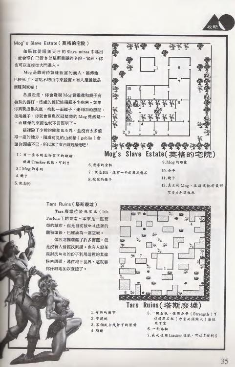

**簡介(莫格的宅院)**:從 Slave Mines 暗門逃出後,可朝 **Mog(莫格)**宅院走去(亦可由正門進)。Mog 是已死的奴隸販子。地下迷宮裡的 goblin(山妖怪)會讓你頭痛,拿了東西就走。

**簡介(塔斯廢墟)**:**Tars(塔斯)廢墟**位於更東方,本是繁榮城市(Isle Forlorn 絕望島〔?〕),自遭納達瘟疫後淪為廢墟。需仔細找入城密道通往地下世界。

**事件/圖例表 — Mog's Slave Estate 莫格的宅院**

| 編號 | 內容/事件 |
|---|---|
| 1 | 有不明生物蹤跡,使用 Tracker 追蹤技能可到 2 |
| 2 | Mog(莫格)的房間 |
| 3 | 鏡子 |
| 4 | **訊息 99** |
| 5 | 〔?〕 |
| 6 | 發霉的食物 |
| 7 | **訊息 105**,還有一些武器〔?〕 |
| 8 | 破裂的鏡子 |

**事件/圖例表 — Tars Ruins 塔斯廢墟**

| 編號 | 內容/事件 |
|---|---|
| 1 | 奇特的廟宇 |
| 2 | 守護蛇 |
| 3 | 某個武士殘留下的裝備 |
| 4 | 陷阱 |
| 5 | 一塊石板,使用 Strength 力量〔?〕 |
| 6 | 寶藏室〔?〕 |

**📖 此處觸發的手冊段落**

> **段落 99**
>
> (前段續至此頁頂端:)
> 的路途真不適合心臟衰弱的人……(前半為段落 98 的續寫,描述拯救山朝聖路途。)
>
> 在這個不通風的房間中,你發現一本傳記。由傳記中你知道這個房子的主人是一個叫做莫格(Mog)的人,一個由採礦事業獲取大量錢財的有錢貴族。由所有的跡像顯示他是一個有錢但卻很粗俗的人,他自認為是一個藝術家。這本傳記大量地記載了莫格在藝術方面的失敗。
>
> 莫格承認在追求藝術的過程中他使用了煉金術,他甚至利用藥物將人變成石頭,可是所得到的結果並不能令他滿意。
>
> 在傳記結束時,莫格提到他「需要一個助手」。看來這個助手他完成了許多創作……(後段續述助手代價很高、可能不是人;完整見段落 99。)

> **段落 105**
>
> 由這個房間的種種跡象顯示這裡曾經關過很巨大的生物。角落上大堆的草料顯示這裡曾有很大的生物睡過。四周牆壁上的爪痕和撞擊痕跡,使你覺得很不舒服。

---

### 5.4 Tars Ruins 地下室 + Guarded Bridge 守橋 + Yellow Mud Toad 前導 + Phoebus 圖例

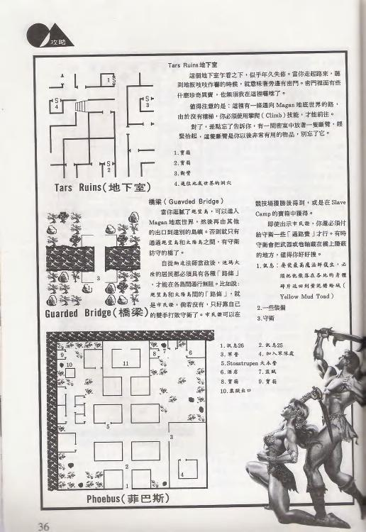

**簡介(塔斯地下室)**:此地下室在大水之下,年久失修。走路聽到地板作響時,旁邊可能有珍貴的東西。

**簡介(守橋)**:逛膩絕望島後,可進 Magan 地底世界由其他出口到別島,否則只能通過絕望島與太陽島之間的**守橋**。市民證可在競技場獲勝或 Slave Camp 取得;即使出示證件,仍須給守衛過路費。

**事件/圖例表 — Tars Ruins 地下室**

| 編號 | 內容/事件 |
|---|---|
| 1 | 寶箱 |
| 2 | 寶箱 |
| 3 | 斷臂 |
| 4 | 通往地底世界的洞穴 |

**事件/圖例表 — Yellow Mud Toad 前導(本頁右上)**

| 編號 | 內容/事件 |
|---|---|
| 1 | 〔?〕 |
| 2 | 一些建築 |
| 3 | 守衛 |

**事件/圖例表 — Phoebus 菲巴斯(承下頁)**

| 編號 | 內容/事件 |
|---|---|
| 1 | **訊息 26** |
| 2 | **訊息 25** |
| 3 | 軍營 |
| 4 | 加入軍隊處 |
| 5 | Stossstrupen〔?〕大本營 |
| 6 | 酒店 |
| 7 | 盜賊 |
| 8 | 寶箱 |
| 9 | 寶箱 |
| 10 | 監獄出口 |

> 守橋段未見獨立編號圖例(地圖僅標少數點位 6/7/8/11),以敘述為主,本文件不另列段落。

---

### 5.5 Phoebus 菲巴斯城 + Phoebus Dungeon 菲巴斯地牢

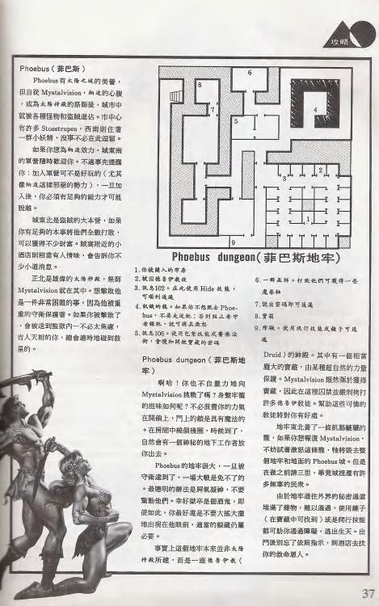

**簡介(菲巴斯城)**:**Phoebus(菲巴斯)**曾為貿易大都市,自 **Mystalvision(美斯達)**出現後成為太陽神勢力範圍,城中設有各種怪物與據點(Stossstrupen)。西側住著一群小妖精(goblin)。

**簡介(菲巴斯地牢)**:向 Mystalvision 挑戰者會被囚於此。地牢中有 **Druid(德魯伊)神殿**,藏有富靈力的寶藏,須與德魯伊教徒對抗才能取得。地牢東北邊養著一條飢餓的龍——可試著激怒牠,牠將毀去整個地牢與地面的 Phoebus 城(但城中尚有無辜民眾,做前請三思)。逃生通道堆滿雜物,可用鏈子或爬行技能通過;出門後到酒店找救命恩人。

**事件/圖例表 — Phoebus Dungeon 菲巴斯地牢**

| 編號 | 內容/事件 |
|---|---|
| 1 | 〔?〕關入的牢房 / 德魯伊教徒 |
| 2 | **訊息 102**。在此使用 Hide 隱藏技能,〔順〕利通過 |
| 3–5 | 與龍相關(不想毀 Phoebus 就別走近;阻止看守可將其激怒) |
| 6 | 一群巫師。打敗可獲魔卷軸 |
| 7 | 說出密碼即可通過(用包紮技能或醫療法〔?〕獲知開啟寶藏的密碼) |
| 8 | 寶箱 |
| 9 | 障礙。使用爬行技能或鏈子可通過 |

**📖 此處觸發的手冊段落**

> **段落 25**
>
> 「歡迎光臨菲巴斯(Phoebus)太陽之城(City of the Sun)!」一個奇怪的機械聲音說。你站在街口四處尋找聲音的來源。幾分鐘之後,當聲音再度響起時,你看到一個突起的石壇祭壇,而聲音則是由你的到來所啟動……(中段機械聲反覆歡迎、祭壇地圖、機械手、黑衣人注視;完整見段落 25。)「歡……迎……」

> **段落 26**
>
> 這個城市的城牆是由光亮的大理石所造成看起來似乎由裏面發光。城內的街道整齊而乾淨,看不到一絲貧窮的痕跡。馬車來回地奔馳著,你實在很難將這座城市和即將到來的災難連想在一起。

> **段落 102**
>
> (前段續至此頁頂端:)
> 是個能帶你到可以幫助你的人的通道。很抱歉我沒有辦法給你武器,就光做這些事已經給我帶來很多危險。
> 如果你逃出去之後,到城市東北方的冒險酒店(Icarian Triumph Tavern)和我見面,我有一些東西要給你。
> 為了太陽和正義,我永遠是你的朋友。
>
> 這裏是獄卒的房間,肥胖的獄卒醉倒在桌上。他趴在桌上,可是手上卻綁了一條繩子,繩子另一端有一個鈴。只要他一移動,鈴就會響,而且招來守衛。獄卒不醒人事,可是守衛卻隨時可能醒來。

> 此段承接段落 101(**Berengaria 貝雷**的紙條),正是菲巴斯地牢的越獄線索,與圖例第 2 點「訊息 102」語境吻合。✓

---

### 5.6 Mystic Wood 神祕林(第 26 期起)

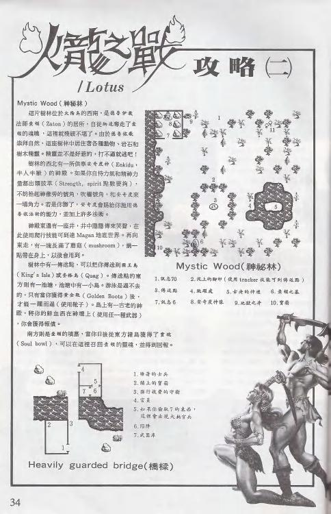

**簡介**:**神祕林(Mystic Wood)**位於某城西南方,是德魯伊系法師(用 Zaton〔?〕法術)的大本營,森林裡有許多陷阱與怪物,進入前最好練高德魯伊魔法。林中與 **Enkidu(恩奇杜)半人半獸**及力量(Strength)/精神(Spirit)檢定相關;可用吹奏號角、Beast Call 呼叫野獸等技能。某處藏有 **Golden Boots 黃金之靴**的一隻(須湊成一雙)。

**事件/圖例表 — Mystic Wood 神祕林**

| 編號 | 內容/事件 |
|---|---|
| 1 | **訊息 70** |
| 2 | 泥土上的腳印(使用 Tracker 技能可到達傳送點) |
| 3 | 傳送點 |
| 4 | 跳躍處 |
| 5 | 古老的神壇 |
| 6 | 韋頓之墓〔?〕 |
| 7 | **訊息 6** |
| 8 | 安奇度神像〔?〕(即 Enkidu) |
| 9 | 地獄之井 |
| 10 | 寶箱 |

**📖 此處觸發的手冊段落**

> **段落 6**
>
> (前段為段落 5 的續寫,屬第 1 頁文字延伸至此頁頂端:)
> 雖然惡臭令人幾乎無法忍受,可是在好奇心的驅使下,你還是湊近去觀察……(前半屬段落 5 續寫:屍體儲存所、裝屍袋拋向牆、波卡城死者被丟入海中、裝死逃生的念頭;完整見段落 6 上半。)
>
> 你發現了一座簡陋的神廟,由一位寂寞的得魯依教士守著。教士告訴你這是一座歡迎所有人朝拜的廟。神廟看起來十分原始,牆壁似乎深深地埋入地下,石頭則似乎是動物的靈魂,空氣是清新的。你發現這座神廟所祭奉的神祇是半人半獸的安奇度(Enkidu)。教士向你解釋:「安奇度是一個半人半獸的神,他欣賞正直而又強壯的人,並且傳授授他的最大恩惠。在納達頒下禁令之前,祂佔有這座森林之中的得魯依廟,而今安奇度已不知去向。兄弟們都已經散去,而我們所熟知的法術也因而失傳。」

> **段落 70**
>
> 這個庵林中巨大的橙樹形成了一條綠色的通道,而陽光照耀下形成了一幅美麗的圖畫,這真是一個奇妙的地方。

---

### 5.7 War Bridge 重兵守橋 + Lansk 蘭斯克

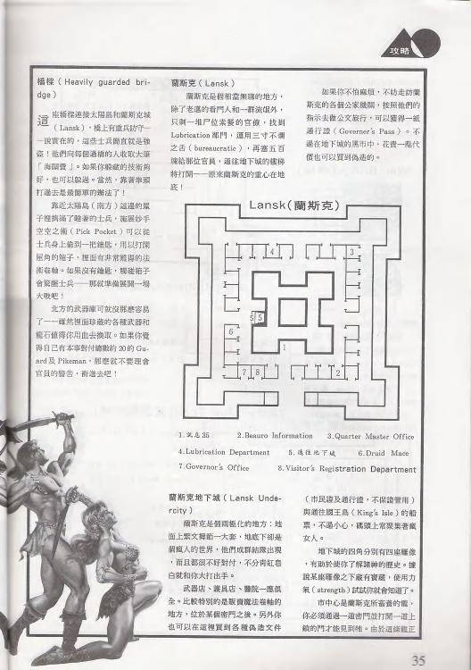

**簡介(守橋)**:連接神祕林(太陽島 the Sun's Isle 與 **Lansk 蘭斯克**之間)的重兵守橋。過橋會碰上強敵守衛(大軍/海關官員),可用 Pick Pocket 扒竊取得官員證件/鑰匙,或製造混亂引開守衛;亦可出示後段拿到的公文/通行證放行。北方武器庫會回應警鈴引來增援,建議不要硬碰。

**簡介(蘭斯克)**:一座開鑿於山壁的城市,是官僚/軍事重鎮。城內有 Lubrication 部門、Bureau Information 詢問處等;辦完官僚流程可拿通行文件,並有前往地下城的入口。取得官方公文後可搭船前往京雄王島(King's Isle / Kingshome);地底城黑市可花錢直接買通行證。

**事件/圖例表 — Lansk 蘭斯克**

| 編號 | 內容/事件 |
|---|---|
| 1 | **訊息 35** |
| 2 | Beauro Information(詢問處) |
| 3 | Quarter Master Office(軍需官辦公室) |
| 4 | Lubrication Department(潤滑/上油部門) |
| 5 | 通往地下城 |
| 6 | Druid Mace(德魯伊權杖) |
| 7 | Governer's Office(總督辦公室) |
| 8 | Visitor's Registration Department(訪客登記處) |

**📖 此處觸發的手冊段落**

> **段落 35**
>
> 在蘭斯克城(Lansk)的中央有座巨大的建築物,和這個城市的城牆不同的是這棟建築的牆壁看起來十分堅固。建築物的四周有著嚴森嚴的守衛,並且有用許多種文字寫成的標語不准任何人接近。你由建築物的間隙中,你看到怪物十分巨大,幾乎塞滿了整個的空間。看起來它至少有八噸重,雖然它現在正在瞌睡,可是一樣令人感到害怕。
>
> 建築物上的看板說明了這條龍是這座城市的最主要防禦手段。一旦這座城市遭受無法抵擋的攻擊時,這條龍就會被釋放出來毀了這座城市和攻擊這座城市的軍隊。這條龍是由昂貴的血的奉獻來餵養,大部份是將罪犯丟入龍坑之中。你不禁為這條龍感到悲哀,這並不是一條令人見人怕的火龍,看起來倒像是一條被養得太胖的怪物。

---

### 5.8 Lansk Undercity 蘭斯克地下城 + Yellow Mud Toad 黃泥蟾蜍城

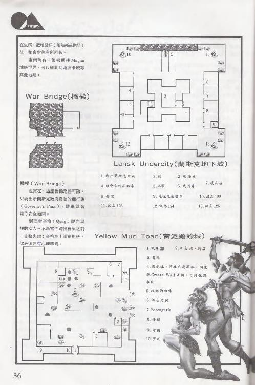

**簡介(蘭斯克地下城)**:由蘭斯克城地圖右下角的樓梯口往下進入,依市民證/通行證查驗;若以市民身分通行需出示往京雄王島的船票。四角各有一座雕像對應一種屬性檢定,依提示通過後可開後續門與地底世界出入口。生病/中毒時留好蘑菇會有回報。東南角有傳送通往 Magan 地底世界。

**簡介(黃泥蟾蜍城前導)**:別理會奎格(Quag)觀光局裡的女人;跨橋前先有心理準備——奎格島上滿布樹林(有強敵/陷阱)。

**事件/圖例表 — Lansk Undercity 蘭斯克地下城**

| 編號 | 內容/事件 |
|---|---|
| 1 | 通往蘭斯克地面 |
| 2 | 龍 |
| 3 | 魔法店 |
| 4 | 販賣文件及船票 |
| 5 | 碼頭 |
| 6 | 武器店 |
| 7 | 護具店 |
| 8 | 醫院 |
| 9 | 通往地底世界 |
| 10 | **訊息 122** |
| 11 | **訊息 123** |
| 12 | **訊息 124** |
| 13 | **訊息 125** |

**事件/圖例表 — Yellow Mud Toad 黃泥蟾蜍城**

| 編號 | 內容/事件 |
|---|---|
| 1 | **訊息 29** |
| 2 | **訊息 30** / 商店 |
| 3 | 魔法水 |
| 4 | Create Wall 法術,可造牆到這個水域〔?〕 |
| 5 | 拉娜的雕像(Lanac'toor 雕像) |
| 6 | 酒店走廊 |
| 7 | Berengaria(蓓蕾賈莉亞〔暫譯〕) |
| 8 | 神殿 |

**📖 此處觸發的手冊段落**

> **段落 29**
>
> 費盡千辛萬苦穿過沼澤之後,你終於拖著疲憊的身體來到了黃泥蟾蜍城(City of Yellow Mud Toad)。這裏的城牆已下垂並且沾滿了污垢,這個城市的味道和它周圍的沼澤一樣難聞。發出惡臭的死水和泥坑沖滿了城市的街道。人們慢吞吞地沒精打采地在路上行走,連看也不看你一眼。

> **段落 30**
>
> 在城牆下的一個不甚起眼的地方,你發現了一家賣拉娜(Lanac'toor)紀念品的小商店。你很好奇走了進去,當你開門時一個看不見的鈴聲響起……(中段與段落 29 重疊,需人工複核;描述拉娜紀念品商店、各種印有拉娜面容的器具、角落一堆無用垃圾含奇怪金屬片/城牆瓦片/黃泥蟾蜍像;完整見段落 30。)

> **段落 122**
>
> 這是地底之后艾卡拉(Irkalla)的雕像,如果你想在這地底世界生存,你就必須向祂祈求。祂常和祂的丈夫那迦(Nergal)爭吵。

> **段落 123**
>
> 這是地底之王那迦(Nergal)的雕像,當他和艾卡拉(Irkalla)不和之後,他就被放逐到奈羅波裡(Necropolis)——藏於她瑪(Dilmun)諸島中的一個死亡之城。那迦是個又胖胖又可笑的傢伙,不過由他的眼中你可能看到一些幽默的東西。

> **段落 124**
>
> 這是永恆神祇(Universal God)的雕像,全世界最古老的神祇。祂是一個沒有臉而有很多手臂的神,每一隻手都比著不同的形狀,代表著希望和平。據說祂能給予所有渴望自由而努力的人力量。祂是傳說中自由港(Freeport)英雄羅拔(Roba)的守護神。祂在尼塞山(Nisir)的神廟每年都吸引了上百萬的信徒前去朝聖。

> **段落 125**
>
> 在這裡你發現了安奇度(Enkidu)的像,祂是動物和得魯依人的守護神。祂的信仰在荒野是很盛行,可是自從納達興起之後,卻很少在城市中看到了。

> 註:段落 122–125 正是蘭斯克地下城四角的四座神像(艾卡拉/那迦/永恆神祇/安奇度),與圖例 10–13「訊息 122–125」完全吻合。✓

---

### 5.9 Yellow Mud Toad 黃泥蟾蜍城 + Lanac'toor's Lab 拉娜的實驗室

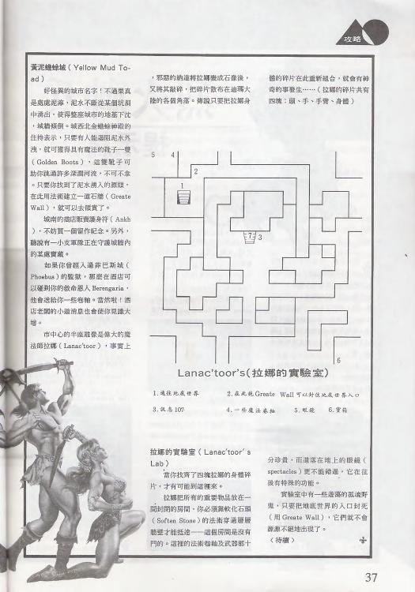

**簡介(黃泥蟾蜍城)**:處處泥濘、城牆極厚的城市。城中蟾蜍住持女巫處,只要有一雙 **Golden Boots 黃金之靴**即可助你渡過泥濘水域。找到泥水源頭後,用 **Create Wall 造牆**法術可到城中心。酒店藏有 **Ankh 護身符**。城中心半毀雕像是魔法師 **Lanac'toor(拉娜)**——被 **Namtar(納達)**變石像後敲碎,碎片(頭/手/手臂/身體共四塊)散布迪瑪大陸;重組可觸發神奇事件。

**簡介(拉娜的實驗室)**:由黃泥蟾蜍城經傳送/暗門進入。在此用 Create Wall 可封住地底世界入口或開通道;實驗室可拿到拉娜碎片。集齊四塊是重組拉娜、推進主線的關鍵。文末以「(待續)」接第 27 期。

**事件/圖例表 — Lanac'toor's Lab 拉娜的實驗室**

| 編號 | 內容/事件 |
|---|---|
| 1 | 通往地底世界 |
| 2 | 在此施 Create Wall 以封住地底世界入口 |
| 3 | **訊息 107** |
| 4 | 一些魔法藥物 |
| 5 | 暗道 |
| 6 | 寶箱 |

**📖 此處觸發的手冊段落**

> **段落 107**
>
> (前段續至此頁頂端:)
> 夕之間,你所能做的只是使他舒服一些。
>
> 這個高塔房間已經很殘破不堪,支柱正在下沈,一半以上的地板則淹在墨水般的黑水中。四散破碎的玻璃瓶到處散佈在地板上。這裏看起來像是個被火和水所破壞的魔法實驗室。
>
> 在一堆屍體中,你發現了一本傳記的一部份。大部份的內容是用你所不懂的魔法文字所記載的,不過由日期是在黃泥蟾蜍城(City of Yellow Mud Toad)被毀之前。你推測這本傳記是屬於拉娜的。
>
> 「小雞們還是活的,可是看來也存活不了多久。傲美斯達(Mystalvision)改變了遊戲規則……我遺失了烏娜(Utnapishtim the Faraway)送我的眼鏡。沒有它我看不見地底世界的入口……」(拉娜的日記,提到遺失 Spectacles 眼鏡、找通往地底世界的入口;完整見段落 107。)
>
> 此段正是拉娜實驗室的高塔房間與拉娜日記,與圖例第 3 點「訊息 107」吻合。✓

---

### 5.10 Smuggler's Cove 海盜竊穴 + The Necropolis 奈羅波裡(第 27 期起)

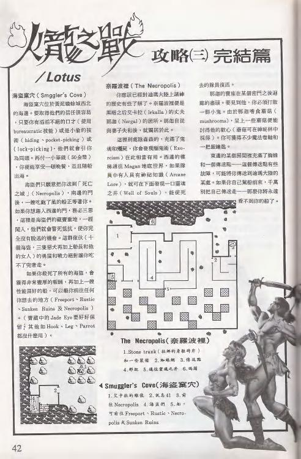

**簡介(海盜竊穴)**:位於黃泥蟾蜍城海邊。取得藏在此的寶箱需高 Lockpick 開鎖或 Pick Pocket 扒竊。藏在此的 **Jade Eye 翠玉之眼**要留好(後面矮人城堡會用到)。

**簡介(奈羅波裡/陳屍所)**:可向 **Irkalla(伊爾卡拉)**的丈夫 **Nergal(奈羅)**〔?〕與妻子求助,讓亡魂(死去隊員)復活。蘑菇(mushrooms,可在神祕林找到)在此有用。傳送陣會把人傳到很遠處(勿誤踩)。

**事件/圖例表 — The Necropolis 奈羅波裡**

| 編號 | 內容/事件 |
|---|---|
| 1 | 石棺(柩裡的身軀有碎片) |
| 2 | 神祕林 |
| 3 | 黃泥蟾蜍 |
| 4 | 蘑菇 |
| 5 | 魔法寶劍處〔?〕 |
| 6 | 碼頭〔?〕 |

**事件/圖例表 — Smuggler's Cove 海盜竊穴**

| 編號 | 內容/事件 |
|---|---|
| 1 | 父子扒的男孩 |
| 2 | **訊息 41** |
| 3 | 前往 Necropolis |
| 4 | 海盜竊穴〔?〕 |
| 5 | 前往 Freeport / Rustic / Necropolis 或 Sunken Ruins〔?〕 |

**📖 此處觸發的手冊段落**

> **段落 41**
>
> 當你付給他們金子的時候,這些海盜變得十分客氣,他們給了你一頓粗劣的晚餐和劣酒。海盜頭子說:「我的名字叫醜約翰(Long John Ugly),這是我的女人佩格(Peg)。」……(海盜頭子醜約翰一段:原是絕望島泰森城(Tarsian)海軍、泰森城在與納達戰爭中滅亡、靠搶劫為生、勒索玩家、最後願帶你去奈羅波裡(Necropolis),指示由南邊的門碰面;完整見段落 41。)

> 此段正是海盜竊穴的醜約翰劇情,與圖例第 2 點「訊息 41」吻合。✓

---

### 5.11 Magan Underworld 瑪根地底世界(大圖)

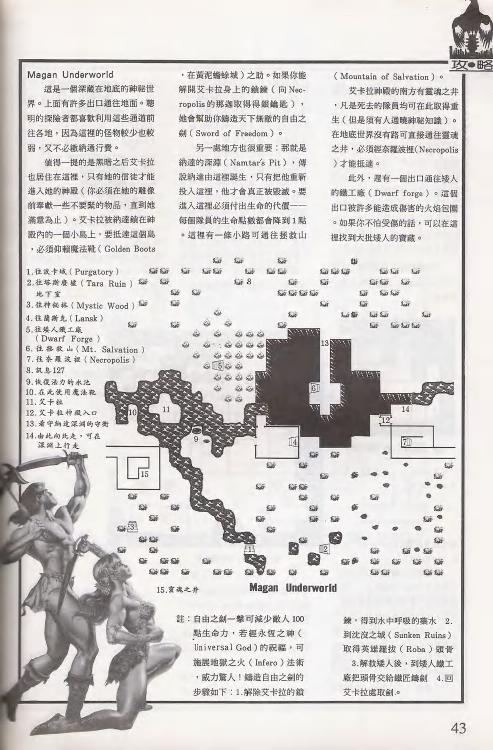

**簡介**:一個龐大的地底神祕世界,上面有許多出入口連往地面,怪物多半很強。主軸任務:取得 **Sword of Freedom 自由之劍**。關鍵地名/詞:Namtar's Pit 納達之坑/深淵、Well of Souls 靈魂之泉、Mountain of Salvation 救贖之山、Necropolis 陳屍所、Inferno 地獄之火法術、Climb 攀爬技能、Golden Boots 黃金之靴、Dwarf Forge 矮人鑄爐。

**鑄劍 SOP(本期列出)**:1. 解除 Irkalla(艾卡拉)的詛咒 → 2. 取得水中呼吸藥水(→ Sunken Ruins 沉沒之城)→ 3. 解救矮人(→ 矮人鐵廠請鐵匠鑄劍)→ 4. 回 Irkalla 處取劍。自由之劍經 Irkalla / Universal God 永恆之神祝福,一擊可減敵 100 點生命。

**事件/圖例表 — Magan Underworld 瑪根地底世界(對開大圖)**

| 編號 | 內容/事件 |
|---|---|
| — | 含 Purgatory(波卡城)、Necropolis(陳屍所)、Dwarf Forge(矮人鑄爐)、Wall of Souls〔?〕等出入口 |
| 15 | 寶藏之井 |

> 本大圖以地表/地底連接示意為主,未標單一「訊息 N」觸發點;另可參照段落 94(Apsu Waters 亞蘇水)、127(地底世界英雄指引)、137(Irkalla 被銀鍊綁住)等地底世界相關段落。

---

### 5.12 Old Dock 老碼頭 + Bridge of Exiles 放逐橋 & Snakepit 蛇窟

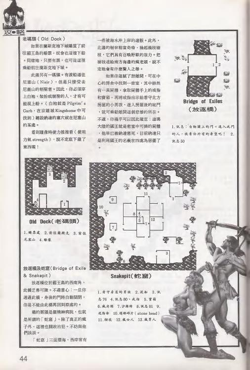

**簡介(老碼頭)**:從黃泥蟾蜍城購得往孤島的船票即在此下船;可再搭船往奈羅波裡下城。此處可通往 **Nisir 尼塞山**,但需穿著 **Pilgrim's Garb 朝聖者之袍**(在 Kingshome 京雄城取得),並用 Strength 力量推門。

**簡介(放逐橋)**:位於孤島西南角。一旦通過此橋,身後的門將自動關閉;橋的那頭是放逐瘋子的精神病院。

**簡介(蛇窟)**:接放逐橋,位於王島西北角,三面環海。

**事件/圖例表 — Bridge of Exiles 放逐橋**

| 編號 | 內容/事件 |
|---|---|
| 1 | 訊息「自動關上的門。進入此門吧」 |
| 2 | **訊息 50** |

**事件/圖例表 — Snakepit 蛇窟**

| 編號 | 內容/事件 |
|---|---|
| 1 | 前往男孩 |
| 2 | 波船 |
| 3 | 訊〔?〕 |
| 4 | 寶箱〔?〕 |
| 5 | 前往 **訊息 80**、威脅 |
| 6 | 寶箱 |
| 7 | 沙海神 |
| 8 | **訊息 81** |
| 9 | 塔郎時片(stone head 石頭) |
| 10 | 瘋女人 |
| 11 | 樹枝 |
| 12 | 瘋男人 |
| 13 | …… |

**📖 此處觸發的手冊段落**

> **段落 50**
>
> 由你背後的這個門所傳出的聲音喚起了死亡終結的感覺。由橋的門和牆層看起來應該是隔音的,因為當你一離開之後,立刻便受到各種咆哮聲的攻擊。雖然你無法找到聲音的來源,尖叫聲似乎從四面八方傳來。這樣的聲音已經足以讓人入瘋狂。
>
> 此段正是放逐橋過橋後的咆哮聲場景,與圖例第 2 點吻合。✓

> **段落 80**
>
> 在這一群小屋中有一個密密的小房間,房間之中有一個身穿皇家衣服的人坐在寶座上。不管他是誰,顯然他已經死去很久。在他的手指間有一個帶有皇家印記的戒指發出微弱的光,看起來非常昂貴。

> **段落 81**
>
> 當你走進房間時,一個侏儒很高興地跳起來,當他發現你們並不是侏儒們時,又很失望地坐下。你聽到他口口喃喃地唸道:「再也不會有其他的侏儒們了,我和我的喬瑟拉(Josephina)將會永遠地孤獨。」
>
> 「國王已經滅亡了,偉大的廳堂被封閉了,而所有的侏儒都在地下室中長眠。納達偷了我們神祇的眼睛並且將它丟到海裏,我日日夜夜地尋找,仍然毫無所獲。」喬瑟不斷地哭泣,幾乎已經忘了你的存在。

---

### 5.13 Dwarf Ruins & Clanhall 矮人廢墟與城堡 + Siege Camp 軍營

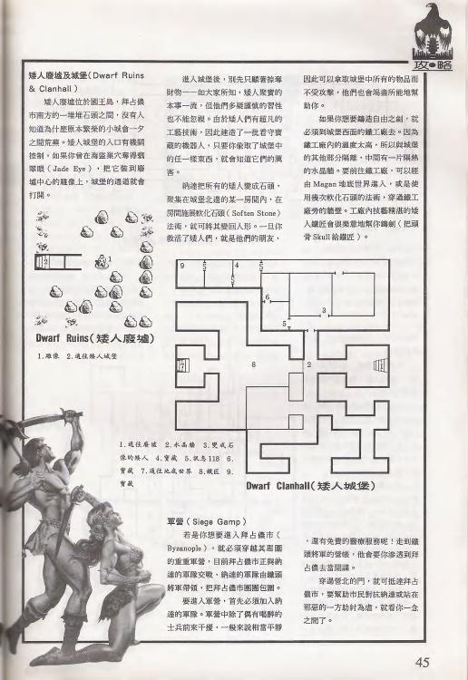

**簡介(矮人廢墟與城堡)**:矮人廢墟位於國王島市南方石頭之間。城堡(Clanhall)有機關控制,把 **Jade Eye 翠玉之眼**裝到牆壁雕像上,城堡通道就會打開。進城後別亂取財物;遇 **Soften Stone 軟化石**法術可軟化石牆。救出矮人後,矮人鐵匠願幫你鑄劍(把 Skull 骷髏頭給鐵匠)——這是製自由之劍的關鍵一環。

**簡介(軍營)**:要進拜占儂市 Byzanople 須先穿越軍營;拜占儂軍隊正與納達軍隊交戰、被圍困。

**事件/圖例表 — Dwarf Ruins 矮人廢墟**

| 編號 | 內容/事件 |
|---|---|
| 1 | 雕像 |
| 2 | 通往矮人城堡 |

**事件/圖例表 — Dwarf Clanhall 矮人城堡**

| 編號 | 內容/事件 |
|---|---|
| 1 | 通往廢墟 |
| 2 | 水晶 room〔?〕 |
| 3 | 雙叉石 |
| 4 | 寶箱 **訊息 118** 等 |
| 5 | 訊息…… |
| 7 | 通往地底世界 |
| 8 | 礦匠 |
| 9 | 寶 |

**📖 此處觸發的手冊段落**

> **段落 118**
>
> 一個巨大的機器人靜靜地站在這個房間之中,它是一個毫無瑕疵的工藝品看起來很巨大而且全身都披滿了盔甲。在黑暗的走道中遇到這個東西實在不是一件好事。

---

### 5.14 Siege Camp 軍營 + Byzanople 拜占儂市 & 地下指揮部

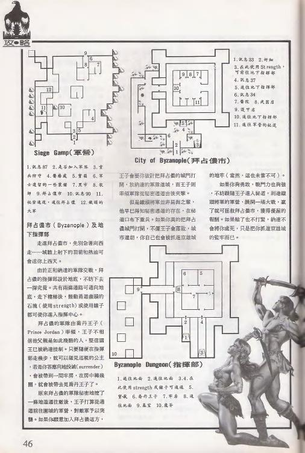

**簡介(拜占儂市)**:城牆上殘破旗幟仍飛揚,四周圍繞納達軍隊。城牆上射下的羽箭與熱油可造成 1~5 天傷害(休息恢復)。可用 Strength 力量或撬棍開石塊下到地下指揮部。劇情見 **Prince Jordan 喬丹王子**;王子不信任你(怕是納達奸細),會給「投降 surrender」選項,拒絕後可下指揮部。

**事件/圖例表 — Siege Camp 軍營**

| 編號 | 內容/事件 |
|---|---|
| 1 | **訊息 87** |
| 2 | 是否加入軍隊 |
| 3 | 寶 |
| 4 | 醫療處 |
| 5 | 寶箱 |
| 6 | 古道時的一些寶物〔?〕 |
| 9 | 將士 |
| 10 | **訊息 90** |
| 11 | 訊息…… |
| 12 | 攻城戰的大軍 |

**事件/圖例表 — City of Byzanople 拜占儂市**

| 編號 | 內容/事件 |
|---|---|
| 1 | **訊息 33** |
| 2 | 封細〔?〕 |
| 3 | 武器使用 Strength,可前往地下指揮部 |
| 4 | **訊息 87** |
| 5 | 通往地下指揮部 |
| 6 | **訊息 34** |
| 7 | 寶 |
| 8 | 武器店 |
| 9 | 寶箱 |
| 10 | 通往地下指揮部 |
| 11 | 通往軍營的祕道 |

**事件/圖例表 — Byzanople Dungeon 拜占儂市地下指揮部**

| 編號 | 內容/事件 |
|---|---|
| 1 | 通往地面 |
| 2 | 用 Strength 或撬子可通過 |
| 4 | 喬丹王子 |
| 6 | 萬聖之神的雕像 |
| 7 | 寶箱 |
| 10 | 醫客〔?〕 |

**📖 此處觸發的手冊段落**

> **段落 33**
>
> (前段續至此頁頂端:)
> 拉娜和納達起衝突,戰爭隨即展開……(前半為段落 32 續寫:納達召喚龍夷平黃泥蟾蜍城、拉娜變石頭。)
>
> 在你的前方正是拜占儂(Byzanople)城,城牆上殘破的旗幟仍然飛揚著。城的四周圍繞著納達的軍隊。你可以看出這座城市已經被圍困很久了。
>
> 當你向城市前進時,你可以看到軍隊又再展開一波新的攻擊,他們爬過石並且衝撞城牆的大門。可是守城軍英勇的抵抗下攻擊的士兵大概有十分之一而退。

> **段落 34**
>
> 一堆地的碎石圈出了圍城軍隊的營地,而拜占儂市的巨大城牆則只在幾呎之遙。一條彎延的小路穿過碎石而到到城門,而路上散滿了折斷的箭、殘骸和企圖攻城者的屍體。

> **段落 87**
>
> 在前方你看到納達軍隊的軍營。軍營在這二山峰之間的山谷中,木製的柵欄圍住了山谷的出入口,以抵擋來自南方的入侵。
>
> 在這個區域裏並沒有敵人的蹤影,看起來這裡似乎是納達軍隊用來圍城的根〔據地〕……(續至段落 88 頂端。)

> **段落 90**
>
> (前段續至此頁頂端:)
> 容易滿足了。當龍跑出地牢時,你也趕快逃走……(前半為段落 89 續寫:龍掙脫鎖鍊吞下駝背、毀掉太陽城 Phoebus 後向東飛去。)
>
> 這裏是納達軍隊最高指揮官——鐵頭將軍的辦公室。鐵頭將軍坐在桌子後面注視著你……(鐵頭將軍 Buck Ironhead 訓話,給「第二次機會」加入納達一方;完整見段落 90。)
>
> ⚠ **編號疑點**:訊息 90 標在 Siege Camp 軍營圖例第 10 點,段落 90 內容(鐵頭將軍辦公室)語境屬軍營/納達指揮體系,大致相容,但前半屬龍毀 Phoebus 的續寫,斷句需注意。

---

### 5.15 Kingshome 京雄城 & 地牢 + Freeport 自由港(起首)

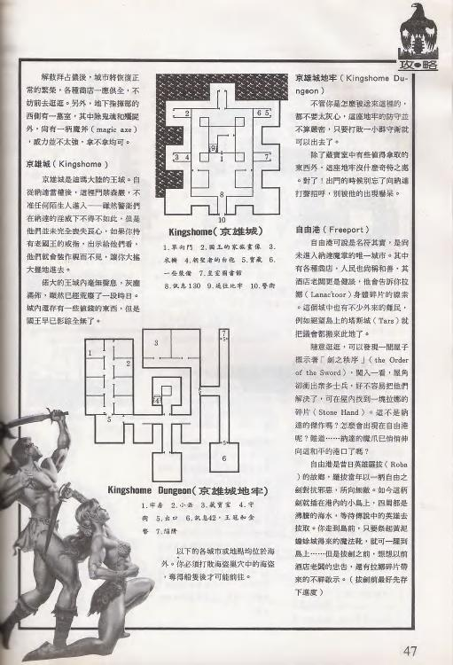

**簡介(京雄城)**:王城。如今不准陌生人進入,一隊垃圾守衛在新城牆上把守。King 國王早已失蹤,城已荒廢,但有少數寶物。**京雄城地牢**守衛不嚴,可分批打散,值得取的東西不少。

**簡介(自由港起首)**:自由港是進入瑪根唯一的城市。線索涉及 Lanac'tor〔?〕、Tarsus/Tars 塔斯、the Order of the Sword 劍之秩序教派、Stone Hand 石手等。

**事件/圖例表 — Kingshome 京雄城**

| 編號 | 內容/事件 |
|---|---|
| 1 | 單向門 |
| 2 | 小巷 |
| 3 | 寶 |
| 4 | 皇家裝置店〔?〕 |
| 5 | 寶箱 |
| 6 | 一隊垃圾守衛 |
| 7 | 皇家暗室 |
| 8 | **訊息 130** |
| 9 | 通往地牢 |

**事件/圖例表 — Kingshome Dungeon 京雄城地牢**

| 編號 | 內容/事件 |
|---|---|
| 1 | 牢房 |
| 2 | 小巷 |
| 3 | 藏寶室 |
| 4 | 寶 |
| 5 | 出口 |
| 6 | **訊息 42**、王冠和金幣 |
| 7 | 熔牆 |

**📖 此處觸發的手冊段落**

> **段落 42**
>
> 在這個陰暗的繪房裏,你發現了她瑪(Dilmun)最偉大統治者杜拉克國王(King Drake)的寶座。寶座被丟在角落並且破爛不堪。在寶座之後你還發現了杜拉克參加典禮用的王冠。你不禁懷疑是不是有什麼地方出了問題?現在是不是還有個真的國王存在?
>
> 此段(杜拉克王冠)與圖例第 6 點「訊息 42、王冠和金幣」吻合。✓

> **段落 130**
>
> 這裡以前是杜拉克國王的宮殿,只有大廳可以隱約看出昔日的光景。曾經富麗亮麗壁底的牆壁,如今是空空如也。空了的基座顯示出這裡曾有許多顯赫的雕像。有許多地方的大理石塊都被拿去建造軍隊的堡壘。這裡再也不是國王的宮殿了。

---

### 5.16 Freeport 自由港(續)+ Royal Game Preserve 皇家專有獵區 + Scorpion Bridge 蠍橋 + College of Magic(起首)

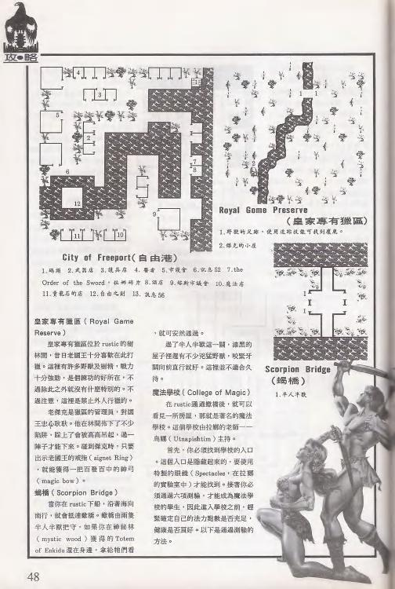

**簡介(自由港續)**:由昔日英雄 **Roba 羅拔**所建。城在一座海島上,島四周海水受魔法作用而沸騰,須等傳送之劍方能入島之門。

**簡介(皇家專有獵區)**:老獵戶為管理員,持國王戒指(Aignet Ring〔?〕)出示可換得 magic bow〔?〕等。

**簡介(蠍橋)**:位於 rustic 城邊,沿海島南向行可達。橋頭有 mystic wood 神祕木與 Totem of Enkidu 恩奇杜圖騰。

**簡介(魔法學院起首)**:在 rustic 城過數座橋後抵達,由魔法師 **Utnapishtim(烏納皮什提姆)**主持。

**事件/圖例表 — Royal Game Preserve 皇家專有獵區**

| 編號 | 內容/事件 |
|---|---|
| 1 | 野獸的足跡(使用 Tracker 追蹤技能可找到獸) |
| 2 | 鋸尤的小屋〔?〕 |
| 6 | **訊息 52** |
| 7 | the…〔?〕 |
| 9 | 前往城市 |
| 10 | 魔法石 |

**事件/圖例表 — Scorpion Bridge 蠍橋**

| 編號 | 內容/事件 |
|---|---|
| 1 | 半人半獸 |

**📖 此處觸發的手冊段落**

> **段落 52**
>
> (前段續至此頁頂端:)
> 的氣息。這裏的人們都穿著布和皮革的衣服,而且看起來都很健康而有活力……(前半為段落 51 續寫,描述自由港居民。)
>
> 碼頭的南方有個小島,島的中央有一個鐵鈷,鐵鈷之中有一把魔法寶劍……一個自由港的居民告訴你:「那是一把自由之劍(Sword of Freedom),它是以前由一個大英雄羅拔(Roba)將它由地底世界中帶出來……」(完整敘述自由之劍傳說、羅拔建城、拔劍者將拯救世界但毀滅城市;完整見段落 52。)
>
> ⚠ **編號疑點**:訊息 52 標在皇家專有獵區圖例第 6 點,但段落 52 內容屬 **Freeport 自由港**(自由之劍傳說)。同頁兼含自由港與獵區,可能為圖例跨區標號或編號偏移。詳見文末。

---

### 5.17 College of Magic 魔法學院(七道測驗)+ Dragon Valley 龍谷(起首)

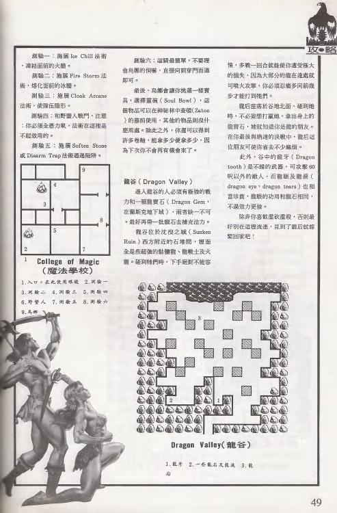

**簡介(魔法學院)**:須通過七道測驗,才能找到 **Spectacles 光譜眼鏡**。七道測驗:

1. **測驗一**:施 **Ice Chill 冰寒**法術,凍結火盆/熔化冰牆。
2. **測驗二**:施 **Fire Storm 火焰風暴**,燒化冰牆。
3. **測驗三**:施 **Cloak Arcane 神祕斗篷**,使隊伍隱形。
4. **測驗四**:和野獸人徒手戰鬥(法術無用,必須全力應戰)。
5. **測驗五**:施 **Soften Stone 軟化石**或 **Disarm Trap 解除陷阱**通過陷阱/石牆。
6. **測驗六**:逃避特殊房間,別貪攻,直接向窗門前進。
7. **測驗七**:按正確順序開門。

通過後可拿 **Soul Bowl 靈魂之碗**相關道具。

**簡介(龍谷起首)**:進入龍谷者須有極強戰力。要取得 **Dragon Gem 龍寶石**。

**事件/圖例表 — College of Magic 魔法學院**

| 編號 | 內容/事件 |
|---|---|
| 1 | 入口 |
| 2 | 測驗一 |
| 3 | 測驗二 |
| 4 | 測驗三 |
| 5 | 測驗四 |
| 6 | 測驗五 |
| 7 | 鳥神 |

> 本頁地圖圖例以測驗序號標示,未標獨立「訊息 N」;魔法學院相關劇情對應手冊段落 141–146(Utnapishtim 烏娜的測驗與三件法器 Soul Bowl/Laugh Staff/Sing Ring),可參照 `34_READ_PARAGRAPHS.md`。

---

### 5.18 Dragon Valley 龍谷(續)+ Sunken Ruins 沉沒之城 + Pilgrim Dock 朝聖者碼頭(起首)

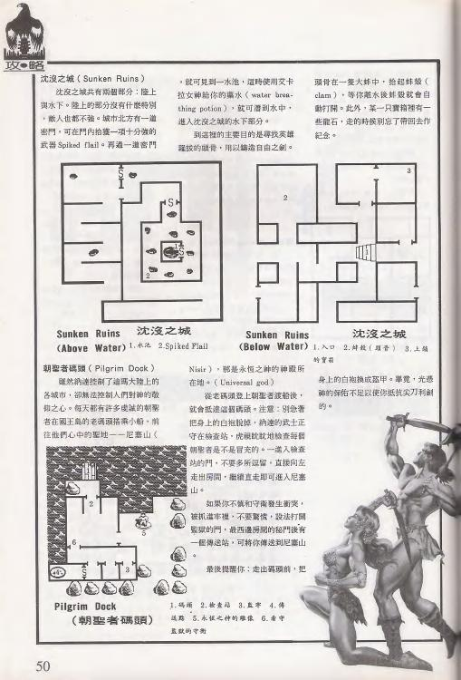

**簡介(龍谷續)**:Dragon Tooth 龍牙是不錯的武器(可攻擊 60 呎外敵人);Dragon Eye 龍眼與 Dragon Tears 龍淚也珍貴。見到 **Dragon Queen 龍后**就快回家。

**簡介(沉沒之城)**:分陸上(Above Water)與水下(Below Water)。陸上北方密門藏 **Spiked Flail 尖刺連枷**;水下需 **water breathing potion 水中呼吸藥水**才能潛入,主要目的是尋找鑄自由之劍要用的英雄魂。

**簡介(朝聖者碼頭起首)**:納達控制了瑪根各城,卻控制不了人對神的敬仰。朝聖者每天在國王島老碼頭搭船前往聖山 **Nisir 尼塞山**。蛤蜊(clam)離水後會自動開殼,部分含珍珠。

**事件/圖例表 — Dragon Valley 龍谷**

| 編號 | 內容/事件 |
|---|---|
| 1 | 龍牙 |
| 2 | 一些龍石及龍淚 |
| 3 | 龍后 |

**事件/圖例表 — Sunken Ruins(Above Water 陸上)**

| 編號 | 內容/事件 |
|---|---|
| 1 | 水庫 |
| 2 | Spiked Flail(尖刺連枷) |

**事件/圖例表 — Sunken Ruins(Below Water 水下)**

| 編號 | 內容/事件 |
|---|---|
| 1 | 入口 |
| 2 | 訊救(頭骨)〔?〕 |
| 3 | 上鎖門…… |

> 本頁地圖圖例未標明確「訊息 N」(第 2 點「訊救」掃描不清);龍谷劇情可對應手冊段落 134(龍后)、147(進入龍谷的山谷)。

---

### 5.19 Nisir 尼塞山 + Depth of Nisir 尼塞山腹(起首)

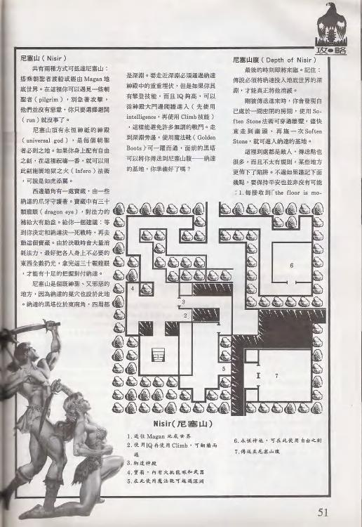

**簡介(尼塞山)**:有兩種方式可抵達(搭朝聖船/經 Magan 地底世界)。山上可遇朝聖者(pilgrim),可要求他們把你藏起來(hiding),避開逃命(run)即可。尼塞山有永恆之神(Universal God)的神殿,可施 **Inferno 地獄之火**法術。

**簡介(尼塞山腹起首)**:最後時刻將至。剛被傳送過來時,原地有鎖閉房間,用 **Soften Stone 軟化石**穿牆進入;直走再施一次 Soften Stone,即可進入納達基地。陷阱很多;收到「the floor is moving」訊息時,趕緊回到原位即可解。

**事件/圖例表 — Depth of Nisir 尼塞山(p51 此張)**

| 編號 | 內容/事件 |
|---|---|
| 1 | 比較多此地……界〔?〕 |
| 2 | 寶箱、龍和武器 旁地是世界〔?〕 |
| 3 | 傳送至尼塞山 |
| 6 | 永恆神效,可在此使用自由之劍 |
| 7 | 傳送至尼塞山腹 |

> 本頁圖例未標獨立「訊息 N」;尼塞山相關劇情可對應手冊段落 82–85、97(尼塞山/拯救者之山/永恆神祇神廟朝聖)。

---

### 5.20 Depth of Nisir 尼塞山腹深處 — 決戰 Namtar 納達 + 結局

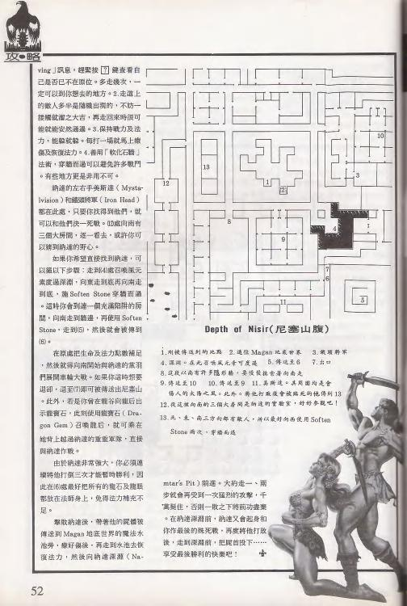

**簡介(尼塞山腹深處)**:陷阱多且不規則,收到「the floor is moving」訊息要回原位。進入時施 **Mystic Vision 神祕視覺**看清地形;先到房間左側 → 向東 → 向南到底,施 Soften Stone 穿牆,再向南到底 → 再 Soften Stone,即可走到 6 號處。在原處把生命與法力補足。若未走出尼塞山,可施 **Dragon Gem 龍寶石**召喚龍后飛出。

**決戰**:**Namtar(納達)**戰力極強,須連續施三次召喚龍后(Dragon Gem)。擊敗納達後,把屍體傳送到 Magan 地底世界的 **Well of Souls 靈魂之泉**,再走向靈魂之泉,然後向 **Namtar's Pit 納達之坑/深淵**前進。

**【結局】**:到了納達之坑前,每走一、兩步就會遭受一次猛烈攻擊,千萬別逃。在這場殊死戰中,用 Irkalla(艾卡拉)的自由之劍(Sword of Freedom)把 Namtar(深淵之獸 the Beast From The Pit)劈死。**勝利後請享受最後勝利的快樂吧!** ✛

**📖 此處觸發的手冊段落(決戰相關)**

> 攻略此頁未標獨立「訊息 N」;決戰/結局相關手冊段落為 **131、132、135**(納達現身對話)、**120 / 134**(龍后)、**137 / 138**(Irkalla 與自由之劍重生):

> **段落 131**
>
> 這是一個私人的臥房,有一個穿著禮服的人躺在長沙發上……「我是納達(Nam Tar)。你們大概早已猜到了!你們給我帶來了很多麻煩。」……(納達現身,自稱神的兒子;完整見段落 131,含 `Rurgatory` 原文拼寫疑為 Purgatory 誤植。)

> **段落 138**
>
> 「由上面世界來的人!」艾卡拉說……「如果你能幫我找到那把銀色鑰匙,並且放我自由,你將會得到很大的報償。」……你看到自由之劍(Sword of Freedom)由海水深浮上來。經過了地獄之火的練驗、英雄羅拔的精神提升再加上亞蘇水(Apsu Waters)的淬煉之後,這把她瑪星的噴出之作終於獲得重生。

---

## 6. 訊息 N ↔ 手冊段落 對照總表

下表涵蓋三期攻略出現過的所有訊息號,逐一查 `34_READ_PARAGRAPHS.md` 取段落一句話摘要,並標所在地點與比對結論。

| 訊息 N | 段落 N 一句話摘要 | 所在地點(攻略) | 比對 |
|---|---|---|---|
| 5 | Morgue 陳屍所石板「出去之路,笨蛋們」 | Purgatory 藏寶室 | 內容屬陳屍所;與「藏寶室」略有出入,但同屬波卡城 ◐ |
| 6 | 得魯依神廟 + 半人半獸 Enkidu 安奇度 | Mystic Wood 神祕林 #7 | ✓ 吻合(對應依據之一) |
| 9 | Namtar 納達雕像,婦人吐口水 | Purgatory #6 | ✓ 吻合(對應依據之一) |
| 16 | 火堆旁無牙領袖「波卡的敵人是我們的朋友」 | Slave Camp #1 | ✓ 吻合 |
| 19 | 傷者烏瑪(Ulm)夢見女神被鐵鍊綁住 | Slave Camp #6 | ✓ 吻合 |
| 22 | 共同廟宇,祭 Irkalla/Nergal/Enkidu | Slave Camp #7 | ✓ 吻合(地底信仰廟) |
| 25 | 菲巴斯太陽之城機械歡迎聲 | Phoebus #2 | ✓ 吻合 |
| 26 | 大理石城牆、街道整齊乾淨 | Phoebus #1 | ✓ 吻合 |
| 29 | 穿過沼澤抵達黃泥蟾蜍城 | Yellow Mud Toad #1 | ✓ 吻合 |
| 30 | 賣拉娜(Lanac'toor)紀念品的小商店 | Yellow Mud Toad #2 | ✓ 吻合 |
| 33 | 拜占儂城被納達軍圍困 | Byzanople #1 | ✓ 吻合 |
| 34 | 圍城軍隊營地、散滿折斷的箭 | Byzanople #6 | ✓ 吻合 |
| 35 | 蘭斯克中央巨建,內有八噸重的龍 | Lansk #1 | ✓ 吻合 |
| 41 | 海盜醜約翰(Long John Ugly)勒索並帶往陳屍所 | Smuggler's Cove #2 | ✓ 吻合 |
| 42 | 杜拉克國王(King Drake)寶座與王冠 | Kingshome Dungeon #6 | ✓ 吻合 |
| 50 | 放逐橋後四面八方的咆哮聲 | Bridge of Exiles #2 | ✓ 吻合 |
| 52 | 自由之劍(Sword of Freedom)傳說、羅拔建城 | Royal Game Preserve #6 | ⚠ 內容屬 Freeport(同頁兼含) |
| 60 | 被送到拜占儂城牆下軍營當刺客 | Slave Mines #4 | ⚠ 內容屬 Siege Camp 軍營 |
| 62 | 最後守衛倒下、礦坑寧靜、終於自由 | Slave Mines #10 | ✓ 吻合 |
| 67 | 美斯達(Mystalvision)太陽神廟最高法師 | Purgatory #9 | ⚠ 內容屬 Phoebus/Mystalvision |
| 68 | 奴隸市場拍賣、人肉販子叫罵 | Slave Camp #3 | ✓ 吻合(奴隸拍賣) |
| 70 | 庵林橙樹綠色通道(神祕林) | Mystic Wood #1 | ✓ 吻合 |
| 77 | 廢墟營火、盜賊之王 Clopin 克羅潘 | Purgatory #3 | ✓ 吻合(波卡城老大) |
| 80 | 密室皇家衣服死者、皇家印記戒指 | Snakepit #5 | ◐ 物品語境相容(待核圖例第 5 點走向) |
| 81 | 侏儒喬瑟(Josephina)哭訴神祇之眼被丟海裏 | Snakepit #8 | ✓ 吻合 |
| 87 | 納達軍隊軍營(二山峰間山谷) | Siege Camp #1 / Byzanople #4 | ✓ 吻合 |
| 88 | 軍營老人擲骰子、口述她瑪背景 | Slave Camp #9 | ⚠ 內容屬 Siege Camp 軍營 |
| 90 | 鐵頭將軍(Buck Ironhead)辦公室訓話 | Siege Camp #10 | ◐ 軍營指揮體系相容,前半為龍毀 Phoebus 續寫 |
| 99 | 莫格(Mog)傳記、煉金術把人變石頭 | Mog's Estate #4 | ✓ 吻合 |
| 102 | 貝雷(Berengaria)紙條 + 獄卒房間越獄 | Phoebus Dungeon #2 | ✓ 吻合 |
| 105 | 曾關過巨大生物的房間、爪痕撞痕 | Mog's Estate #7 | ✓ 吻合(地下迷宮關獸處) |
| 107 | 拉娜高塔實驗室、拉娜日記(遺失眼鏡) | Lanac'toor's Lab #3 | ✓ 吻合 |
| 118 | 房間中一個巨大的機器人(盔甲) | Dwarf Clanhall #4 | ✓ 吻合(城堡機器人) |
| 122 | 地底之后艾卡拉(Irkalla)雕像 | Lansk Undercity #10 | ✓ 吻合 |
| 123 | 地底之王那迦(Nergal)雕像 | Lansk Undercity #11 | ✓ 吻合 |
| 124 | 永恆神祇(Universal God)雕像 | Lansk Undercity #12 | ✓ 吻合 |
| 125 | 安奇度(Enkidu)雕像 | Lansk Undercity #13 | ✓ 吻合 |
| 130 | 杜拉克國王宮殿,已空空如也 | Kingshome #8 | ✓ 吻合 |

> 圖示:✓ 內容與地點吻合;◐ 大致相容但語境略有出入;⚠ 內容與所在地點明顯不符(見文末疑點)。

---

## 7. 整合譯名表(三期合併)

> 三期各自「新發現譯名」整併。「與 CONTEXT 對照」欄標 ✓ 一致 / ⚠ 衝突 / + 待登錄。譯名衝突一律以 CONTEXT.md 為準,衝突處標待確認。

| English | 中譯 | 來源期 | 與 CONTEXT 對照 |
|---|---|---|---|
| Purgatory | 波卡城 / 罪惡之城 | 25 | ✓ 一致 |
| Namtar | 納達 | 25/27 | ✓ 一致(深淵之獸 The Beast From The Pit) |
| Humbaba | 胡姆巴巴 | 25 | ✓ 一致 |
| Irkalla | 伊爾卡拉 | 25/27 | ✓ 一致 |
| Magan / Magan Underworld | 瑪根 / 瑪根地底世界 | 25/27 | ✓ 一致 |
| Mud Toad / Yellow Mud Toad | 黃泥蟾蜍城 | 25/26 | ✓ 一致 |
| Kingshome | 京雄城 | 26/27 | ✓ 一致 |
| Byzanople | 拜占儂(市) | 27 | ✓ 一致 |
| Nisir | 尼塞 / 尼塞山 | 27 | ✓ 一致(CONTEXT 作「尼塞」,本期補「山」) |
| Morgue | 陳屍所 | 25 | ✓ 一致 |
| Well of Souls | 靈魂之泉 | 27 | ✓ 一致 |
| the Pit / Namtar's Pit | 深淵 / 龍坑 / 納達之坑 | 27 | ✓ 一致 |
| Mountain of Salvation | 救贖之山 / 拯救山 | 27 | ✓ 一致 |
| Clopin Trouillefou | 克羅潘 / 克洛潘·特魯伊弗 | (段落 77) | ✓ 一致 |
| Slave Camp | 奴隸營 | 25 | + 待登錄 |
| Slave Mines | 礦場 / 礦坑 | 25 | + 待登錄 |
| Mog / Mog's Slave Estate | 莫格 / 莫格的宅院 | 25 | + 待登錄 |
| Tars / Tars Ruins | 塔斯 / 塔斯廢墟 | 25/27 | ⚠ CONTEXT 列「Tars/Tarsus 保留待確認」 |
| Guarded Bridge / War Bridge | 守橋 / 重兵守橋 | 25/26 | + 待登錄 |
| Phoebus | 菲巴斯(太陽之城) | 25 | + 待登錄(26 期曾誤作「巴斯城」待核) |
| Phoebus Dungeon | 菲巴斯地牢 | 25 | + 待登錄 |
| Mystic Wood | 神祕林 | 26 | + 待登錄 |
| Lansk | 蘭斯克 | 26 | ⚠ CONTEXT 列「Lansk 保留待確認」;本期譯蘭斯克 |
| Lansk Undercity | 蘭斯克地下城 | 26 | + 待登錄 |
| Lanac'toor / Lanac'toor's Lab | 拉娜 / 拉娜的實驗室 | 26 | ⚠ 衝突(見 Flagged) |
| Quag | 奎格 | 26 | + 待登錄 |
| King's Isle | 王島 | 26 | ⚠ 與 Kingshome 京雄城關係待核(見 Flagged) |
| Governer's Pass / Office | 總督通行證 / 辦公室 | 26 | + 待登錄 |
| Druid Mace | 德魯伊權杖 | 26 | + 待登錄 |
| Enkidu | 恩奇杜 / 安奇度〔?〕 | 26/27 | ⚠ CONTEXT 列「保留待確認」 |
| Golden Boots | 黃金之靴 | 26 | + 待登錄 |
| Berengaria | 蓓蕾賈莉亞 / 貝雷〔暫譯〕 | 26 | + 待登錄(段落 101 作「貝雷」) |
| Ankh | 護身符 | 26 | + 待登錄 |
| Smuggler's Cove | 海盜竊穴 | 27 | + 待登錄 |
| Old Dock | 老碼頭 | 27 | + 待登錄 |
| Bridge of Exiles | 放逐橋 | 27 | + 待登錄 |
| Snakepit | 蛇窟 | 27 | + 待登錄 |
| Dwarf Ruins / Clanhall / Forge | 矮人廢墟 / 城堡 / 鑄爐 | 27 | + 待登錄 |
| Siege Camp | 軍營 | 27 | + 待登錄 |
| Freeport | 自由港 | 26/27 | + 待登錄 |
| Royal Game Preserve | 皇家專有獵區 | 27 | + 待登錄 |
| Scorpion Bridge | 蠍橋 | 27 | + 待登錄 |
| College of Magic | 魔法學院 | 27 | + 待登錄 |
| Dragon Valley | 龍谷 | 27 | + 待登錄 |
| Sunken Ruins | 沉沒之城 | 27 | + 待登錄 |
| Pilgrim Dock | 朝聖者碼頭 | 27 | + 待登錄 |
| Depth of Nisir | 尼塞山腹 | 27 | + 待登錄(最終地城) |
| Prince Jordan | 喬丹王子 | 27 | + 待登錄 |
| Utnapishtim | 烏納皮什提姆 / 烏娜〔待核〕 | 27 | ⚠ CONTEXT 列「保留待確認」 |
| Roba | 羅拔〔待核〕 | 27 | + 待登錄(自由港建造者) |
| Nergal | 奈羅 / 那迦〔待核〕 | 22/27 | ⚠ 勿與 Namtar 混淆(見 Flagged) |
| Sword of Freedom | 自由之劍 | 27 | + 待登錄(終極武器) |
| Dragon Gem | 龍寶石 | 27 | + 待登錄(召喚龍后) |
| Dragon Queen | 龍后 | 27 | + 待登錄 |
| Spectacles | 光譜眼鏡 / 眼鏡 | 27 | + 待登錄 |
| Soul Bowl | 靈魂之碗 / 靈碗〔待核〕 | 27 | + 待登錄(段落 146 作「靈碗」) |
| Jade Eye | 翠玉之眼 | 27 | + 待登錄 |
| Pilgrim's Garb | 朝聖者之袍 | 27 | + 待登錄 |
| Apsu Waters | 亞蘇水 | 25(更正)/段落 94 | + 待登錄(原誤作 Apeu) |
| Mystalvision | 美斯達 | 25/段落 67 | + 待登錄(太陽神廟最高法師) |
| Stossstrupen | 〔保留原文,音譯待定〕 | 25 | + 疑為德文 Stoßtruppen 突擊隊 |
| Universal God | 萬有之神 / 永恆之神 | 27 | + 待登錄 |

### Flagged ambiguities(待釐清,沿用三期)

- **Lanac'toor 譯名衝突**:`CONTEXT.md` 暫記「拉哥」,《軟體世界》譯「**拉娜**」(被納達變石像的魔法師;手冊段落 20/30/32/54/107 均作拉娜)。兩者皆非官方手冊確認,建議以官方臺灣手冊(珍066)定案;在此之前本文件統一用「拉娜」並註明出處。
- **Nergal vs Namtar**:Nergal(奈羅 / 那迦)為 Irkalla 之夫、獨立冥神(手冊段落 22/93/114/115/123 均作「那迦」);Namtar(納達)為最終魔王。`CONTEXT.md` 已明確「⚠ 勿與 Namtar 混淆」;第 27 期攻略 OCR 曾將 Nergal 誤判為納達,本文件依 CONTEXT 區分。
- **King's Isle vs Kingshome**:第 26 期「王島」(King's Isle 直譯)與官方「京雄城(Kingshome)」是否同一地/鄰近待核。本文件保留兩種寫法並標待確認。

---

## 8. 品質與轉寫說明

- **掃描判讀**:三期攻略掃描頁均以 **300 DPI** 重渲染分欄放大轉寫(地圖編號圖例清晰度佳);本整合文件嵌入之掃描圖以 **150 DPI** 低解析保存(歷史保存用途)。
- **不確定標記**:掃描不清處一律保留原轉寫的 `〔?〕`,未臆造補字。
- **段落原文**:§5 引用之手冊段落,忠實照抄 `34_READ_PARAGRAPHS.md` 內容,含其 `〔?〕` 與「需人工複核」註記;為控制篇幅,部分超長段落(如 88、99、131)節錄核心並標「完整見 `34_READ_PARAGRAPHS.md` 段落 N」。
- **編號對應**:「訊息 N = 段落 N」以同號對應為主軸,逐項以內容語境核對(見 §6 與下列疑點)。

### 編號對應疑點(訊息 N 與段落 N 內容明顯不符者)

以下幾處,攻略地圖標的「訊息 N」與手冊「段落 N」內容語境**明顯不符**,需與英文手冊或遊戲實機再核對(可能為攻略掃描 OCR 誤標、雜誌排版編號偏移,或同號段落確實對應不同地點):

1. **訊息 67(波卡城 #9)vs 段落 67(美斯達/太陽神廟)**:段落 67 內容是 Mystalvision 太陽神廟最高法師訓話,屬 **Phoebus 菲巴斯**語境,卻標在 Purgatory 波卡城圖例。疑為攻略誤標,或波卡城此點實際觸發另一段。
2. **訊息 60(Slave Mines 礦場 #4)vs 段落 60(拜占儂軍營)**:段落 60 內容是「被送到拜占儂城牆下軍營當刺客」,屬 **Siege Camp 軍營**語境,與礦場不符。
3. **訊息 88(Slave Camp 奴隸營 #9)vs 段落 88(軍營擲骰子老人)**:段落 88 內容是軍營老人擲骰子、口述她瑪背景,屬 **Siege Camp 軍營**語境,與奴隸營不符。
4. **訊息 52(皇家專有獵區 #6)vs 段落 52(自由港自由之劍傳說)**:段落 52 屬 **Freeport 自由港**;惟該掃描頁同時兼含自由港與獵區,可能為跨區圖例標號或編號偏移,疑點較輕。
5. **訊息 90(Siege Camp 軍營 #10)vs 段落 90(鐵頭將軍辦公室)**:語境屬軍營/納達指揮體系大致相容,但段落 90 前半是「龍毀 Phoebus」的續寫(段落 89 尾),斷句需注意。
6. **訊息 5(波卡城藏寶室 #13)vs 段落 5(Morgue 陳屍所)**:同屬波卡城,但「藏寶室」與「陳屍所」點位略有出入,疑點較輕。

> 上述 1–3 為**內容明顯不符**(語境跨地點),建議列入後續中文化驗證的優先核對項;4–6 為**輕度出入**(同頁/同城範圍)。其餘訊息號(§6 標 ✓ 者)內容與所在地點吻合,可採同號對應。
