# 火龍之戰《軟體世界》三期攻略 — 逐頁全文轉寫 + 切割地圖

> **本檔定位**:這是 [`38_SOFTWORLD_WALKTHROUGH.md`](38_SOFTWORLD_WALKTHROUGH.md)(按遊戲進程合一重編的**導讀整合版**)的**補充檔**。
> 兩者分工:
> - **38**:按地點串成一條流程的攻略導讀,搭配事件表與手冊段落擴充(可讀性優先)。
> - **39(本檔)**:**逐頁忠實存檔** —— 把每張掃描頁的文字**逐字解讀成可複製的 markdown**(文字歸文字)、把頁內地圖**精確切成「純方格本體」**(像素複製、**不含任何中文**,僅保留方格與阿拉伯數字編號),再**potrace 臨摹成高畫質向量圖**(原圖切圖 + 臨摹向量版**並列**),讓讀者能直接複製文字、單獨取用地圖、看到比低解析掃描更清晰、可無損縮放的臨摹線稿。
>
> **出處**:《軟體世界》月刊 第 25 / 26 / 27 期(1991 年 4 / 5 / 6 月號),署名 /Lotus。版權屬《軟體世界》及原作者;本轉寫為非商業性歷史保存 / 中文化研究用途。完整版權聲明見 38 之 §1。
>
> **製作方式**:來源 PDF 以 300 DPI 重算(`pdftoppm -jpeg -r 300`,docker image `dwimg` = poppler + imagemagick + librsvg + potrace),由能讀圖的代理逐頁視覺判讀。地圖兩種版本:① **純方格切圖**(`imagemagick convert -crop` 從原圖切出地圖方格本體、避開所有中文,存 [`softworld_images/maps/`](softworld_images/maps))= 原像素複製;② **臨摹向量圖**(`convert` 灰階二值化 → `potrace` 自動描摹成 SVG,`rsvg-convert` 渲回 PNG 比對驗證,存 [`softworld_images/maps_svg/`](softworld_images/maps_svg))= 描著原圖牆走的高畫質線稿。兩版檔名一一對應。
>
> **轉寫品質**:正文為**逐字盡力轉寫**(非摘要),保留原刊用字與英文遊戲術語;舊雜誌小字 / 裝訂邊 / 壓在插圖下的字較難辨識,模糊或推測處以 `〔?〕`、`〔…〕` 標註,未臆造。個別段落 OCR 仍偏粗(尤其第 27 期密排正文),**若要通順可讀的整理版請看 38**;本檔以「貼近原頁、可複製」為目標。
>
> **地圖臨摹說明**:SVG 是用 potrace **直接描摹**純方格切圖得到,線條**跟著原圖的牆走**(非人工簡化、非臆造),縮放不糊。規則方格迷宮(如 Purgatory、Lansk、Depth of Nisir)臨摹結果乾淨清晰;原圖本身為**陰影/開闊區域**者(尤其 Magan Underworld、含大片水域或網點的圖)會把深色區描成黑塊,屬忠於原圖的呈現。原圖切圖(maps/)為像素複製真本,臨摹向量圖(maps_svg/)為高畫質呈現,兩者並列。
>
> 39 張純方格切圖 + 39 張臨摹向量圖一覽見文末附錄。

---

## 第 25 期(1991-04)· 攻略(一)

### sw25-034.jpg — 雜誌 p32:開場敘述 + 玩法總覽
**切割地圖**
（此頁無方格地圖;右下角為 Conan 風武士插畫）

**全文轉寫**

火龍之戰 /Lotus　攻略(一)

各位好,我是 LOTUS……一個精通各種魔法的巫師。自從我和我的同伴把邪惡法師納達(Namtar)一腳踢入萬丈深淵後,就一直住在 Purgatory。除了魔法外,我最大的專長便是繪製地圖(是不是魔法師的方向感比較好?),我很樂意和各位分享我的經驗。

比起我和伙伴們過去的冒險經歷(冰城傳奇 I、II、III),這次的探險似乎比較輕鬆:怪物不那麼多,謎題沒那麼難……不過人物升級慢很多。很多難關可以用好幾種方法解決,有些地方你甚至不必去,也對大局無損。

如果你正要開始探險旅程,那麼建議你:只要設一個魔法師即可,因為補充法力的龍石(dragon stone)太貴又太少,而且在旅程中,隊員之一有機會「免費」成為德魯依法師。其他的人最好具有不同的技能:包紮(Bandage)最重要,隨著等級的增加,這項技能的點數也應跟著增加,才不會浪費法力在醫療傷患上。

其他像爬山(Climb)、開鎖(Lockpick)、武器技術(Weapon Skill)都是值得投資的技能。

如果你已經進行了一段時間,最頭大的事恐怕就是能攜帶的物品太少,幾顆龍石就把荷包塞滿了。因此物品的取捨相當重要,以下是一些重要物品的列表:

- **非常重要的物品**:the Golden Boots、the king's Signet Ring、the Dragon Gem、Spectacles。
- **用過一次就丟(但是地方要對)**:mushrooms、Soul Bowl、Jade Eyes、mirror、Stone Arm、Stone Head、Stone Hand、Stone Trunk、Roba's skull(the clam)、stone hammer、key、silver key、battered cup、shovel。
- **可用來通行的物品**:Pilgrim's Garb、Citizen Papers、Governer's Pass、Enkidu Totem。

通常你可以把物品送往商店待價而沽,物品的價格越高,表示越珍貴。武器和護甲可經試穿試用,觀察各屬性值的升降及打架時的效果來評估。

還有很重要的一點,寶箱一旦被打開,就要把其中的物品拿完,不要想離開後再回來拿……一旦你重臨舊地,連箱子都會不見了(更別說是裡面的東西了)。由於有龍石的地方不多,看到龍石時,把身上沒有用的東西都扔掉,能拿多少便拿多少。

迪瑪大陸中很有人情味的一點是:再壞的敵人都很少趕盡殺絕,即使你昏厥在地,身上的物品和錢財也不會被掠奪——而且還可以賺到經驗點數。所以萬一打輸了,趕緊包紮傷口,再度奮勇向前……當然,因為大多數的戰鬥都沒有戰利品可拿,逃跑對你而言,也不會有太多損失的啦!

**Purgatory(波卡城)**

這是一座有進無出的城,城門有重兵把守。除了士兵外,到處都是小偷和流氓,所以打架是少不了的,幸好大部分的人都很好對付,打不過就逃吧!城北的競技場很有名,不妨去試試,即使打不過也能獲得一套基本裝備,如果打勝了,可以獲得一紙市民證(Citizen Paper),西北有一座小屋,其中的巫師會無條件供應初級的魔法卷軸給你。

有空不妨到酒店和黑市逛逛,說不定你能在酒店找到志同道合的朋友,或是打聽到消息。另外,在城西南可以找到此城的龍頭老大 Clopin,若是不想跟他一起做小偷或乞丐,就必須打敗城東北的怪物 Humbaba,回到這裡可得到鉅額賞金。

離開波卡城有許多法子:最笨的方法是強行打敗門口的守衛,再跳入海中游泳而去;此外,如果你實在很無聊,不妨把自己賣給奴隸市場,然後想辦法逃出(這要有實力才行)。比較簡單的兩個辦法是:到城東南角,躲在屍袋中,讓別人把你扔出去(像基督山恩仇記);或是由西北角的祕門進入城牆,〔接 p33〕

---

### sw25-035.jpg — 雜誌 p33:Purgatory 波卡城
**切割地圖**
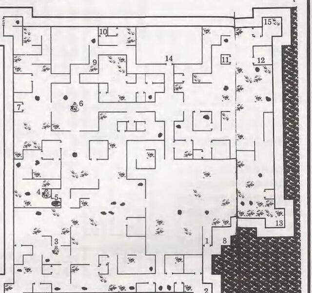
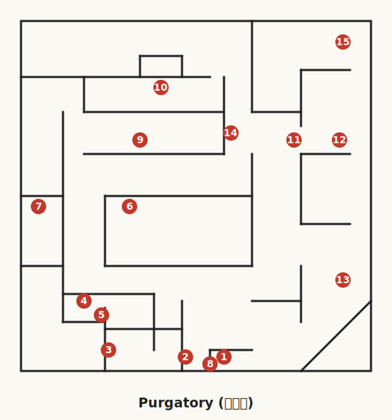
**全文轉寫**

〔承 p32〕再由西南角的祕門出城。

你也可以從 Apsu Waters 中進入 Magan 地底世界,再覓路出去。當你看到 Irkalla 女神的雕像,別忘了奉獻幾樣不要緊物品,直到她高興為止,這將對你大有助益。

**行動清單**:
1. 大門
2. 恢復魔法力量的池子
3. Purgatory 城的老大,要打敗其周圍的眾多怪物才能見到他。訊息 77
4. Irkalla 的雕像
5. Apsu Waters,由此可進入 Magan 地下世界
6. 訊息 9
7. 供應卷軸的巫師
8. 使用游泳技術能,可以離城。(所有的人都要會游才行)
9. 訊息 67
10. 黑市
11. 酒店
12. 醫院
13. 藏屍袋。訊息 5。使用 Hide(躲藏)技能可出城
14. 競技場
15. Humbaba 怪獸

> 地圖標題:Purgatory(波卡城)

**Slave Camp(奴隸營)**

逃出 Purgatory 城後,旁邊有一水池,不妨進去洗浴一番,很有好處的。向前走(有一棵樹),那就是奴隸營了。

在這裡你不會有機會掄刀弄槍。這裡的居民都很和善,唯一特殊的是一位老巫師,但是當你施法術給他看〔使用任何一項法術或知識(Knowledge)〕,他立刻會引你為知己。雖然如此,看到他家後面的寶箱時,也不必不好意思下手。

碰到受傷的人,發揮你的同情心,救他可省掉一些消耗(使用包紮技能或施 heal 法術)。到處逛逛,這是迪瑪大陸上唯一的詳和之地了。

> 〔頁尾〕香港讀者:不要讓你的權益睡著了!請參閱本期第 62 頁。

---

### sw25-036.jpg — 雜誌 p34:Slave Camp 奴隸營 + Slave Mines 礦場
**切割地圖**
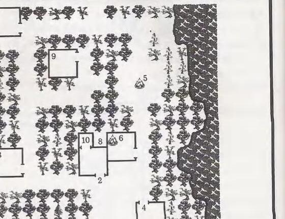
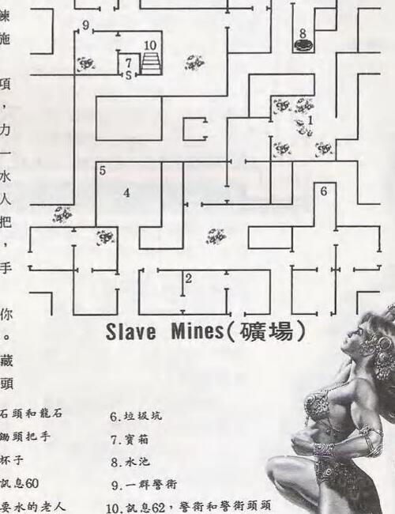

**全文轉寫**

**Slave Camp(奴隸營)行動清單**:
1. 訊息 16
2. 巫師
3. 訊息 68
4. 志願加入者
5. 營火,可治傷
6. 訊息 19
7. 訊息 22
8. 寶箱(有不少法術卷軸)
9. 訊息 88
10. 巫師送你的東西

> 地圖標題:Slave Camp(奴隸營)

**Slave mines(礦場)**

如果你在 Purgatory 賣身給奴隸市場,就會發現自己鐐銬加身,在這裡大作苦工,怎麼樣?此刻你後悔了嗎?

這裡到處都是守衛,而你完全沒有還擊的能力,不僅所有的武器都被搜光,更糟的是全身都被鐵鍊綁著,不能自由活動,所幸還能施法術。

要恢復自由,首先要自製一項能敲壞鎖鍊的錘子。到各處逛逛,你能發現一些石頭和可以恢復法力的龍石,一柄鋤頭的把手,還有一個破杯子。用杯子在水池裝滿了水後,拿去送給(5)處奄奄一息的老人,他會把鞋帶送你。有了石頭、把手和鞋帶(Use 其中任何一項),就可製成錘子。使用錘子,你的手腳就自由了。

在垃圾坑拾回自己的武器,你會發現這裡的守衛實在不堪一擊。臨走之前,不妨從暗門中帶些寶藏離開,再到 10 處打敗一群警衛和頭頭,自由已經在望。

**Slave Mines(礦場)行動清單**:
1. 石頭和龍石
2. 鋤頭把手
3. 杯子
4. 訊息 60
5. 要水的老人
6. 垃圾坑
7. 寶箱
8. 水池
9. 一群警衛
10. 訊息 62,警衛和警衛頭頭

> 地圖標題:Slave Mines(礦場)

---

### sw25-037.jpg — 雜誌 p35:Mog's Slave Estate 莫格的宅院 + Tars Ruins 塔斯廢墟
**切割地圖**
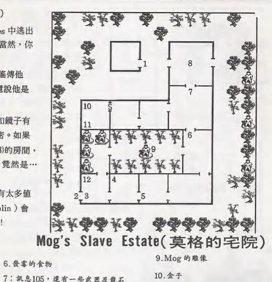
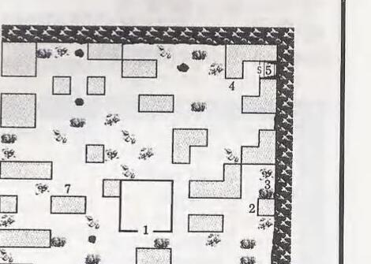

**全文轉寫**

**Mog's Slave Estate(莫格的宅院)**

如果你從暗無天日的 Slave mines 中逃出,就會發現自己置身於這所華麗的宅院。當然,你也可以直接從大門進入。

Mog 是靠苛待奴隸致富的商人,謠傳他已經死了,這點不妨由你來證實。有人還說他是個雕刻家呢!

各處走走,你會發現 Mog 對雕像和鏡子有特殊的偏好,(5)處的傳記能揭露不少秘密。如果你真要追根究底,拾起一面鏡子,走到(3)的房間,使用鏡子,你就會發現衣冠楚楚的 Mog 竟然是……,而雕像的來源也就不言而明了。

這裡除了少數的錢和龍石外,並沒有太多值得一逛的地方,隨處可見的山妖精(goblin)會讓你頭痛不已,所以拿了東西就趕緊走吧!

**Mog's Slave Estate(莫格的宅院)行動清單**:
1. 有一些不明生物留下的蹤跡,使用 Tracker 技能,可到 2
3. Mog 的房間
4. 鏡子
5. 訊息 99
6. 發霉的食物
7. 訊息 105,還有一些武器及龍石
8. 破裂的鏡子
9. Mog 的雕像
10. 金子
11. 鏡子
12. 真正的 Mog,在消滅他前最好不要走到這裡來

> 地圖標題:Mog's Slave Estate(莫格的宅院)

**Tars Ruins(塔斯廢墟)**

Tars 廢墟位於絕望島(Isle Forlorn)的東南。本來是一座繁榮的城市,但是自從被龍破壞後,已經淪為一座空城。

傳說這裡蘊藏了許多寶藏,但也沒有人曾經找到過。也有人說某些對抗納達的份子利用這裡的某條秘密通道,逃往地下世界,這就要你仔細地加以查證了。

**Tars Ruins(塔斯廢墟)行動清單**:
1. 奇特的廟宇
2. 守護蛇
3. 某個武士殘留下的裝備
4. 陷阱
5. 一塊石板,使用力量(Strength)可以揭開石板(力量必須夠大)前往地下室
6. 一些卷軸
7. 在此使用 tracker 技能,可以直接到 5

> 地圖標題:Tars Ruins(塔斯廢墟)

---

### sw25-038.jpg — 雜誌 p36:Tars Ruins 地下室 + Guarded Bridge 守橋 + Phoebus 圖例
**切割地圖**
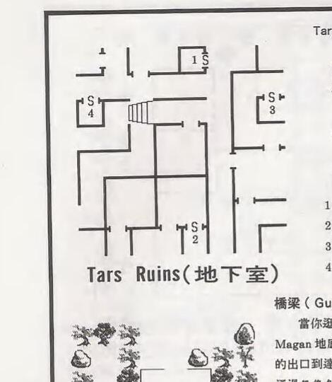
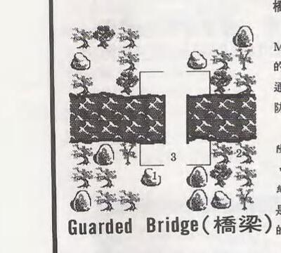
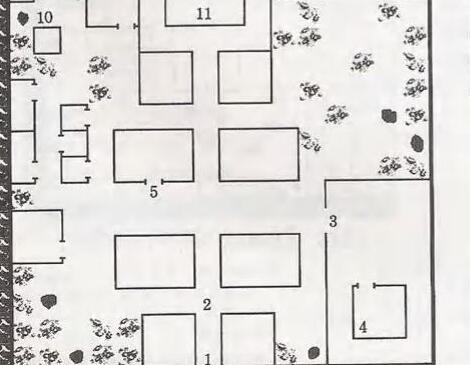
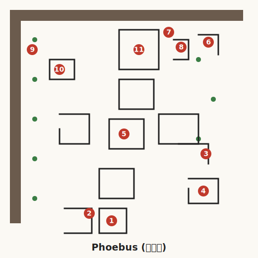
**全文轉寫**

**Tars Ruins 地下室**

這個地下室乍看之下,似乎年久失修。當你走起路來,聽到地板吱吱作響的時候,就意味著旁邊有密門。密門裡面有些什麼珍奇異寶,也無須我在這裡囉嗦了。

值得注意的是:這裡有一條通向 Magan 地底世界的路,由於沒有樓梯,你必須使用攀爬(Climb)技能,才能前往。

對了,差點忘了告訴你,有一間密室中放著一隻斷臂,趕緊拾起,這隻斷臂是你以後非常有用的物品,別忘了它。

**Tars Ruins(地下室)行動清單**:
1. 寶箱
2. 寶箱
3. 斷臂
4. 通往地底世界的洞穴

> 地圖標題:Tars Ruins(地下室)

**橋梁(Guarded Bridge)**

當你逛膩了絕望島,可以進入 Magan 地底世界,然後再由其他的出口到達別的島嶼。否則就只有通過絕望島和太陽島之間,有守衛防守的橋了。

自從納達法師當政後,迪瑪大陸的居民都必須具有各種「路條」,才能在各島間通行無阻。比如說:絕望島和太陽島間的「路條」,就是市民證,倘若沒有,只好靠自己的雙手打敗守衛了。市民證可以在競技場獲勝後得到,或是在 Slave Camp 的寶箱中獲得。

即使出示市民證,你還必須付給守衛一些「過路費」才行。有時守衛會把武器或卷軸藏在橋上隱蔽的地方,值得你好好搜。

**Guarded Bridge(橋梁)行動清單**:
1. 訊息:要使最高魔法師復生,必須把他散落在各地的身體碎片送回到黃泥塘蛤城(Yellow Mud Toad)
2. 一些裝備
3. 守衛

> 地圖標題:Guarded Bridge(橋梁)

**Phoebus(菲巴斯)行動清單**:
1. 訊息 26
2. 訊息 25
3. 軍營
4. 加入軍隊處
5. Stosstrupen 大本營
6. 酒店
7. 盜賊
8. 寶箱
9. 寶箱
10. 監獄出口

> 地圖標題:Phoebus(菲巴斯)（城本身的方格地圖印在 p36 此頁,見上方 `sw25-038_phoebus.jpg`)

---

### sw25-039.jpg — 雜誌 p37:Phoebus 菲巴斯城 + Phoebus Dungeon 菲巴斯地牢
**切割地圖**
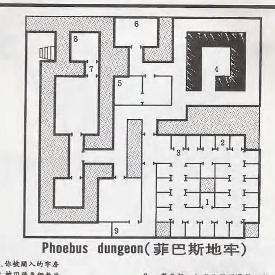
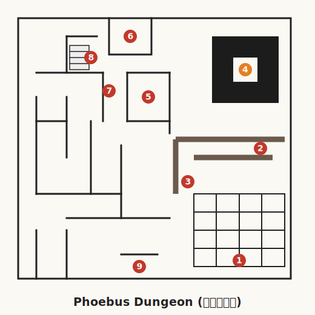（註:本頁左欄為 Phoebus 城正文,地圖僅一張「Phoebus dungeon 菲巴斯地牢」;城本身的方格地圖在 p36)

**全文轉寫**

**Phoebus(菲巴斯)**

Phoebus 有太陽之城的美譽,但自從 Mystalvision,納達的心腹,成為太陽神殿的祭師後,城市中就被各種怪物和盜賊進佔。市中心有許多 Stosstrupen,西南則住著一群小妖精,沒事不必在此逗留。

如果你想為納達效力,城東南的軍營隨時歡迎你。不過事先提醒你:加入軍營可不是好玩的(尤其像納達這樣邪惡的勢力),一旦加入後,你必須有足夠的能力才可能脫離。

城東北是盜賊的大本營,如果你有足夠的本事將他們全數打敗,可以獲得不少財富。賊窩附近的小酒店則相當有人情味,會告訴你不少小道消息。

正北是雄偉的太陽神殿,祭師 Mystalvision 就在其中。想擊敗他是一件非常困難的事,因為他被重重的守衛保護著。如果你被擊敗了,會被送到監獄內——不必太焦慮,吉人天相的你,總會適時地碰到救星的。

**Phoebus dungeon(菲巴斯地牢)**

啊哈!你也不自量力地向 Mystalvision 挑戰了嗎?身繫牢籠的滋味如何呢?不必浪費你的力氣在開鎖上,門上的鎖是具有魔法的。在房間中繞個幾圈,時候到了,自然會有一個神秘的地下工作者放你出去。

Phoebus 的地牢很大,一旦被守衛逮到了,一場大戰是免不了的。最聰明的辦法是屏氣凝神,不要驚動他們。幸好獄卒是個酒鬼,即使如此,你最好還是不要大搖大擺地出現在他眼前,適當的躲藏仍屬必要。

事實上這個地牢本來並非太陽神殿所建,而是一座德魯伊教(Druid)的神殿。其中有一個相當龐大的寶藏,由某種超自然的力量保護。Mystalvision 顯然亟於獲得寶藏,因此在這裡囚禁並嚴刑拷打許多德魯伊教徒。幫助這些可憐的教徒將對你有好處。

地牢東北養了一條飢腸轆轆的龍,如果你想報復 Mystalvision,不妨試著激怒這條龍,牠將毀去整個地牢和地面的 Phoebus 城。但是在做之前請三思,畢竟城裡還有許多無辜的民眾。

由於地牢通往外界的秘密通道堆滿了雜物,難以通過,使用鏟子(在寶藏中可找到)或是爬行技能都可助你通過障礙,逃出生天。出門後別忘了依照指示,到酒店去找你的救命恩人。

**Phoebus dungeon(菲巴斯地牢)行動清單**:
1. 你被關入的牢房
2. 被囚德魯伊教徒
3. 訊息 102。在此使用 Hide 技能,可順利通過
4. 飢餓的龍。如果你不想殺去〔?〕 Phoebus,不要走近牠;否則阻止看守者餵牠,就可將其激怒
5. 訊息 106。使用包紮技能或醫療法術,會獲知開啟寶藏的密碼
6. 一群巫師。打敗他們可獲得一些魔卷軸
7. 說出密碼即可通過
8. 寶箱
9. 障礙。使用爬行技能或鏟子可通過

> 地圖標題:Phoebus dungeon(菲巴斯地牢)

---

## 第 26 期(1991-05)· 攻略(二)

### sw26-036.jpg — 雜誌 p34:Mystic Wood 神祕林 + Heavily guarded bridge 橋樑(局部)
**切割地圖**
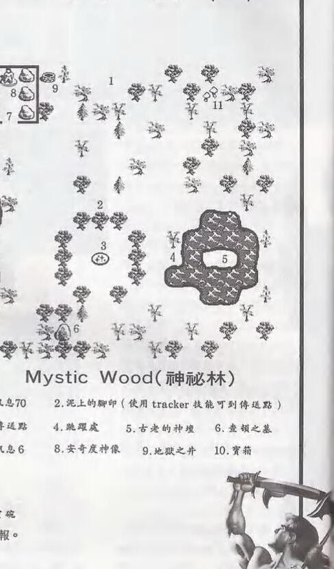
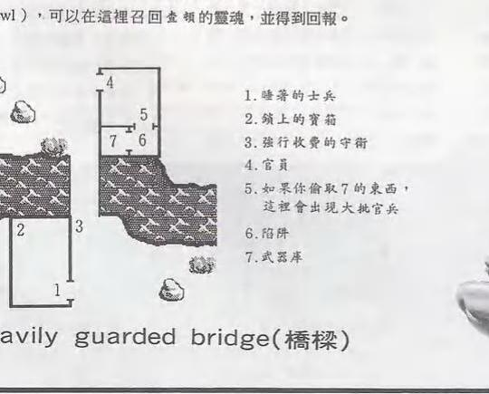
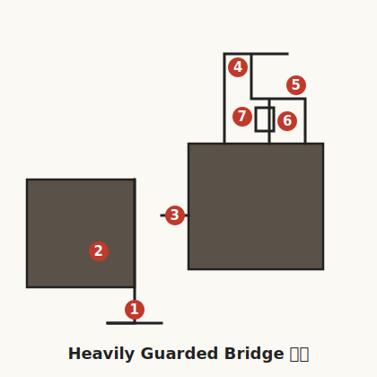
**全文轉寫**

火龍之戰 攻略(二) /Lotus

**Mystic Wood(神祕林)**

這片樹林位於太陽島的西南,是德魯伊教法師查頓(Zaton)的居所,自從納達奪走了查頓的魂魄,這裡就殘破不堪了。由於德魯依教崇拜自然,這座樹林中居住著各種動物、岩石和樹木精靈。精靈並不是好惹的,打不過就逃吧!

樹林的西北有一所供奉安奇度神(Enkidu,半人半獸)的神殿。如果你自恃力氣和精神力量都出類拔萃(Strength, spirit 點數要夠),不妨拾起神像旁的號角,吹響號角,和安奇度來一場角力。若是你勝了,安奇度會賜給你施用德魯依法術的能力,並加上許多法術。

神殿東邊有一座井,井中隱隱傳來哭聲,在此使用爬行技能可到達 Magan 地底世界。再向東走,有一塊長滿了蘑菇(mushroom),摘一點帶在身上,以後會用到。

樹林中有一傳送點,可以把你傳送到國王島(King's Isle)或奎格島(Quag)。傳送點的東方則有一池塘,池塘中有一小島。游泳是過不去的,你必須找到金靴子(Golden Boots)後,才能一躍而過(使用靴子)。島上有一古老的神殿,神殿中有鮮血需在神殿上(使用任一種武器)你會獲得報償。

南方的城牆有一座墳塞,當你日後從東方諸島獲得了靈碗(Soul bowl),可以在這裡召回查頓的靈魂,並得到回報。

**Mystic Wood 圖例**:
1. 訊息 70
2. 泥上的腳印(使用 tracker 技能可到傳送點)
3. 傳送點
4. 跳躍處
5. 古老的神壇
6. 查頓之墓
7. 訊息 6
8. 安奇度神像
9. 地獄之井
10. 寶箱

**Heavily guarded bridge(橋樑)圖例**:
1. 睡著的士兵
2. 嶺上的寶箱
3. 強行收費的守衛
4. 官員
5. 如果你偷取 7 的東西,這裡會出現大批官兵
6. 陷阱
7. 武器庫

---

### sw26-037.jpg — 雜誌 p35:War Bridge 橋樑 + Lansk 蘭斯克(含 Lansk Undercity 開頭)
**切割地圖**
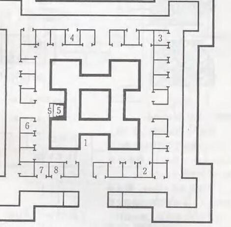

**全文轉寫**

**橋樑(Heavily guarded bridge)**

這座橋樑連接太陽島和蘭斯克城(Lansk),橋上有重兵防守——說實在的,這些士兵簡直就是強盜!他們向每個過橋的人收取大筆「海關費」。如果你躲藏的技術夠好,也可以躲過。當然,靠拳頭打過去是最簡單的辦法了!

靠近太陽島(南方)這邊的屋子裡擠滿了睡著的士兵,施展妙手空空之術(Pick Pocket)可以從士兵身上偷到一把鑰匙,用以打開屋角的箱子,裡面有非常難得的法術卷軸。如果沒有鑰匙,觸碰箱子會驚醒士兵——那就準備展開一場大戰吧!

北方的武器庫可就沒那麼容易了——雖然裡面珍藏的各種武器和龍石值得你用血去換取。如果你覺得自己有本事對付總數約 20 的 Guard 及 Pikeman,那麼就不要理會官員的警告,衝進去吧!

**蘭斯克(Lansk)**

蘭斯克是個相當無聊的地方,除了老邁的看門人和一群流氓外,只剩一堆尸位素餐的官僚,找到 Lubrication 部門,運用三寸不爛之舌(bureaucratic),再塞五百塊給那位官員,通往地下城的樓梯將打開——原來蘭斯克的重心在地底!

如果你不怕麻煩,不妨走訪蘭斯克的各個公家機關,按照他們的指示去做公文旅行,可以獲得一紙通行證(Governer's Pass)。不過在地下城的黑市中,花費一點代價也可以買到偽造的。

**Lansk 圖例**:
1. 訊息 35
2. Beauro Information
3. Quarter Master Office
4. Lubrication Department
5. 通往地下城
6. Druid Mace
7. Governor's Office
8. Visitor's Registration Department

**蘭斯克地下城(Lansk Undercity)**

蘭斯克是個兩極化的地方:地面上繁文褥節一大套,地底下卻是個瘋人的世界,他們成群結隊出現,而且都很不好對付,不分青紅皂白就和你大打出手。

武器店、護具店、醫院一應俱全。比較特別的是販賣魔法卷軸的地方,位於某個密門之後。另外你也可以在這裡買到各種偽造文件(市民證及通行證,不保證管用)與通往國王島(King's Isle)的船票,不過小心,碼頭上常聚集著瘋女人。

地下城的四角分別有四座雕像,有助於使你了解諸神的歷史。據說某座雕像之下藏有寶藏,使用力氣(strength)試試你就會知道了。市中心是蘭斯克所畜養的龍,你必須通過一道密門並打開一道上鎖的門才能見到牠。由於這條龍正〔續 p36〕

---

### sw26-038.jpg — 雜誌 p36:War Bridge 橋樑 + Lansk Undercity 蘭斯克地下城 + Yellow Mud Toad 黃泥蟾蜍城
**切割地圖**
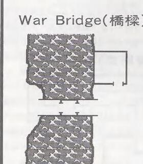
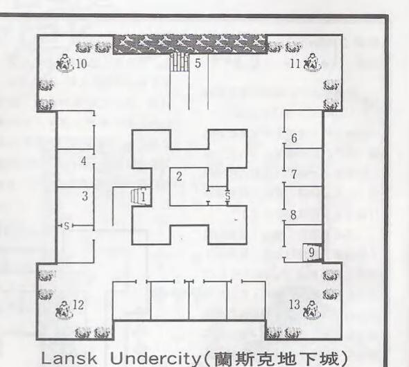
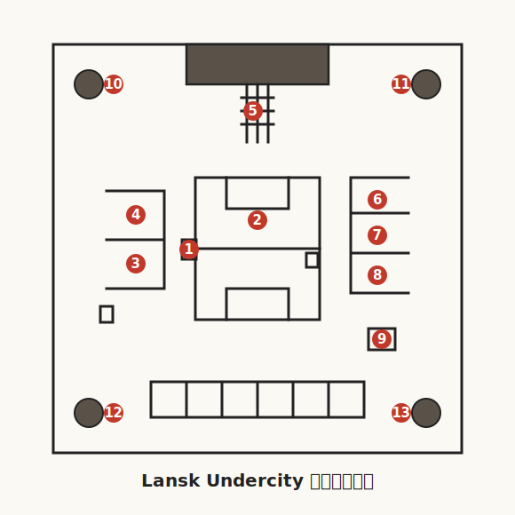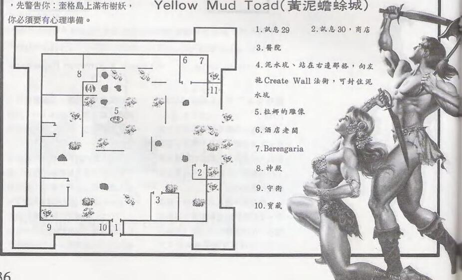

**全文轉寫**

〔承 p35〕在生病,把牠醫好(用法術或物品)後,牠會對你有所回報。

東南角有一樓梯通往 Magan 地底世界,可以經此到達波卡城等其他地點。

**橋樑(War Bridge)**

說實在,這座橋樑乏善可陳,只要出示蘭斯克政府發給的通行證(Governer's Pass),駐軍就會讓你安全過關。

別理會奎格(Quag)觀光局裡的女人。不過當你跨出橋樑之前,先警告你:奎格島上滿布樹妖,你必須要有心理準備。

**Lansk Undercity 圖例**:
1. 通往蘭斯克地面
2. 龍
3. 魔法店
4. 販賣文件及船票
5. 碼頭
6. 武器店
7. 護具店
8. 醫院
9. 通往地底世界
10. 訊息 122
11. 訊息 123
12. 訊息 124
13. 訊息 125

**Yellow Mud Toad 圖例**:
1. 訊息 29
2. 訊息 30,商店
3. 醫院
4. 泥水坑、站在右邊那格,向左施 Create Wall 法術,可封住泥水坑
5. 拉娜的雕像
6. 酒店老闆
7. Berengaria
8. 神殿
9. 守衛
10. 寶藏

---

### sw26-039.jpg — 雜誌 p37:Yellow Mud Toad 黃泥蟾蜍城(續)+ Lanac'toor's Lab 拉娜的實驗室
**切割地圖**
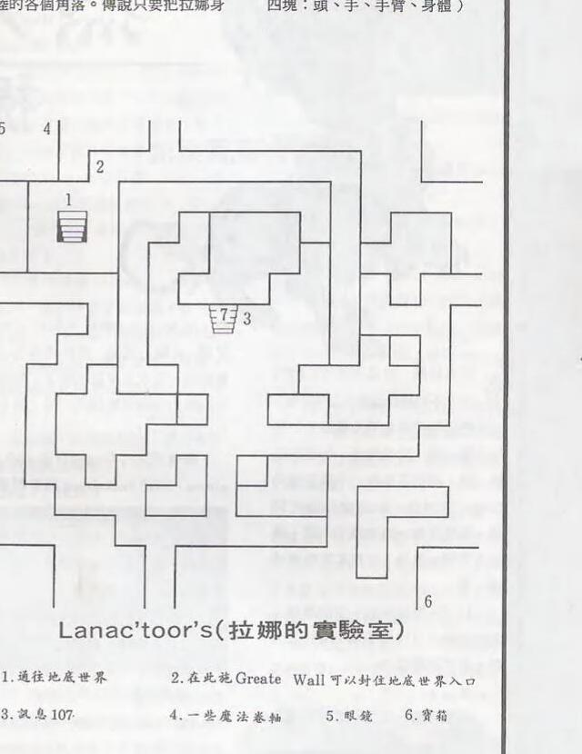

**全文轉寫**

**黃泥蟾蜍城(Yellow Mud Toad)**

好怪異的城市名字!不過果真是處處泥濘,泥水不斷從某個坑洞中湧出,使得整座城市的地基下沈,城牆傾倒。城西北金蟾蜍神殿的住持表示,只要有人能遏阻泥水外洩,就可獲得具有魔法的靴子一雙(Golden Boots),這雙靴子可助你跳過許多深澗河流,不可不拿。只要你找到了泥水湧入的源頭,在此用法術建立一道石牆(Create Wall),就可以去領賞了。

城南的商店販賣護身符(Ankh),不妨買一個留作紀念。另外,聽說有一小支軍隊正在守護城牆內的某處寶藏。

如果你曾經入過菲巴斯城(Phoebus)的監獄,那麼在酒店可以碰到你的救命恩人 Berengaria,他會送給你一些卷軸。當然啦!酒店老闆的小道消息也會使你見識大增。

市中心的半座雕像是偉大的魔法師拉娜(Lanac'toor),事實上邪惡的納達將拉娜變成石像後,又將其敲碎,把碎片散布在迪瑪大陸的各個角落。傳說只要把拉娜身體的碎片在此重新組合,就會有神奇的事發生……(拉娜的碎片共有四塊:頭、手、手臂、身體)

**Lanac'toor's Lab 圖例**:
1. 通往地底世界
2. 在此施 Create Wall 可以封住地底世界入口
3. 訊息 107
4. 一些魔法卷軸
5. 眼鏡
6. 寶箱

**拉娜的實驗室(Lanac'toor's Lab)**

當你找齊了四塊拉娜的身體碎片,才有可能到這裡來。

拉娜把所有的重要物品放在一間封閉的房間,你必須靠軟化石頭(Soften Stone)的法術穿過層層牆壁才能抵達——這個房間是沒有門的。這裡的法術卷軸及武器都十分珍貴,而遺落在地上的眼鏡(spectacles)更不能錯過,它在往後有特殊的功能。

實驗室中有一些遊蕩的孤魂野鬼,只要把地底世界的入口封死(用 Create Wall),它們就不會源源不絕地出現了。

〈待續〉

---

## 第 27 期(1991-06)· 攻略(三)完結篇

> 本期密排正文掃描難度最高,部分句子 OCR 仍偏粗,已盡力逐字並標 `〔?〕`;通順整理版見 [`38_SOFTWORLD_WALKTHROUGH.md`](38_SOFTWORLD_WALKTHROUGH.md)。

### sw27-044.jpg — 雜誌 p42:Smuggler's Cove 海盜竊穴 + The Necropolis 奈羅波裡
**切割地圖**
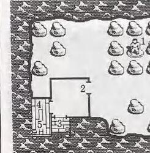
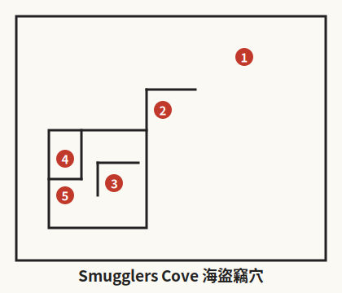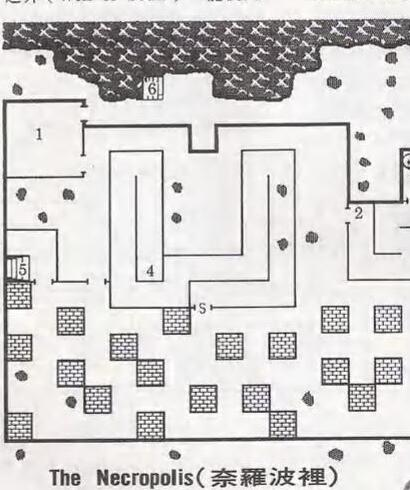
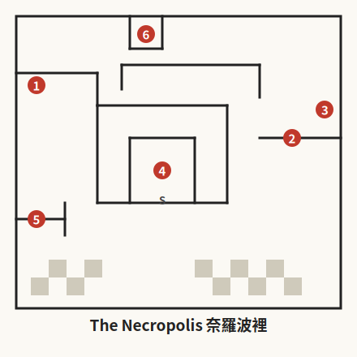
**全文轉寫**

火龍之戰　攻略(三) 完結篇　/Lotus

**海盜竊穴(Smuggler's Cove)**

海盜竊穴位於黃泥蟾蜍城西北的海邊。要取得他們的信任很容易,只要你有滔滔不絕的口才(使用 bureaucratic 技能)或是小偷的技術(hiding、pocket-picking 或 lock-picking),他們就會引你為同類。再付一小筆錢(50 金幣)你便能享受一個晚〔?〕,並且順利出海。

〔本段掃描破損嚴重,語意約為:海盜的藏寶箱在某個門後,須有相當的開鎖/扒竊能力才能取得;救出被擄的女子可獲報酬。〕〔?〕

如果你救完了所有的海盜,會獲得非常豐厚的報酬,還加上一艘性能良好的船,可以載你前往任何你想去的地方(Freeport、Rustic、Sunken Ruins 及 Necropolis)。(寶藏中的 Jade Eye 要好好保留;其他如 Hook、Leg、Parrot 都沒什麼用)

**奈羅波裡(The Necropolis)**

你應該已經對迪瑪大陸上諸神的歷史有了解了。奈羅波裡便是黑暗之后艾卡拉(Irkalla)的丈夫那迦(Nergal)的居所。自從那迦與妻子失和後,就獨居於此。

這裡到處陰森森的,充滿了鬼魂和殭屍,你會發現驅鬼術(Exorcism)在此相當有用。西邊的樓梯通往 Magan 地底世界,如果隊員中有人具有神祕知識(Arcane Lore),就可在下面發現一口靈魂之井(Well of Souls),能使死去的隊員復活。

那迦的寶物在某個密門之後迴廊的盡頭。要見到他,你必須打敗一群小鬼。由於那迦喜食蘑菇(mushrooms),呈上一些蘑菇便能討得他的歡心了。蘑菇可在神祕林子裡的水池中採得;只有此處才能採到。

東邊的某個房間裡充滿了蜘蛛和一個傳送點——這個傳送點有故障,會把你傳送到迪瑪諸大陸某處。如果想找到回家的路,千萬別把自己傳送出去——否則你將永遠回不到家了。

**The Necropolis(奈羅波裡)圖例**:
1. Stone trunk(石製樹幹)
2. 神祕門
3. 傳送處
4. 那迦
5. 通往靈魂之井
6. 碼頭

**Smuggler's Cove(海盜竊穴)圖例**:
1. 救你出海者
2. 訊息 41
3. 往 Necropolis
4. 往訊息〔?〕
5. 船,可前往 Freeport、Rustic、Necropolis 或 Sunken Ruins

---

### sw27-045.jpg — 雜誌 p43:Magan Underworld 瑪根地底世界(大地圖)
**切割地圖**
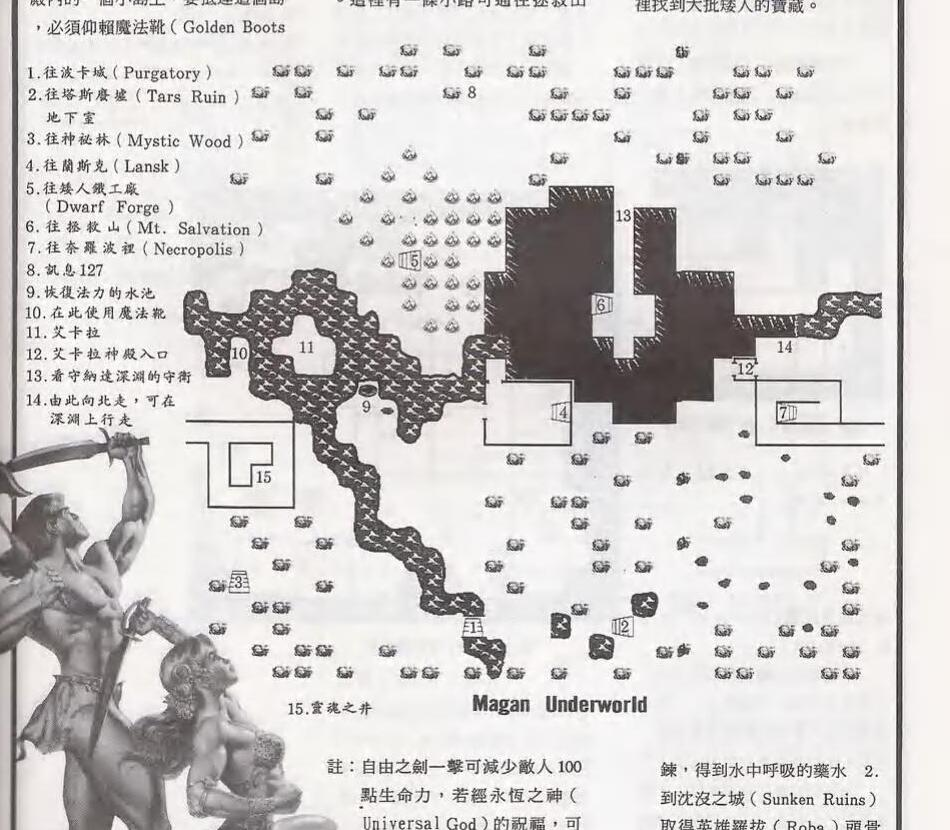

**全文轉寫**

**Magan Underworld**

這是一個深藏在地底的神祕世界。上面有許多出口通往地面。聰明的探險者都喜歡到地底通過前往各地,因為這裡的怪物較少、又不必繞遠路。

值得一提的是黑暗之后艾卡拉也居住在這個神域。你必須先通過她那守衛森嚴的雕像。艾卡拉就居住在神殿內的一個小房間裡,要抵達這個區域,必須要有魔法靴(Golden Boots)〔與拯救山 Mountain of Salvation〕之助。如果你能解開艾卡拉身上的鎖鏈(可從 Necropolis 那邊取得銀鎖匙),她會幫助你鑄造天下無敵的自由之劍(Sword of Freedom)。

另一處地方也很重要:那就是納達的深淵(Namtar's Pit),傳說納達由這裡誕生,只有把他重新投入這裡,他才會真正被毀滅。要進入這裡必須付出生命的代價——每個隊員的生命點數都會降到 1 點。這裡有一條小路可通往拯救山〔?〕,只是去的隊員須有生命再生(但是須有人通曉神祕知識)。在地底世界沒有路可直接通往靈魂之井,必須經奈羅波裡(Necropolis)才能抵達。

此外,還有一個出口通往矮人的鐵工廠(Dwarf forge)。這個出口被許多能造成傷害的火焰包圍。如果你不怕受傷的話,可以在這裡找到大批矮人的寶藏。

**Magan Underworld 圖例**:
1. 往波卡城(Purgatory)
2. 往塔斯廢墟(Tars Ruin)地下室
3. 往神祕林(Mystic Wood)
4. 往蘭斯克(Lansk)
5. 往矮人鐵工廠(Dwarf Forge)
6. 往拯救山(Mt. Salvation)
7. 往奈羅波裡(Necropolis)
8. 訊息 127
9. 恢復法力的水池
10. 在此使用魔法靴
11. 艾卡拉
12. 艾卡拉神殿入口
13. 看守納達深淵的守衛
14. 由此向北走,可在深淵上行走
15. 靈魂之井

> 地圖標題:Magan Underworld

> **〔底部註腳〕** 自由之劍一擊可減少敵人 100 點生命力,若經永恆之神(Universal God)的祝福,可摧毀地獄之火(Inferno)法術,威力驚人!鑄造自由之劍步驟如下:1. 解除艾卡拉的鎖鍊,得到水中呼吸的藥水;2. 到沈沒之城(Sunken Ruins)取得英雄羅拔(Roba)頭骨;3. 解救隊員 1 名,以〔?〕鎖匙開啟有鐵鍊鎖的箱子;4. 從艾卡拉處取〔劍〕。

---

### sw27-046.jpg — 雜誌 p44:Old Dock 老碼頭 + Bridge of Exiles 放逐橋 + Snakepit 蛇窟
**切割地圖**
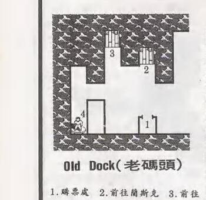
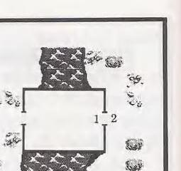
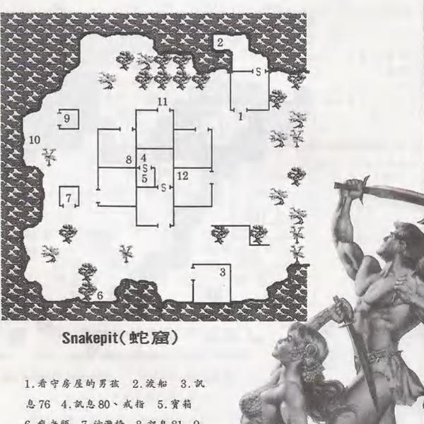

**全文轉寫**

> 〔本頁正文掃描破損較多,以下逐字保留,語意以 `〔?〕` 標註不確定處;通順版見 38。〕

**老碼頭(Old Dock)**

如果在蘭斯克地下城購買了前往王島的船票,就會在這裡下船。同樣地,你也須有船票,才可能搭船前往京雄〔城〕。

此處另有一碼頭,有渡船通往尼塞山(Nisir),但是只接受去尼塞山的朝聖者。因此,你必須穿上朝聖者的朝聖衣(Pilgrim's Garb),在京雄城 Kingshome 中可找到。〔納達的窟穴就在尼塞山中的某處。〕

看到雕像時你拚力推進(使用力氣 strength),說不定底下藏了東西喔!

〔右欄,掃描破損:語意約為——中心房舍中有一密室,內有屍體,拿取屍體手上的戒指和寶箱;由此可確定迪瑪大陸的國王早已被納達害死,納達只是利用國王的名義四處為惡。〕〔?〕

**放逐橋 & 蛇窟(Bridge of Exiles & Snakepit)**

放逐橋位於王島的西南角,此橋乏善可陳。不過要小心——一旦你通過此橋,就無法再從此橋回到原處了。

橋的另一邊是座精神病院;也就是說放逐橋盡頭的「蛇窟」,除了真正的瘋子之外,還住著被放逐的人。不妨與他們談談。

「蛇窟」三面環海,西岸常有一些被海浪沖上岸的遇難人。此外,北邊的樹林裡有許多樹枝,它們具有喚醒〔亡魂〕之力。把這些〔交〕給海邊的魔老頭,說不定會有助人之事。〔?〕

**Bridge of Exiles(放逐橋)圖例**:
1. 訊息:「自動鎖上的門。進入此門的人,放棄你所有的希望吧!」
2. 訊息 50

**Old Dock(老碼頭)圖例**:
1. 購票處
2. 前往蘭斯克
3. 前往尼塞山
4. 雕像

**Snakepit(蛇窟)圖例**:
1. 看守房屋的男孩
2. 渡船
3. 訊息 76〔?〕
4. 訊息 80、戒指
5. 寶箱
6. 〔?〕
7. 沖灘〔?〕
8. 訊息 81
9. 通陸〔?〕
10. 〔?〕(stone head)
11. 樹枝
12. 瘋女人
13. 瘋男人

---

### sw27-047.jpg — 雜誌 p45:Dwarf Ruins 矮人廢墟 & Clanhall 矮人城堡 + Siege Camp 軍營(起首)
**切割地圖**
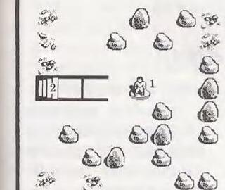
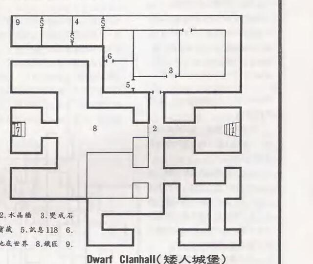

**全文轉寫**

**矮人廢墟及城堡(Dwarf Ruins & Clanhall)**

矮人廢墟位於國王島,拜占儂市南方的一堆石頭之間。沒有人知道為什麼原本繁榮的城會於一夕之間荒廢。矮人城堡的入口有機關控制,如果你曾在海盜竊穴奪得翡翠眼(Jade Eye),把它擺到廢城中心的雕像上,城堡的通道就會打開。

進入城堡後,別忘〔?〕只顧著掠奪財物——如大家所知,矮人的工藝技術精湛,因此建造了守護寶藏的機器人,只要你拿取了城堡中的任一樣東西,你就會知道它們的厲害。

納達把城堡之寶聚集在城堡北面的某一房間內,在此施軟化石牆(Soften Stone)法術,就可〔將變成石像的矮人〕還原原形——一旦你救活了矮人們,就是他們的朋友,因此可以拿取城堡中所有的物品而不受攻擊。他們也會隨處助你。

如果你想要鑄造自由之劍,就必須到城堡西邊的鐵工廠去。中間有一片水晶牆。要前往鐵工廠,可以由 Magan 地底世界進入,或是使用軟化石牆的法術,穿過鐵工廠的城牆。工廠內技藝精湛的矮人鐵匠會很樂意地幫你鑄劍(把頭骨 Skull 給鐵匠)。

**Dwarf Ruins(矮人廢墟)圖例**:
1. 雕像
2. 通往矮人城堡

**Dwarf Clanhall(矮人城堡)圖例**:
1. 通往廢墟
2. 水晶牆
3. 變成石像的矮人
4. 訊息〔?〕
5. 訊息 118
6. 寶藏
7. 通往地底世界
8. 鐵匠
9. 寶藏

**軍營(Siege Camp)**〔起首,地圖在 p46〕

若是你想要進入拜占儂市(Byzanople),就必須穿越其周圍的重重軍營。納達的軍隊由被剝奪靈魂者帶領,把拜占儂市團團包圍。

要進入軍營,首先必須加入軍隊,有人會向你詢問是否願加入納達前往拜占儂的士兵……一般來說相當平靜,還有免費的醫療服務。走過軍營後,他會要你滲透到拜占儂城去當間諜。

穿過營北的門,直至接近拜占儂市內,要幫助市民對抗納達、或站在邪惡的一方助紂為虐,就看你一念之間了。

---

### sw27-048.jpg — 雜誌 p46:Siege Camp 軍營 + City of Byzanople 拜占儂市 + Byzanople Dungeon 指揮部
**切割地圖**
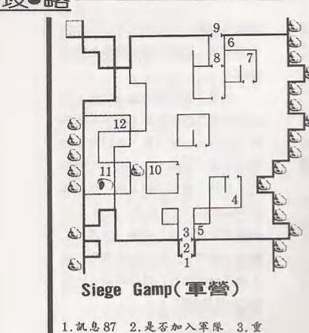
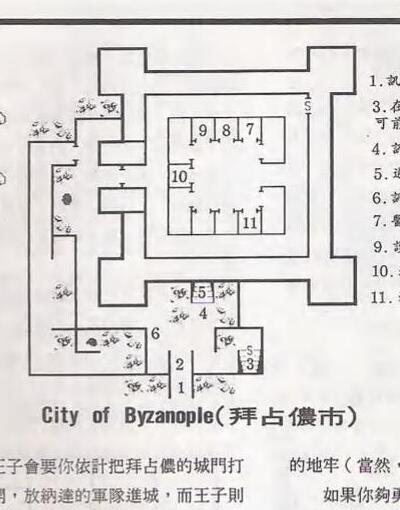
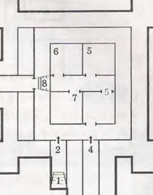
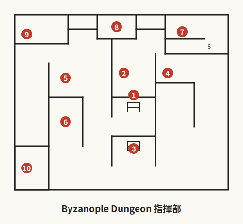
**全文轉寫**

> 〔本頁正文密排且掃描破損嚴重,逐字保留,語意以 `〔?〕` 標註;通順版見 38。〕

**Siege Camp(軍營)圖例**:
1. 訊息 87
2. 是否加入軍隊
3. 寶〔?〕
4. 醫療處
5. 寶箱
6. 〔?〕的一些裝備
7. 寶箱
9. 〔?〕
10. 訊息 90
11. 訊息〔?〕、秘密通道,通往拜占儂城
12. 通往〔?〕大牢

**City of Byzanople(拜占儂市)圖例**:
1. 訊息 33
2. 對話
3. 在此使用 Strength,可前往地下指揮部
4. 訊息 37〔?〕
5. 通往地下指揮部
6. 訊息 34
7. 武器店
8. 護甲店
9. 護甲店
10. 通往地下指揮部
11. 通往軍營的秘道

**拜占儂市(Byzanople)及地下指揮部**

〔正文掃描破損,語意整理:城牆上的羽箭和熱油會造成傷害;指揮部設於城內,有兩條通路可通向地底,以 strength 或鏟子可進入。〕〔?〕

拜占儂的軍隊由喬丹王子(Prince Jordan)率領,王子不相信他父親(國王)是如此殘酷的人,堅信國王被納達控制了。〔王子會給你「投降 surrender」的選項;若你跟隨他,王子會要你把城門打開放納達軍進城,王子則率隊從秘密通道突擊。但繞道將軍早已得知秘道所在並設下重兵;若你真把城門打開,王子會喪命、城市遭劫,你也會被抓進京雄城地牢。〕〔?〕

如果你夠勇敢、戰鬥力夠強,不妨跟隨王子進入秘道,到達〔軍營〕展開一場大戰,贏了就可救出喬丹王子,獲得優良的報酬。如果輸了也不打緊,納達不會將你弄死,只是把你抓進京雄城的監牢罷了。

**Byzanople Dungeon(指揮部)圖例**:
1. 通往地面
2. 通往地面
3.–4. 在此使用 strength 或鏈子可通過
5. 寶藏
6. 喬丹王子
7. 牢房
8. 通往軍營
9. 寶藏
10. 〔?〕

---

### sw27-049.jpg — 雜誌 p47:Kingshome 京雄城 & 地牢 + Freeport 自由港(起首)
**切割地圖**
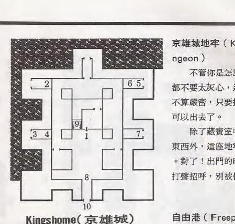
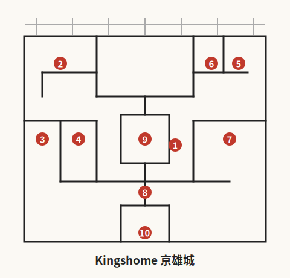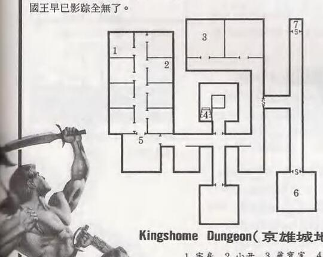
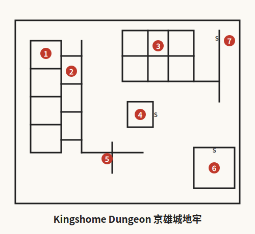
**全文轉寫**

〔左欄承前頁〕解救拜占儂後,城市將恢復正常的繁榮,各家商店一應俱全,不妨前去逛逛。另外,地下指揮部的西邊有一處暗室,其中除鬼魂和殭屍外,偶有一柄魔斧(magic axe),威力並不太強,拿不拿由你。

**京雄城(Kingshome)**

京雄城是迪瑪故的王城。自從納達當權後,這座王城就荒廢,不准任何居民進入。一旦你看到守衛在納達淫威下守王城外——出示〔通行證〕給他們看,他們就會放你大搖大擺地進去。

偌大的王城內毫無聲息,灰塵滿佈,顯然已經荒廢了一段時日。城內還存有一些值錢的東西,但是國王早已影踪全無了。

**Kingshome(京雄城)圖例**:
1. 中庭
2. 國王的家族雕像
3. 寶藏
4. 一些裝備
5. 國王御寶藏
6. 雕像
7. 寶藏
8. 訊息 130
9. 通往地牢
10. 守衛

**京雄城地牢(Kingshome Dungeon)**

不管你是怎麼進來這座地牢的,都不要太灰心,這座地牢的防守並不算嚴密,只要找一處弱點便可以出去了。

除了藏寶室中有些值得拿取的東西外,這座地牢沒什麼可怖之處。對了!出門的時候你和納達道打聲招呼,別被他偷出來啦!〔?〕

**Kingshome Dungeon(京雄城地牢)圖例**:
1. 牢房
2. 小巷
3. 藏寶室
4. 出口
5. 出口
6. 訊息 42、王冠和金幣〔?〕
7. 陷阱

> **以下各城/地點均位於海外**:你必須打敗海盜竊穴中的海盜、奪得船隻後才可能前往。

**自由港(Freeport)**〔起首,地圖在 p48〕

自由港名實相符,是個未落入納達魔掌的避難所。這裡有各種商店,人民也尚稱安泰,其酒店老闆會告訴你拉娜(Lanac'toor)身懷許多線索。〔正文掃描破損,語意整理:島上的塔斯城 Tars 換取酒店老闆所要的礦石;城內有一座「劍之秩序」(the Order of the Sword)的屋子,進入後會冒出許多士兵,擊敗後可得一塊鑄劍的碎片(Stone Hand);自由港是英雄羅拔 Roba 的故鄉,傳說自由之劍藏於此。〕〔?〕

---

### sw27-050.jpg — 雜誌 p48:Freeport 自由港(續)+ Royal Game Preserve 皇家專有獵區 + Scorpion Bridge 蠍橋 + College of Magic(起首)
**切割地圖**
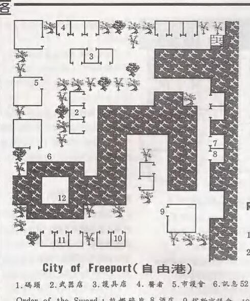
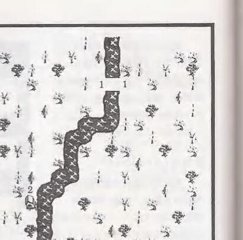
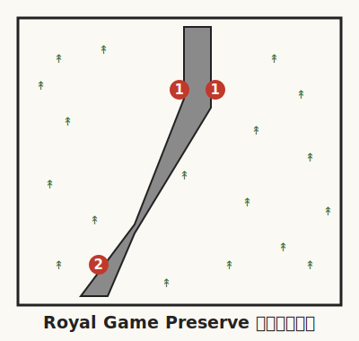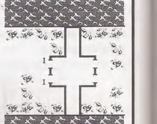
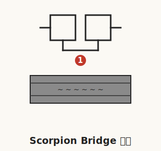
**全文轉寫**

**City of Freeport(自由港)圖例**:
1. 碼頭
2. 武器店
3. 護具店
4. 醫者
5. 市議會
6. 訊息 52
7. the Order of the Sword,拉娜碎片
8. 酒店
9. 塔斯市議會
10. 魔法店
11. 賣龍石的店
12. 自由之劍
13. 訊息 56

**Royal Game Preserve(皇家專有獵區)圖例**:
1. 野獸的足跡。使用追蹤技能可找到
2. 傑克的小屋

**Scorpion Bridge(蠍橋)圖例**:
1. 半人半獸

**皇家專有獵區(Royal Game Reserve)**

皇家專有獵區位於 rustic 的樹林間,昔日老國王十分喜歡在此打獵。這裡有許多野獸及樹精,戰力十分強勁,是個練功的好所在,不過除此之外就沒有什麼特別的。不過注意,這裡是禁止外人行獵的。

老傑克是獵區的管理員,對國王忠心耿耿。他在林間佈下了不少陷阱,踩上了會被高高吊起,過一陣子才能下來。碰到傑克時,只要出示老國王的戒指(signet Ring),就能獲得一把百發百中的神弓(magic bow)。

**蠍橋(Scorpion Bridge)**

當你在 rustic 下船,沿著海向南行,就會抵達蠍橋。蠍橋由兩隻半人半獸把守,如果你在神祕林(mystic wood)獲得的 Totem of Enkidu 還在身邊,拿給牠們看,就可安然通過。

過了半人半獸這一關,漆黑的屋子裡還有不少兇猛野獸,咬緊牙關向前直行就好。這裡並不適合久待。

**魔法學校(College of Magic)**

在 rustic 通過蠍橋後,就可以看見一所房屋,那就是著名的魔法學校。這個學校由拉娜的老師——烏娜(Utnapishtim)主持。

首先,你必須找到學校的入口。這個入口是隱藏起來的,要使用特製的眼鏡(Spectacles,在拉娜的實驗室中)才能找到。接著你必須通過六項測驗,才能成為魔法學校的學生,因此進入學校之前,趕緊確定自己的法力點數是否充足,健康是否良好。以下是通過測驗的方法。

---

### sw27-051.jpg — 雜誌 p49:College of Magic 魔法學院(六項測驗)+ Dragon Valley 龍谷(起首)
**切割地圖**
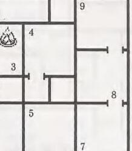
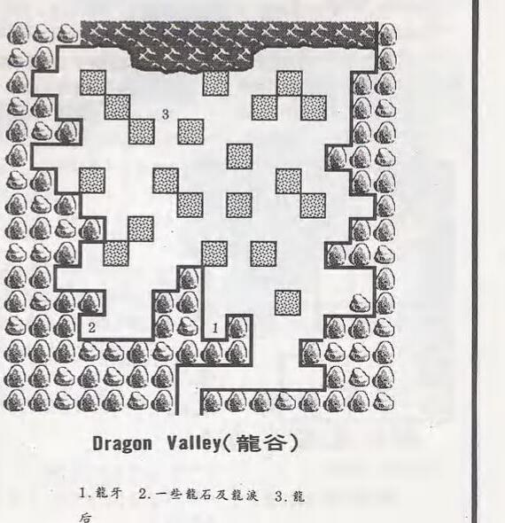
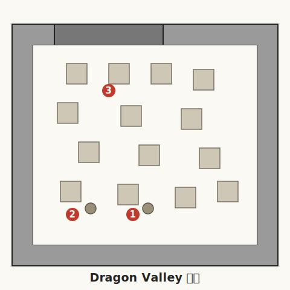
**全文轉寫**

**College of Magic(魔法學校)圖例**:
1. 入口。在此使用眼鏡
2. 測驗一
3. 測驗二
4. 測驗三
5. 測驗四
6. 野蠻人
7. 測驗五
8. 測驗六
9. 烏娜

**Dragon Valley(龍谷)圖例**:
1. 龍牙
2. 一些龍石及龍淚
3. 龍后

**六項測驗**:
- **測驗一**:施展 Ice Chill 法術,凍結面前的火牆。
- **測驗二**:施展 Fire Storm 法術,熔化面前的冰牆。
- **測驗三**:施展 Cloak Arcane 法術,使隊伍隱形。
- **測驗四**:和野蠻人戰鬥,注意:你必須全憑力氣,法術在這裡是不起效用的。
- **測驗五**:施展 Soften Stone 或 Disarm Trap 法術通過陷阱。
- **測驗六**:這關最簡單,不要理會烏娜的恫嚇,直接向前穿門而過即可。

最後,烏娜會讓你挑選一樣寶具,選擇靈碗(Soul Bowl),這個物品可以在神祕林中查頓(Zaton)的墓前使用,其他的物品則沒什麼用處。除此之外,你還可以得到許多卷軸,能拿多少便拿多少,因為下次你不會再有機會來了。

**龍谷(Dragon Valley)**

進入龍谷的人必須有極強的戰力和一顆龍寶石(Dragon Gem,在蘭斯克地下城),兩者缺一不可。最好再帶一批龍石去補充法力。

龍谷位於沈沒之城(Sunken Ruin)西方附近的石堆間,裡面盡是些超強的骷髏龍、龍鷹士及火龍。碰到牠們時,下手絕對不能容情,多戰一回合就能使你遭受極大的損失,因為大部分的龍在遠處就可噴火攻擊,你必須忍痛多向前幾步才能打到牠們。

龍后座落於谷地北面,碰到她時,不必妄想打贏她,拿出身上的龍寶石,她就知道你是龍的朋友。在你最後與納達的決戰中,龍后這位朋友可使你省去不少麻煩。

此外,谷中的龍牙(Dragon tooth)是不錯的武器,可攻擊 60 呎以外的敵人,而龍眼及龍淚(dragon eye、dragon tears)也相當珍貴,龍眼的功用和龍石相同,不過效力更強。

除非你喜歡濫砍濫殺,否則最好別在這裡流連,見到了龍后就趕緊回家吧!

---

### sw27-052.jpg — 雜誌 p50:Sunken Ruins 沉沒之城 + Pilgrim Dock 朝聖者碼頭(起首)
**切割地圖**
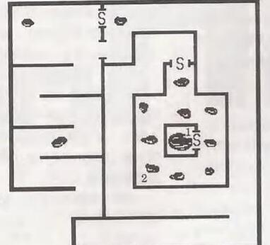
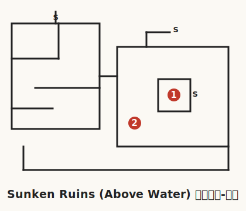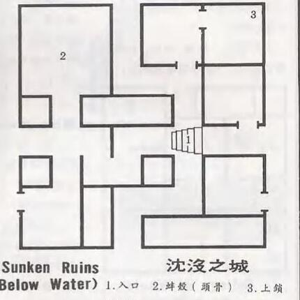
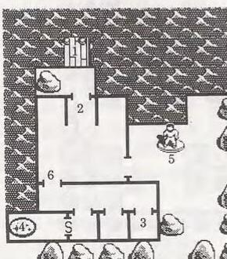

**全文轉寫**

**Sunken Ruins (Above Water)(沈沒之城-陸上)圖例**:
1. 水池
2. Spiked Flail

**Sunken Ruins (Below Water)(沈沒之城-水下)圖例**:
1. 入口
2. 蚌殼(頭骨)
3. 上鎖〔門〕

**Pilgrim Dock(朝聖者碼頭)圖例**:
1. 碼頭
2. 檢查站
3. 監牢
4. 傳送站
5. 永恆之神的雕像
6. 看守監獄的守衛

**沈沒之城(Sunken Ruins)**

沈沒之城共有兩個部分:陸上與水下。陸上的部分沒有什麼特別,敵人也都不強。城市北方有一道密門,可在門內拾獲一項十分強的武器 Spiked Flail。再過一道密門,就可見到一水池,這時候使用艾卡拉給你的藥水(water breathing potion),就可潛到水中,進入沈沒之城的水下部分。

到沈沒之城的主要目的是尋找英雄羅拔的頭骨,用以鑄造自由之劍。頭骨在一隻大蚌中,拾起蚌殼(clam),等你離水後蚌殼就會自動打開。此外,某一只寶箱裡有一些龍石,走的時候別忘了帶回去作紀念。

**朝聖者碼頭(Pilgrim Dock)**

雖然納達摧毀了瑪沙陸上的各個城市,卻無法控制人們對神的敬仰之心。每天都有許多虔誠的朝聖者在國王島的老碼頭搭乘小船,前往他們心中的聖地——尼塞山(Nisir),那是永恆之神(Universal God)的神殿所在地。

從老碼頭登上朝聖者渡船後就會抵達這個碼頭。注意:別急著把身上的白袍脫掉,納達的武士正守在檢查站,虎視眈眈地檢查每個朝聖者是不是冒充的。一進入檢查站的門,不要多所逗留,直接走出房間,繼續直走即可進入尼塞山。

如果你不慎和守衛發生衝突、被抓進牢裡,不要驚慌,設法打開監獄的門,最西邊房間的秘門後有一個傳送站,可將你傳送到尼塞山。

最後提醒你:走出碼頭前,要把身上的白袍換成盔甲。畢竟,光憑神的保佑不足以使你抵抗尖刀利劍。

---

### sw27-053.jpg — 雜誌 p51:Nisir 尼塞山 + Depth of Nisir 尼塞山腹(起首)
**切割地圖**
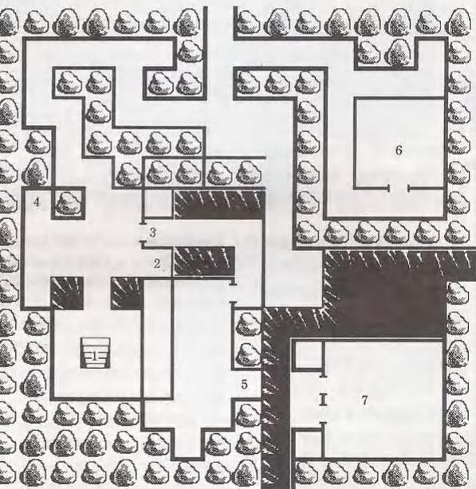
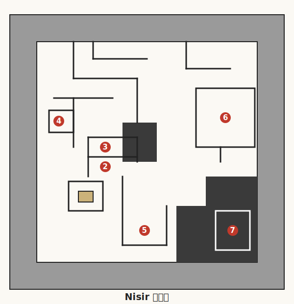
**全文轉寫**

**Nisir(尼塞山)圖例**:
1. 通往 Magan 地底世界
2. 使用 IQ 再使用 Climb,可翻牆而過
3. 納達神殿
4. 寶箱,內有大批龍眼和武器
5. 在此使用魔法靴可越過深淵
6. 永恆神祇,可在此使用自由之劍
7. 傳送至尼塞山腹

**尼塞山(Nisir)**

共有兩種方式可抵達尼塞山:搭乘朝聖者渡船或經由 Magan 地底世界。在這裡你可以遇見一些朝聖者(pilgrim),別急著攻擊,他們並沒有惡意,你只要選擇避開(run)就沒事了。

尼塞山頂有永恆神祇的神殿(Universal God),是每個朝聖者必到之地。如果你身上配有自由之劍,在這裡祝禱一番,再施展地獄之火(Inferno)法術,可說是如虎添翼。

西邊牆角有一處寶藏,由一些納達的爪牙守護著。寶藏中有三十顆龍眼(dragon eye),對法力的補益大有助益。給你一個建議:等到你決定和納達決一死戰時,再去動這個寶藏。由於決戰時會大量消耗法力,最好把各人身上不必要的東西全數扔光,拿完這三十顆龍眼,才能有十足的把握對付納達。

尼塞山是個既神聖、又邪惡的地方,因為納達的巢穴也設於此地,納達的黑塔位於東南角,四周都〔承右欄/續〕是深淵。要走近深淵必須通過納達神殿中的重重埋伏,但是如果你具有攀登技能,而且 IQ 夠高,可以從神殿大門邊爬牆進入(先使用 intelligence,再使用 Climb 技能),這樣能避免許多無謂的戰鬥。走到深淵旁邊,使用魔法靴(Golden Boots)可一躍而過,面前的黑塔可以將你傳送到尼塞山腹——納達的基地,你準備好了嗎?

**尼塞山腹(Depth of Nisir)**

最後的時刻即將來臨。記住:傳說必須將納達投入地底世界的深淵,才能真正將他消滅。

剛被傳送進來時,你會發現自己處於一間密閉的房間,使用 Soften Stone 法術可穿過牆壁,儘快直走到盡頭,再施一次 Soften Stone,就可進入納達的基地。

這裡到處都是敵人,傳送點也很多,而且不太有規則,某些地方更佈下了陷阱。不過如果謹記下面幾點,要保持平安也並非沒有可能:〔1. 每接收到「the floor is mo-」續下頁〕

---

### sw27-054.jpg — 雜誌 p52:Depth of Nisir 尼塞山腹深處 — 決戰 Namtar 納達 + 結局
**切割地圖**
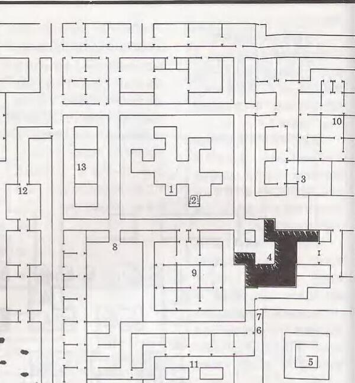
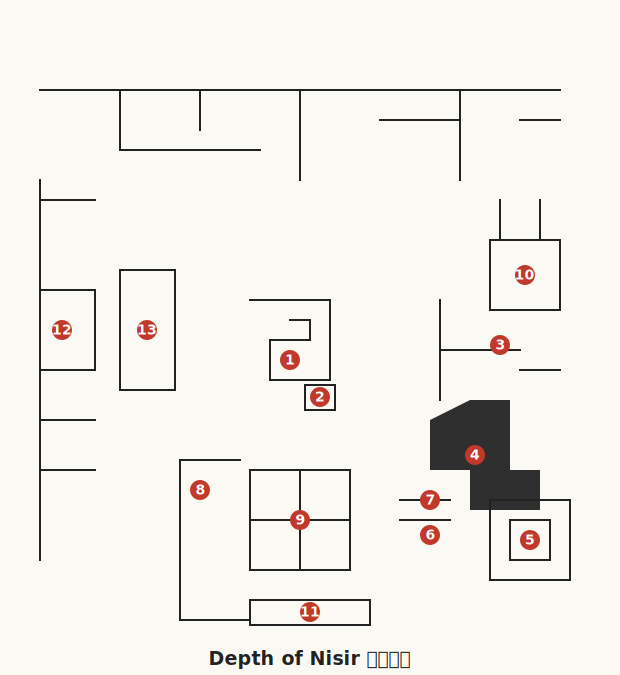
**全文轉寫**

**Depth of Nisir(尼塞山腹)圖例**:
1. 剛被傳送到時的地點
2. 通往 Magan 地底世界
3. 鐵頭將軍
4. 深淵。在此召喚風元素可度過
5. 傳送到 6
6. 〔位置點〕
7. 出口
8. 這段以南有許多隱形牆,要慢慢摸索著向南走
9. 傳送至 10
10. 傳送至 9
11. 美斯達。其周圍均是會傷人的太陽之風。將他打敗後會被臨死的他傳到 13
12. 從這裡向南的三個大房間是納達的實驗室,好好參觀吧!
13. 北、東、南三方向都有敵人,所以最好向西使用 Soften〔Stone〕穿牆而過

**正文(承前頁第 1 點)**:

〔1. 每接收到「the floor is mo-〕ving」訊息,趕緊按〔?〕鍵查看自己是否已不在原位。多走幾次,一定可以到你想去的地方。2. 走道上的敵人多半是隨機出現的,不妨一接觸就溜之大吉,再走回來時很可能就能安然通過。3. 保持戰力及法力,能躲就躲。每打一場就馬上療傷及恢復法力。4. 善用「軟化石牆」法術,穿牆而過可以避免許多戰鬥。有些地方更是非用不可。

納達的左右手美斯達(Mystalvision)和鐵頭將軍(Iron Head)都在此處,只要你找到他們,就可以和他們決一死戰。⑫處向南有三個大房間,逐一看去,或許你可以猜到納達的野心。

如果你希望直接找到納達,可以循以下步驟:走到 ⑷ 處召喚風元素度過深淵,向東走到底再向南走到底,施 Soften Stone 穿牆而過。這時你會到達一個充滿陷阱的房間,向南走到牆邊,再使用 Soften Stone,走到 ⑸,然後就會被傳到 ⑹。

在原處把生命及法力點數補足,然後就得向南開始與納達的黨羽們展開車輪大戰。如果你這時想要退卻,退至 ⑺ 即可被傳送出尼塞山。此外,若是你曾在龍谷向龍后出示龍寶石,此刻使用龍寶石(Dragon Gem)召喚龍后,就可乘在她背上越過納達的重重軍隊,直接與納達作戰。

由於納達非常強大,你必須連續將他打倒三次才能暫時勝利,因此在 ⑹ 處最好把所有的龍石及龍眼都放在法師身上,免得法力補充不足。

擊敗納達後,帶著他的屍體被傳送到 Magan 地底世界的魔法水池旁,療好傷後,再走到水池去恢復法力,然後向納達深淵(Namtar's Pit)前進。大約走一、兩〔步,千萬撐〕住,否則一敗之下將前功盡棄……在納達深淵前,納達又會起身和你作最後的殊死戰,再度將他打敗後……走到深淵前,把屍首投下……**享受最後勝利的快樂吧!**

---

## 附錄:39 張純方格切圖 + 39 張臨摹向量圖一覽

> 純方格切圖(像素複製、無中文)位於 [`softworld_images/maps/`](softworld_images/maps),檔名格式 `<掃描頁>_<地點slug>.jpg`;
> 每張另有**同名臨摹向量圖** `.svg`(potrace 描摹),位於 [`softworld_images/maps_svg/`](softworld_images/maps_svg)(例 `sw25-035_purgatory.jpg` ↔ `sw25-035_purgatory.svg`)。

| # | 檔名 | 地點 | 期 |
|---|---|---|---|
| 1 | `sw25-035_purgatory.jpg` | Purgatory 波卡城 | 25 |
| 2 | `sw25-036_slave_camp.jpg` | Slave Camp 奴隸營 | 25 |
| 3 | `sw25-036_slave_mines.jpg` | Slave Mines 礦場 | 25 |
| 4 | `sw25-037_mog_estate.jpg` | Mog's Slave Estate 莫格的宅院 | 25 |
| 5 | `sw25-037_tars_ruins.jpg` | Tars Ruins 塔斯廢墟 | 25 |
| 6 | `sw25-038_tars_dungeon.jpg` | Tars Ruins 地下室 | 25 |
| 7 | `sw25-038_guarded_bridge.jpg` | Guarded Bridge 守橋 | 25 |
| 8 | `sw25-038_phoebus.jpg` | Phoebus 菲巴斯城 | 25 |
| 9 | `sw25-039_phoebus_dungeon.jpg` | Phoebus Dungeon 菲巴斯地牢 | 25 |
| 10 | `sw26-036_mystic_wood.jpg` | Mystic Wood 神祕林 | 26 |
| 11 | `sw26-036_guarded_bridge.jpg` | Heavily guarded bridge 橋樑 | 26 |
| 12 | `sw26-037_lansk.jpg` | Lansk 蘭斯克 | 26 |
| 13 | `sw26-038_war_bridge.jpg` | War Bridge 橋樑 | 26 |
| 14 | `sw26-038_lansk_undercity.jpg` | Lansk Undercity 蘭斯克地下城 | 26 |
| 15 | `sw26-038_yellow_mud_toad.jpg` | Yellow Mud Toad 黃泥蟾蜍城 | 26 |
| 16 | `sw26-039_lanactoor_lab.jpg` | Lanac'toor's Lab 拉娜的實驗室 | 26 |
| 17 | `sw27-044_smugglers_cove.jpg` | Smuggler's Cove 海盜竊穴 | 27 |
| 18 | `sw27-044_necropolis.jpg` | The Necropolis 奈羅波裡 | 27 |
| 19 | `sw27-045_magan_underworld.jpg` | Magan Underworld 瑪根地底世界 | 27 |
| 20 | `sw27-046_old_dock.jpg` | Old Dock 老碼頭 | 27 |
| 21 | `sw27-046_bridge_of_exiles.jpg` | Bridge of Exiles 放逐橋 | 27 |
| 22 | `sw27-046_snakepit.jpg` | Snakepit 蛇窟 | 27 |
| 23 | `sw27-047_dwarf_ruins.jpg` | Dwarf Ruins 矮人廢墟 | 27 |
| 24 | `sw27-047_dwarf_clanhall.jpg` | Dwarf Clanhall 矮人城堡 | 27 |
| 25 | `sw27-048_siege_camp.jpg` | Siege Camp 軍營 | 27 |
| 26 | `sw27-048_byzanople.jpg` | City of Byzanople 拜占儂市 | 27 |
| 27 | `sw27-048_byzanople_dungeon.jpg` | Byzanople Dungeon 指揮部 | 27 |
| 28 | `sw27-049_kingshome.jpg` | Kingshome 京雄城 | 27 |
| 29 | `sw27-049_kingshome_dungeon.jpg` | Kingshome Dungeon 京雄城地牢 | 27 |
| 30 | `sw27-050_freeport.jpg` | City of Freeport 自由港 | 27 |
| 31 | `sw27-050_royal_game_preserve.jpg` | Royal Game Preserve 皇家專有獵區 | 27 |
| 32 | `sw27-050_scorpion_bridge.jpg` | Scorpion Bridge 蠍橋 | 27 |
| 33 | `sw27-051_college_of_magic.jpg` | College of Magic 魔法學院 | 27 |
| 34 | `sw27-051_dragon_valley.jpg` | Dragon Valley 龍谷 | 27 |
| 35 | `sw27-052_sunken_ruins_above.jpg` | Sunken Ruins 沉沒之城-陸上 | 27 |
| 36 | `sw27-052_sunken_ruins_below.jpg` | Sunken Ruins 沉沒之城-水下 | 27 |
| 37 | `sw27-052_pilgrim_dock.jpg` | Pilgrim Dock 朝聖者碼頭 | 27 |
| 38 | `sw27-053_nisir.jpg` | Nisir 尼塞山 | 27 |
| 39 | `sw27-054_depth_of_nisir.jpg` | Depth of Nisir 尼塞山腹 | 27 |

---

## 相關文件

- [`38_SOFTWORLD_WALKTHROUGH.md`](38_SOFTWORLD_WALKTHROUGH.md) — 三期攻略**導讀整合版**(按地點 + 事件表 + 手冊段落擴充)
- [`34_READ_PARAGRAPHS.md`](34_READ_PARAGRAPHS.md) — 手冊「編號段落書」段落 1–147 全文(攻略「訊息 N」對應)
- [`35_SOFTWORLD_25.md`](35_SOFTWORLD_25.md) / [`36_SOFTWORLD_26.md`](36_SOFTWORLD_26.md) / [`37_SOFTWORLD_27.md`](37_SOFTWORLD_27.md) — 各期原始轉寫
- [`CONTEXT.md`](../CONTEXT.md) — 譯名標準
