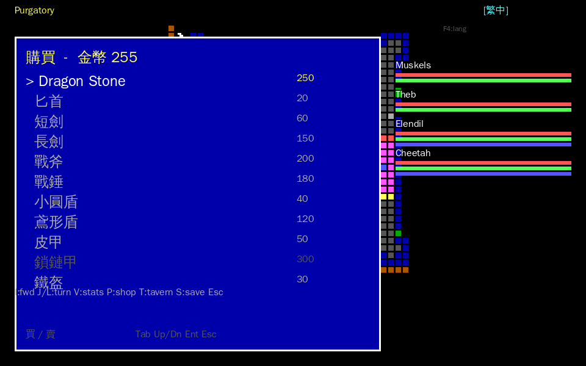
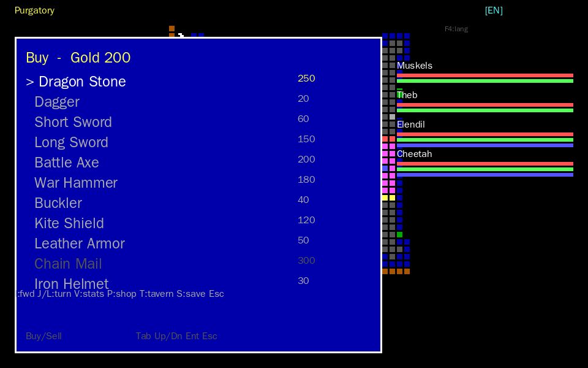
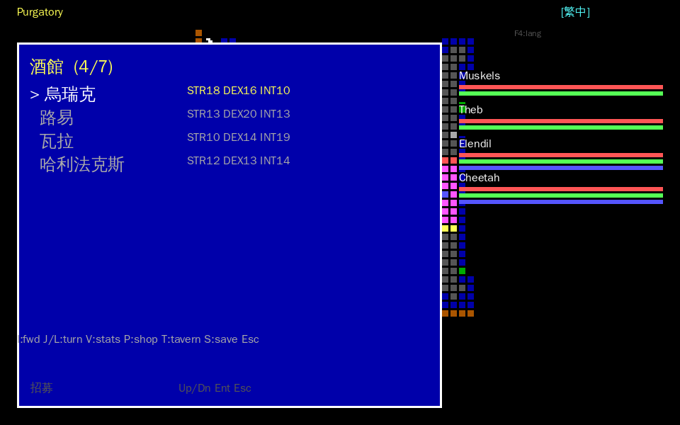

# 58 — 商店買賣 + 酒館招募(PM review docs/gameplay/57 選項 B 實作)

> 日期:2026-06-16
> 範圍:opendw_remake 補上 CRPG「經濟出口 + 隊伍構築」兩環(docs/gameplay/57 §5 選項 B)。
> 前置:選項 A(成長迴圈)已合併 PR #127。
> 誠實分級沿用四級:**bytecode 真值** / **grounded(手冊/fraterrisus)** / **remake 設計** / **受阻**。

---

## 1. 一句話總結

讓金幣有出口、隊伍可構築:踩商店/酒館格(或按 `P`/`T`、headless `--shop`/`--recruit`)即可
**買賣裝備**(扣/加 `gold[81]`)與**招募 NPC**(Ulrik/Louie/Valar/Halifax 入隊,最多 7 員)。
物品價格與 23B 格式 **grounded fraterrisus**;商店庫存清單、NPC 屬性、買賣/招募邏輯
**誠實標為 remake 設計**(這些在 opendw C 反編譯本身未實作)。

---

## 2. 商店買賣

### 2.1 來源分層(grounded vs remake)

| 構面 | 來源 | 真值層 |
|---|---|---|
| 物品 23B 欄位佈局 | fraterrisus《Hex Editing Guide》= docs/reverse-engineering/44 §2 | **grounded**(`equipment.cpp` 已解,byte 對拍) |
| 售價編碼(M×10^E,指數 3b + 尾數 5b) | fraterrisus | **grounded**(`decode_price`) |
| 購買價 / 售價關係 | `購買價 = bit[32-39] 解碼值`;`售價(賣出可得) = 購買價 ÷ 2` | **grounded**(對齊 `equipment.cpp` 既有 `purchase_price` / `sale_price`) |
| 金幣存放 | 角色 record `gold[81]`(fraterrisus;1 byte) | **grounded** |
| 商店庫存清單(賣哪些) | `bundle/shop/stock.json`(grounded 真實物品 + curated 標準裝備) | **混合,逐項標示** |
| 買 / 賣動作邏輯 | 扣付款方 gold、物品入第一個空背包格、半價賣出 | **remake 設計**(opendw C 未實作商店) |

### 2.2 庫存來源(stock.json,逐項誠實標示)

- `"grounded": true` —— 從 `bundle/items/items.bin`(extract_items 抽的真實 DATA1 物品)取
  **可販售**(price>0)者。目前僅 **Dragon Stone(購買價 250)**;其餘真實物品多為魔法
  召喚物,原版 `price=0`(非賣品),不列入商店。
- `"grounded": false` —— **curated 標準裝備**(remake 設計):匕首/短劍/長劍/戰斧/戰錘/
  小圓盾/鳶形盾/皮甲/鎖鏈甲/鐵盔。以 fraterrisus 23B bit 佈局(docs/reverse-engineering/44 §2)**乾淨編碼**,
  價格取攻略 docs/walkthrough/38 量級的合理值。產生器:`tools/extract/gen_shop_stock.py`(可重現)。

### 2.3 已知限制(誠實)

- **`gold[81]` 為 1 byte → 上限 255**。買賣均夾到 `[0,255]`(避免破壞 512B 格式)。
  故 **鎖鏈甲(購買價 300)實際買不起**(UI 以灰字顯示);原版 gold 可能更寬(另有
  4B 解析在 0x55),但 remake 以 fraterrisus 1B 欄為金幣真值來源,飽和處理。
- 付款 / 收款方 = **隊伍第 0 名(主角)**(remake 設計;原版隊伍共用金幣池)。
- 背包可用格 = **12 格(0..11)**:docs/reverse-engineering/44 標 13 格(A..M),但 `236 + 13×23 = 535 > 512`,
  第 13 格(0-based 12)起點越界,實際可用 12 格(對齊 `equipment.cpp`/`progression.cpp`
  既有 `base+i < 512` 防護)。

---

## 3. 酒館招募

### 3.1 來源分層

| 構面 | 來源 | 真值層 |
|---|---|---|
| NPC 識別碼存於 record `[77]` | fraterrisus / docs/reverse-engineering/44 §1 | **grounded** |
| 可招募 NPC + 識別碼:Ulrik=0x01 / Louie=0x03 / Valar=0x04 / Halifax=0x05 | fraterrisus NPC identifier 表 | **grounded**(名 + id) |
| 512B record 佈局(名/屬性/HP/level/identifier) | fraterrisus | **grounded** |
| NPC 各項屬性 / HP / 定位 | curated 平衡值 | **remake 設計**(非萃自 DATA1 真實 NPC blob) |
| 隊伍上限 7 槽 | docs/reverse-engineering/44 §1(最多 7 員 record) | **grounded(上限)** |
| 招募動作 + identifier gate | append 到隊伍尾、同 id 不可重複招 | **remake 設計**(opendw C 未實作招募) |

### 3.2 隊伍 >4 員處理

- 上限 **7 員**(`recruit.hpp kMaxPartyMembers`)。招募 append 到隊伍尾。
- 右側狀態面板(`party_panel.cpp`)本就 iterate 到 7,5/6/7 員正確顯示。
- 存讀檔走 `raw_records()`/`from_raw_records()`,7 員 **byte-for-byte round-trip**(verify_recruit 驗)。
- `identifier[77]` gate 在 round-trip 後仍生效(已招的不可重複招)。

### 3.3 招募點(誠實)

- 原版於酒館觸發(攻略:波卡城等;黃泥蟾蜍城 Berengaria 為例外無招募)。
- remake 地圖事件格資料**尚未對映商店/酒館類型**,故先以 **快捷鍵 `P`(商店)/ `T`(酒館)
  + headless `--shop`/`--recruit`** 提供入口(remake 設計)。日後若逆出商店/酒館格 tile
  類型,可改接踩格觸發。

---

## 4. UI 接遊戲

| 入口 | 觸發 | 說明 |
|---|---|---|
| 商店 | in-game `P` / headless `--shop` | 子狀態 `ShopUi`;Tab 切買/賣、↑↓ 選、Enter 買賣、Esc 離開 |
| 酒館 | in-game `T` / headless `--recruit` | 子狀態 `TavernUi`;↑↓ 選、Enter 招募、Esc 離開 |
| 給金幣(demo/截圖) | `--gold N` | 設隊伍第 0 名 `gold[81]=N` |

i18n:`assets/i18n/{zh-TW,en,ja}/shop.tsv`(商店/酒館 UI + curated 物品名 + NPC 名)。
**zh-TW 全填(38/38)**;en passthrough;**ja 僅 UI 標籤,固有名詞(NPC/curated 裝備名)
留語言權威審定**(verify_i18n 報為未訳缺口,不臆造)。

---

## 5. 驗證(ctest,確定性)

新增兩支 ctest(全 PASS;總計 25/25):

- **`verify_shop`**:stock.json 載入 / 買(gold 扣對 + 物品入背包 + round-trip)/ 窮買不到
  (shop_no_gold)/ 背包滿(shop_full)/ 賣(gold 加半價 + 物品移除)/ 賣空格擋下 / gold 飽和。
- **`verify_recruit`**:名冊 4 NPC / NPC serialize(identifier[77]+屬性)/ 招募入隊 /
  identifier gate 防重複(recruit_already)/ 未知 id(recruit_unknown)/ 上限 7(recruit_full)/
  >4 員 + 7 員 round-trip byte-for-byte。

回歸:既有 23 項 ctest 全綠;`verify_i18n` 納入 shop.tsv 後 PASS。

---

## 6. 改了哪些檔

- 新增模組:`src/game/shop.{hpp,cpp}`、`src/game/recruit.{hpp,cpp}`(純資料 + 規則,無 SDL)。
- `src/game/party.{hpp,cpp}`:加 `Party::add_record`(招募 append 用窄介面)。
- `src/main.cpp`:`ShopUi`/`TavernUi` 子狀態 + draw_shop/draw_tavern + 鍵 P/T + headless
  `--shop`/`--recruit`/`--gold` + i18n merge shop.tsv。
- `src/render/sdl_video.cpp`:`SDLK_TAB → in.key='\t'`(商店買/賣分頁;additive)。
- 資產:`assets/bundle/shop/stock.json`(`gen_shop_stock.py` 產);`assets/i18n/*/shop.tsv`。
- 工具:`tools/extract/gen_shop_stock.py`、`tools/verify/verify_shop.cpp`、`tools/verify/verify_recruit.cpp`。
- `tools/verify/verify_i18n.cpp`:kFiles 納入 shop.tsv。
- `CMakeLists.txt`:dwr_game 加 shop/recruit;新增兩 ctest。
- 截圖:`docs/media/remake/shop_recruit/{shop_buy_zh,shop_buy_en,tavern_zh}.png`。

---

## 7. 截圖

