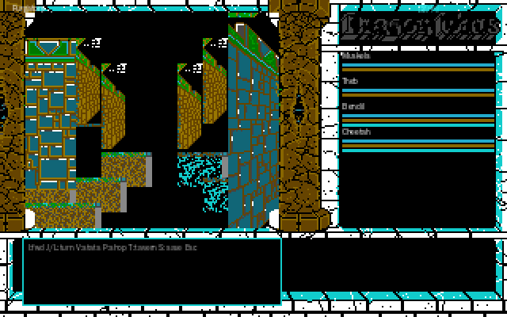

# 61. 多版本美術素材萃取（Amiga / X68000 / PC-98）

為 remake 後續「遊戲中切換 theme」準備,從《Dragon Wars》三個原版磁碟抽出美術素材
(標題畫面、怪物 sprite、場景圖、UI 圖示),轉成 PNG。DOS 版美術已在既有 bundle
(預設 theme),本文件處理另外三個平台。

原始遊戲檔(.dim / .PIX / .PKH / .adf / DRAGON.X / data*)一律**不入庫**,只放抽出
並轉成可用格式的 PNG + 抽取工具 + 本文件。全程 docker,不污染系統。

## 0. 三版總結

| 版本 | 磁碟形式 | 標題畫面 | 怪物 sprite | 場景/過場 | UI 圖示 | 狀態 |
|---|---|---|---|---|---|---|
| **Amiga** | .adf + WHDLoad HD(`data/`) | ✅ title.pic | ✅ data4 4-bitplane(**50 隻已切**，見 §1.5） | ✅ endgame、**第一人稱 viewport 牆面 data3 + 原生盤(已逆 + 接 §1.6)** | ✅ cursors | **接近完整**（標題+結局+50 怪物+第一人稱地牢牆面;data5/6=音訊非美術,見 §1.7） |
| **X68000** | .DIM(Human68k FAT12) | ⚠️ TITLE.PKH(解碼演算法已逆出,接合受阻) | ✅ MON.PIX | ✅ PIC.PIX、⚠️ 3D/END(同 PKH) | ✅ ICON.PIX | **未壓縮 .PIX 成功;.PKH 核心 RLE 解碼器已逆出,GVRAM 接合受阻** |
| **PC-98** | — | — | — | — | — | **素材不存在(見 §3)** |

產出路徑:`opendw_remake/assets/bundle/themes/<version>/`(`amiga` / `x68000`)。

---

## 1. Amiga 版

### 磁碟結構
來源 `dragonwars_amiga_win.7z`(8.7MB)= FS-UAE 打包的 WHDLoad 版。實際美術在
**WHDLoad 硬碟安裝的 `data/` 目錄**(未壓縮個別檔,非磁碟映像):

```
DragonWars/fsuae/Hard Drives/data/
  title.pic   21805 B   標題畫面(壓縮)
  endgame     32468 B   結局過場圖
  picparts    16777 B   過場圖元件
  data1..6              地圖/事件/資料
  dw          75404 B   主程式或資料
  cursors       574 B   游標
```
另有 `Floppies/disk.adf`(901120 B,原版開機磁碟)。

### 格式與解碼(已確認)

**關鍵發現:Amiga 與 DOS 共用同一個 Huffman 壓縮 codec**(`src/resource/decompress.cpp`,
`[size_LE][tree][bitstream]`,big-endian 16-bit bit reader)。只有 X68000 的 `.PKH`
是另一套不相容的 codec(見 §2)。

title.pic 解碼流程(逐字驗證):
```
title.pic (21805B, 壓縮)
  → Huffman decompress (DOS codec)
  → 35996B = [32B palette][32000B bitplane data][尾端少量 bytes]
     palette: 16 個 big-endian word,0x0RGB 格式(每 nibble × 17 → 8-bit)
              word[0]=000(黑) word[1]=fff(白) word[2]=f59(金) … → 金色龍頭
     image:   320×200,**4 bitplanes,sequential(plane0 全圖→plane1→…,非 Amiga interleaved)**
              dataoff = 32(palette 之後)
```

- **title.pic → `themes/amiga/title.png`**:**成功**(640×400 = 320×200 ×2)。完整標題 =
  金色龍頭(紅舌)+ 紅甲持斧戰士 + "Dragon Wars / Copyright Interplay 89-90" logo。真實 palette。
- **endgame → `themes/amiga/scenes/endgame.png`**:**成功**(320×200)。同 codec/格式。結局場景
  (爆發的鬍鬚巨人 = Namtar,藍天 + 月 + 山)。
- **picparts**:⚠️ **部分/受阻**。過場圖元件(viewport/dungeon frame),已解出結構但未完整還原
  正確 planar 佈局,目前僅 1bpp 預覽看得出輪廓。

### 工具
- `tools_build/amiga_pic_extract.py <raw_decompressed.bin> <out.png>`:吃「已 Huffman 解壓」
  的 buffer,依 `[32B palette][320×200×4 seq planes]` 佈局渲染成 PNG。
- 解壓用既有 DOS Huffman 解壓器(`src/resource/decompress.cpp` 同演算法;tools_build/scratch
  亦有可移植版本)。

---

## 1.5 Amiga 怪物 sprite（data4，已逆向 + 接進戰鬥）

> **2026-06-18 更新（全套抽取 + 權威對映）**:由 6 隻擴到 **50 隻**(data4 全部偶數資源)。
>
> - **格式關鍵更正**:data4 怪物資源 = **偶數 res ID**(140/144/146/152/…/254)為怪物 sprite,
>   奇數 res ID 解出垃圾尺寸(非 sprite,語意未明)。50 個偶數資源全部解碼成合理尺寸的立繪
>   (目視 contact sheet 確認:人類/野獸/惡魔/龍/騎士/巨人…完整圖鑑)。
> - **權威 name→sprite 對映(本次確立)**:`MonsterRecord::sprite_res() = (attr[0x0B]<<1)+0x8A`
>   **正確**(舊 docs/reverse-engineering/26 §二「+0x8A 有偏差」的疑慮為誤判)。monsters.bin 全 25 隻記錄的
>   `sprite_res()` 皆落在已抽的偶數資源(Spider→196、Wolf→168、Pikeman→210、Fanatic→222、
>   Innocent Man→200、King's Guard/Soldier→166、Humbaba→218、Gladiator→202…)。
> - **入庫命名**:全套以 `<res>.spr` 命名(`themes/amiga/sprites/166.spr` …);原 6 隻具名檔
>   (`196_spider.spr` 等)保留(verify_theme 既有斷言用)。
> - **接線改用權威對映**:`main.cpp` `sprite_for_monster(name, sprite_res)` 在 Amiga theme 下
>   **優先**載 `<sprite_res>.spr`(全套命中),名稱關鍵字降為次選、DOS bundle 為末選回退。
>   F8 切 Amiga → 每隻怪物呈現自己的 Amiga 立繪(不再只有名稱命中的 6 隻;含 Humbaba/Gladiator
>   等先前缺的)。headless `--theme amiga --encounter <idx>` dump 目視確認 Gladiator(202)、
>   Humbaba(218)為原生 Amiga 美術。
> - **工具**:`tools_build/amiga_res_extract`(C++,連 decompress.cpp)批次抽 data4 →
>   `amiga_sprite_extract.py --auto-crop` 逐隻轉 .spr。
> - **多動畫格已定論(2026-06-18 深逆向)**:**資源本身即單格,無多格可切**(逐字測量 9 隻,真資料皆
>   = 1.00 格,單格後全是 fill padding;見下「多動畫格定論」節)。改以單格做程序化 idle 呼吸 + 受擊閃白,
>   讓戰鬥怪物會動(不偽造假格);200/242/244 等少數自帶盤 bg=黑,裁切品質次於紅底主流。


### archive 結構（已驗證）
Amiga `data1`–`data6` 與 DOS opendw archive **同格式、同 codec、同資源編號**:每檔 768B
header(384 個 LE16 size,≥0xFF00 = 資源不在此檔)+ 串接 Huffman 壓縮資源。怪物 sprite 主力
在 **data4(res 140–255)**。各檔自帶 header,offset = 768 + 該檔內前序 present 資源 size 總和。

- 抽取工具:`tools_build/amiga_res_extract.cpp`(連結既有 `src/resource/decompress.cpp`,
  不重寫 Huffman)。`amiga_res_extract <datafile> <res_id> <out.bin>`。

### sprite 格式（本次逆向確認）
怪物資源解壓後佈局:
```
[0..31]   16 個 BE word palette(0x0RGB,每 nibble ×17 → 8-bit;同 title.pic）
[32..]    8-word sprite header:
            word[1] = 高度 H(px)
            word[2] = 每 plane 每列 bytes(bpr）→ 寬 W = bpr*8
          影像資料即自 offset 32 起(header 與 plane0 前幾列共用前 16 bytes)：
          4 bitplanes、**plane-sequential**（plane0 整張→plane1 整張→…）、MSB-first。
解碼:val = Σ plane_p[y][x] << p（p=0..3）→ palette index 0..15
```
逆向過程(由結構分析 + 目視比對 DOS contact sheet 收斂):確認非 DOS encounter XOR-delta
blit、非 chunky、而是 plane-sequential 4-bitplane;width/height 由 header word[2]/word[1] 取得。

### 已切 sprite（6 隻，目視確認）
背景紅(palette index 8 = 0xF00,各怪物自帶盤一致)→ 戰鬥用 index 8 為透明色。
多動畫格資源以「整列同色 solid bar」自動分隔取主格(`--auto-crop`)。

| 資源 | 怪物 | 尺寸(px) | 備註 |
|---|---|---|---|
| 196 | Spider | 94×63 | 藍蜘蛛,乾淨 |
| 168 | Wolf | 83×112 | 棕狼,乾淨 |
| 222 | Fanatic | 67×132 | 白髮藍衣人,乾淨 |
| 152 | Guard/Soldier | 88×112 | 持斧戰士,乾淨 |
| 210 | Pikeman | 93×137 | 持矛裝甲兵,乾淨 |
| 200 | Innocent Man | 33×104 | ⚠️ 自帶盤 bg=黑、多格自動裁切只取單格;品質次於上列 5 隻 |

- 轉檔工具:`tools_build/amiga_sprite_extract.py <res.bin> <name> <out_dir> --auto-crop`
  → remake `.spr`(indexed + 自帶 16 色 Amiga palette)+ `.png`(目視)。
- 入庫:`assets/bundle/themes/amiga/sprites/`(原始遊戲檔不入庫)。

### 接進 Amiga 主題戰鬥（theme-aware combat art）
- `UiTheme` 新增 `sprite_dir` / `sprite_own_palette` / `sprite_transparent`;Amiga theme =
  `themes/amiga/sprites` / true / 8。`main.cpp` `sprite_for_monster()` 依當前 theme 選來源
  (Amiga 缺檔回退 DOS bundle,誠實降級)。
- 各 Amiga 怪物自帶 palette(蜘蛛綠金 / 狼棕 / 狂信者藍紅各異)→ combat 渲染前
  `set_palette(sprite.palette)`(index 0=黑 1=白 8=紅 各盤一致,UI/backdrop 仍可讀);
  探索/地圖等非戰鬥畫面於 `draw_base` 還原 `theme.palette`,避免色盤殘留。
- **F8 切 Amiga → 戰鬥怪物圖即時換成 Amiga 美術**(戰鬥中 F8 會 reload `enc.sprite`)。
- headless 驗證:`--theme amiga --encounter <id>`;dump 已目視確認 Spider/Wolf/Fanatic/Pikeman
  皆為 Amiga 原生立繪。DOS theme combat 像素 dump 與改動前 **byte-identical**(golden 未破)。
- 回歸保護:`verify_theme`(ctest)新增 6 隻 Amiga sprite 載入 + 尺寸 + 自帶盤 + sprite 接線斷言。

### 多動畫格:2026-06-18 深逆向定論 = **資源本身就是單格**(非「切不出」,是「沒有多格可切」)

> 先前(#161)記為「多格邊界非確定性可偵測 → 保留主格」。本次**逐字測量解壓後完整 byte 結構**,
> 推翻「Pikeman 塞了第二個人形」的判讀:那其實是**單格真資料與 fill padding 的邊界被誤讀成第二格**。
> 結論升級為**確定性**:Amiga 怪物 sprite 每資源只含 1 個 frame 的真實像素,**無動畫格存在**。

**測量方法(docker,可重現;工具見 `tools_build/amiga_res_extract` + scratch 分析腳本)**:
1. 解壓後 buffer 遠大於單格(Spider 196 解出 64523 B,單格僅 3024 B;= 21 倍)。先前只解單格、
   把其餘當噪音。
2. 量「真資料結束點」= 從尾端往前找第一個 ≠ 主導 fill byte 的位置:

   | 資源 | H | bpr | 單格大小(B) | fill byte | 真資料(去 pal 後) | = 幾格 |
   |---|---|---|---|---|---|---|
   | 152 Guard | 112 | 14 | 6272 | 0x86 | 6284 | **1.00** |
   | 166 K.Guard | 120 | 16 | 7680 | 0x70 | 7692 | **1.00** |
   | 168 Wolf | 112 | 14 | 6272 | 0xf8 | 6284 | **1.00** |
   | 196 Spider | 63 | 12 | 3024 | 0x00 | 3036 | **1.00** |
   | 200 Innocent | 104 | 8 | 3328 | 0xd0 | 3340 | **1.00** |
   | 202 Gladiator | 131 | 16 | 8384 | 0xff | 8396 | **1.00** |
   | 210 Pikeman | 137 | 16 | 8768 | 0xfb | 8780 | **1.00** |
   | 218 Humbaba | 112 | 16 | 7168 | 0xf3 | 7180 | **1.00** |
   | 222 Fanatic | 132 | 10 | 5280 | 0x00 | 5291 | **1.00** |

   9/9 隻真資料皆 = 1.00 格;單格後**整段是同一 fill byte**(tail 熵 ≈ 0.00:Wolf 尾端 37740 B 全 `0xf8`、
   Spider 尾端 61455/61467 B 全 `0x00`)。fill 是 Huffman 解壓器把畫布補滿背景的產物,非動畫資料。
3. 視覺反證:把單格後資料當「frame 1」以 plane-sequential 解碼 → 第一格乾淨、第二格只是 padding 邊界錯位的
   殘影、第三格起全是縱條噪音(`/tmp` dump 已目視)。interleaved 解碼整張即垃圾 → 確認單格為 plane-sequential。
4. 排除「奇數資源 = 另一格」:140–254 偶數=怪物 sprite;相鄰奇數資源(167/169/197/211)header 解出
   H=354/476/1054 等不合理值,以怪物幾何解碼為純噪音 → **不是同怪的別格**。
- **header 欄位全解**:@32 word[0]=顯示寬 W、word[1]=H、word[2]=bpr(plane 寬=bpr*8)、word[3]=H 重複;
  word[4..] 即像素資料。**無 frame 計數欄、無 frame offset 表、無 separator** —— 因為根本沒有多格需要索引。
- 結論:**沒有可切的動畫格**(不是切不乾淨,是資料裡只有一格)。維持每怪單格立繪。

### 戰鬥怪物會動(單格程序化動畫;不偽造假格)
既然無真動畫格,改用單格做程序化「活化」,讓戰鬥怪物不再是死圖:
- **idle 呼吸**:`main.cpp draw_encounter` 依全域 `anim_tick`(每幀 +1)以三角波讓立繪 y ±1px 緩慢起伏
  (週期 48 幀)。headless 與 anim_tick 同步 → `--dump-frame N` 相位確定可重現。
- **受擊閃白**:我方命中怪物時(`append_group_events` 見 `e.hit && e.attacker_is_player`)設
  `enc.hit_flash=8`;閃白期間怪物立繪非透明像素改畫 index 1(白)的剪影,**只蓋立繪輪廓、不動 backdrop**。
- **DOS golden 不破**:呼吸在 anim_tick=0(每場戰鬥起手 frame 0)bob=0 → 與改動前位置一致;
  `verify_encounter_golden_wolf` 走獨立 blit 路徑(不經主迴圈動畫),未受影響。ctest 34 全綠。
- 目視:`--theme amiga --encounter 4 --combat-rounds 1 --dump-frame 0`(Pikeman 受擊閃白剪影)、
  `--dump-frame 1/13`(呼吸 ±1px)已 dump 確認。

### 殘留
- 200_innocent_man 自帶盤 bg=黑(非紅),自動裁切品質次於其餘隻(屬裁切邊界,非動畫問題)。

---

## 1.6 Amiga 第一人稱 viewport 牆面（data3，已逆向 + 接進 Amiga 第一人稱）

對應舊「picparts ⚠️ 部分/受阻」與 docs/reverse-engineering/26 §七「viewport 場景組譯器」待辦 —— **本次逆出格式並接進
Amiga 第一人稱**。

### archive 結構（已驗證）
viewport 元件主力在 **data3(res 110–135)**,與 DOS `bundle/components/<tag>.bin` **同資源編號**
(110=Castle wall、111=Sky、112=Road、116=Water…;DOS 用到的 19 個 tag 在 data3 全present)。

### Amiga viewport 圖塊格式（本次逆向確認）
與怪物 sprite **不同**(怪物是單一帶 palette 的 sprite;viewport 是「多子圖塊容器」):
```
[BE word offset 表]  N 個遞增 BE-u16,各指向一個子圖塊。Castle wall(110)= 10 個子圖塊
                     (正面牆 96×96 + 近/中/遠 側牆 trapezoid + 距景小牆面);單純 tile
                     (Road 112 / Water 116)= 1 個子圖塊。
各子圖塊 @off:       word[1]=高度 H、word[2]=每 plane 每列 bytes bpr → 寬 W=bpr*8;
                     影像自 off 起 4-bitplane plane-sequential MSB-first(同 sprite,
                     **惟無自帶 palette** → 共用 viewport 全域盤)。
```
目視確認:110 解出完整城堡牆面(不規則石塊 + 灰泥縫 + 頂部裝飾條 + 透視側牆)。

### palette（2026-06-18 已從 dw 抽出原生盤,取代 stone 近似色）

> **更新**:viewport 原生 16 色盤 **已找到並接上**。先前用的 stone 相容近似色已退役。

- **來源**:`dw` 主程式(75404 B)內 16-word CLUT,出現於 **@0x0fdf4 / @0x0fe34 / @0x10d34**
  (同一份盤多處引用 = 預設世界盤)。格式同 title.pic:16 個 BE word `0x0RGB`,每 nibble ×17 → 8-bit。
- **盤值**(hex 0RGB):`000 fff 640 666 970 070 444 289 090 1cc 860 888 167 2ac 000 000`
  - index0=黑、index1=白(同 title.pic 起手);牆面石塊用 `640`/`970`/`444`/`666`/`888`(棕/灰),
    mortar/距景偏冷 `289`/`1cc`/`2ac`(青藍),頂部裝飾 `070`/`090`(綠)。
- **判別方法**:docker 掃 `dw` 全檔,找連續 16 個 `≤0x0FFF` 的 BE word(0x0RGB 特徵),
  以「index0 暗 + index1 亮」評分。全檔僅此一份符合世界盤特徵的 16 色塊;與 title.pic 的金龍盤
  (`f59 f28 d15…`)明顯不同 → 確認是獨立的 viewport/世界盤,非標題盤。
- **目視對照**:F8 Amiga `--fp --map 1` dump(`dwshot_amiga_native_fp.ppm`)。原生盤 vs 舊 stone
  近似色明顯有別:原生為青藍石塊 + 棕側牆 + 綠頂條(真實 Amiga 觀感),近似色為暖灰石。
  原生盤為遊戲實際資料,採用之(正確性 > 美觀)。
- **逆不出的部分**:`dw` 內只找到這一份世界盤;若不同區域/地城有切換盤,其載入邏輯(哪個 area
  對應哪份 CLUT)未 trace —— 但全檔無第二份候選,推定為單一全域世界盤。

### 工具
- `tools_build/amiga_viewport_extract.py <res.bin> <tag> <out_dir> [--legacy-stone]`:offset 表 →
  逐子圖塊 4-bitplane 解碼 → `<tag>_<blockidx>.spr`(indexed + 內嵌**原生 viewport palette**;
  `NATIVE` 常數即上述 dw CLUT)。傳 `--legacy-stone` 可改回舊 stone 近似色對照。
- 入庫:`assets/bundle/themes/amiga/components/`(15 個 tag,共 60 個子圖塊 .spr;已以原生盤重生)。

### 接進 Amiga 第一人稱（theme-aware viewport;DOS golden 不破）
- `UiTheme` 新增 `component_dir`;Amiga = `themes/amiga/components`,DOS 為空(走原 golden 路徑)。
- 新模組 `render/viewport_amiga.{hpp,cpp}`:**元件選擇/落點沿用 DOS golden
  `compose_draw_sequence`(read-only,不改一字)**,只把「像素來源」換成 Amiga 子圖塊 ——
  以 DOS template header(runlen→寬、numruns→高)做**維度匹配**挑該 tag 尺寸最接近的子圖塊,
  blit 到 DOS DrawCmd 的 (xpos,ypos)。
- `main.cpp` `draw_game_fp`:theme.component_dir 非空且 Amiga 元件可用 → 套**原生 viewport 盤**
  (`AmigaComponentStore::viewport_palette()`)+ `render_first_person_amiga`(疊 DOS 透視框線維持
  景深);**否則回退 DOS `render_first_person`**。
- **F8 切 Amiga + `--fp` → 地牢牆面變 Amiga 石牆美術**(headless `--fp --theme amiga --map 1`
  dump 目視確認:石塊牆面 + 側牆 trapezoid + water tile)。
- **DOS theme 完全不經此模組** → verify_fp / verify_compose / render_sweep golden 全綠(未破)。



`--theme amiga --fp --map 1` dump:原生 viewport 盤的青藍石塊正面牆 + 棕側牆 trapezoid + 綠頂裝飾條 + 青藍 water tile。

### 受阻 / TODO
- **透視非 byte-faithful**:DOS 用精確 perspective decode(填滿天花/地板、側牆完美收斂);
  Amiga 路徑用維度匹配 + DOS 落點近似,牆面為 Amiga 美術且結構可辨,但中央遠景/收斂不如 DOS 精準。
  要完全對位需替 Amiga 子圖塊重寫 DOS perspective placement(本次未做,風險為動到 golden 幾何)。
- ~~**viewport 原生 palette 未抽**(用 stone 相容色)~~ → **2026-06-18 已抽出並接上**(見上 palette 節)。
- Sky(111)/120/128/133 等 tag 非 offset-表結構(0 子圖塊),Amiga 路徑跳過留底色(天空走 DOS
  `fill_sky_flat` 同義的留空)。

---

## 1.7 Amiga data5 / data6（res 257–266）= 音訊資產（已檢視,非美術）

2026-06-18 檢視 data5(res 257/259–265,共 8 個)+ data6(res 266,共 1 個)。**結論:全部為
Amiga 音效 / 音樂取樣(8-bit signed PCM,delta 風格編碼),非視覺美術 → 不入 themes/amiga/。**

### 判別過程(docker,可重現)
- 用 `amiga_res_extract`(連 decompress.cpp)解壓全 9 個資源(同 Huffman codec,解壓成功)。
- 結構:每個資源共用 **16-byte header** `[8×00][01 00 00 00][LE32 payload_size][...]`,接著常數
  `20 06 00 00`(0x620=1568)、`3c 00 00 00`(0x3c=60)—— 像 sample-rate / block 參數。
- body **無 offset 表、無 4-bitplane sprite header、無 0x0RGB palette 起手**(逐項排除美術格式)。
- byte 分佈:集中在 `00/01/ff/fe/fd/02`(signed −3..+3 小幅振盪)+ 單值長 run(`5d`/`ff`/`03`/`22`
  = 靜音 / 持續段);熵 0.26–6.41。
- **決定性驗證**:把 payload 當 8-bit signed PCM 畫波形 → 標準音訊包絡(attack → noisy body →
  decay → 靜音)。`d5_264`/`d6_266` 為密集音效 / 較長持續音(疑音樂 / 環境音),`d5_259`/`d5_265`
  幾近靜音 / 單純音。波形圖證實為 sound。

### 受阻 / 未做
- **Amiga 音訊播放格式未完整逆向**(sample rate、loop point、與 remake 既有音訊系統的接法)——
  本次任務為「美術精修」,音訊接線超出範圍,僅**檢視確認=非美術**並記錄。後續若做 Amiga 原音,
  從此處 `[16B header][PCM body]` + `0x620`/`0x3c` 參數續查。

| 資源 | 解壓後大小 | 熵 | 內容 |
|---|---|---|---|
| data5 res 257 | 42513 B | 1.07 | PCM(大量 `5d` run = 靜音/持續) |
| data5 res 259 | 53764 B | 0.26 | PCM(幾近靜音) |
| data5 res 260 | 26123 B | 1.29 | PCM |
| data5 res 261 | 29449 B | 1.05 | PCM |
| data5 res 262 | 30765 B | 2.91 | PCM |
| data5 res 263 | 48969 B | 2.44 | PCM |
| data5 res 264 |  9757 B | 6.15 | PCM(密集音效;波形含 attack/decay) |
| data5 res 265 | 50437 B | 0.33 | PCM(幾近靜音) |
| data6 res 266 | 16458 B | 6.41 | PCM(較長持續音,疑音樂/環境音) |

---

## 2. X68000 版（Starcraft / Hudson soft 1990)

### 磁碟結構
來源 = 三個 `.DIM`(DiskImage,256B header + 2HD raw)。`.DIM` 去 header → Human68k
FAT12 → 抽檔。流程與工具見 docs/reverse-engineering/46;FAT12 抽取 `tools_build/fat12_extract.py`。

```
zip → .DIM → dd bs=256 skip=1 → raw → fat12_extract.py → 個別檔
```

| 磁碟 | 美術檔 | 大小 | 內容 |
|---|---|---|---|
| Disk 2 (A) | **PIC.PIX** | 518400 B | NPC/場景 portrait(未壓縮) |
| Disk 3 (B) | **MON.PIX** | 810000 B | 怪物 sprite sheet(未壓縮) |
| Disk 3 (B) | **ICON.PIX** | 16640 B | UI/viewport 圖示(未壓縮) |
| Disk 3 (B) | TITLE.PKH | 53987 B | 標題畫面(**壓縮,受阻**) |
| Disk 3 (B) | 3D1-4.PKH | ~35-50 KB | 3D 地城圖(**壓縮,受阻**) |
| Disk 3 (B) | END1-5.PKH | ~15-53 KB | 結局過場(**壓縮,受阻**) |
| Disk 2 (A) | SUBTTL.PKH | 13423 B | 副標題(**壓縮,受阻**) |

`.PIX` = 未壓縮圖;`.PKH` = 壓縮。

### .PIX 格式(已破解)
- **headerless chunky 4bpp**:每 byte = 2 像素,**high nibble 在前**,index 進 16 色 CLUT。
- geometry(row stride)由 **byte-autocorrelation** 還原(熵 3.2-3.7 bits/byte 確認未壓縮,
  stride 相鄰列 byte 相符率 0.6-0.77):

  | 檔 | stride | 寬度 | 備註 |
  |---|---|---|---|
  | ICON.PIX | 16 B | 32 px | 圖示;sheet 中每格水平加倍(64=32+32) |
  | MON.PIX | 24 B | 48 px | 怪物;垂直 cell 週期 ~112 px,每隻水平加倍(96=48+48) |
  | PIC.PIX | 48 B | 96 px | portrait;垂直週期 ~112 px |

- **palette**:X68000 原生 16 色 CLUT **尚未還原**(需 trace DRAGON.X 的 GVRAM CLUT 載入)。
  目前用 **DOS EGA-16 placeholder**(`tools_build/scene_render.py` 的 P[]):形狀、構圖、
  sprite 邊界完全可辨識,僅色相與原機不同。屬色彩精修 TODO,不影響「抽成可辨識 PNG」目標。

### 產出
```
themes/x68000/monsters/mon_contact_sheet.png   完整怪物 bestiary(骷髏/惡魔/巨魔/蛇/犬/蜘蛛/龍/騎士…)
themes/x68000/scenes/pic_contact_sheet.png     NPC/場景 portrait(王座國王/書房賢者/商人/寶藏…)
themes/x68000/tiles/icon_contact_sheet.png     UI 圖示(盾/劍/箭/寶箱/卷軸/符文/火把)
themes/x68000/tiles/icon_sheet_w32.png         icon 原寬(32px)直條版
```

### 工具(docker dwpil,可重現)
- `tools_build/x68k_pix_extract.py <file.PIX> <width> <out.png>`:單一寬度 chunky 4bpp → PNG。
- `tools_build/x68k_contact_sheet.py <file> <cell_w> <band_h> <cols> <out.png>`:把 tall strip
  切 band 後左右排成接觸表(便於目視)。
- docker image `dwpil`(`python:3.12-slim` + pillow,Dockerfile 在 `.scratch/Dockerfile.pillow`)。

### .PKH 壓縮(TITLE / 3D1-4 / END1-5 / SUBTTL)— 解碼常式已逆出,接合受阻

- 這些檔熵 ~6.0 bits/byte → 真正壓縮。既有 DOS Huffman 解壓器
  (`src/resource/decompress.cpp`,`[size_LE][tree][bitstream]` big-endian 16-bit)套用後輸出垃圾
  → **X68000 PKH 與 DOS codec 不相容**。

> 狀態更新(2026-06-19):核心 RLE+nibble codec + **GVRAM blitter(0x32b4c)已逐指令完整逆出**,
> 並用 `dwemu` 實機驗證。**GVRAM = chunky 16-bit-word、stride 1024 words/line,無 plane 交錯**
> (推翻舊「需 4-plane deinterleave」假設)。真正且唯一的殘餘缺口:**w/h/palette 不存在於 PKH 檔內**
> (檔內對應欄位為零/垃圾,已 emu 證實),維度與調色盤由 DRAGON.X 內某「圖號→參數」表供給,該表
> 位置尚未定位 → 標題暫未還原。詳下。

#### DRAGON.X 結構
- `DRAGON.X` 是 **Human68k `.X` 執行檔**,fat12 抽出的映像在 file offset **0x1400** 有 `HU`(0x4855)
  header(前 0x1400 是另一段資料/Shift-JIS 文字)。X-format header(64B):base=0、entry=0x349a2、
  text=0x353d8、data=0x861a、bss=0x4ca84、reloc=0x4a1a。
- text 段 vaddr↔file 映射:**`file_offset = 0x1440 + vaddr`**(base=0,text 起於 header 後)。
- 檔尾(file 0x43eb8 起)是 **Human68k 符號表**(`02 01 00 02 <addr:4> <name\0>`),含解碼符號:
  `_xunpack`=0x281be、`_pxunpack`=0x281ec、`_xunpackb`=0x287da、`_xcomp`=0x1808。

#### 已逆出的呼叫鏈與演算法
- `_xunpack(name, out, ...)`(0x281be):`jsr 0x11c4`(open+read 整檔到 buffer)→ `jsr 0x27fa6`(解析)
  → `jsr 0x2816a`(GVRAM plane 展開,目標 0xC00000 / 0xD83000)。
- `0x27fa6`:讀 buffer 前綴 — 16 個 big-endian word @buf+0x0c → 全域表 0x69ba6;
  word@buf+0x34 → 0x69bca、word@buf+0x36 → 0x69bcc;out=0xD83000(GVRAM)存 0x69bce;
  然後 **`jsr 0x32c3c`(out, buf+0x38, len)** = 真正的解碼主迴圈。
- **核心解碼器(已逐指令逆出,可重寫)**:
  - 主迴圈 `0x32c3c`:`ctrl = *in++`;`count = ctrl & 0x7F`(存 0x445d2);`btst #7,ctrl`:
    bit7=1 → `jsr 0x32ccc`(run),bit7=0 → `jsr 0x32cfe`(literal);迴圈至 `in >= in_end`(0x445de)。
    全域:out=0x445d6、in=0x445da、in_end=0x445de。
  - run `0x32ccc`:讀 1 byte,`movew` 重複 count 次寫 **word**(byte→word RLE)。
  - literal `0x32cfe`:每讀 1 byte 拆 hi nibble(`b>>4`)、lo nibble,各寫一個 **word**(4bpp 展開)。
- python 重寫:`tools_build/pkh_unpack.py`(`decode(data)`),已驗證能跑、輸出 16 色全用到的點陣。

#### GVRAM 4-plane 接合層 — 已完整逆出(2026-06-19)

本批把 `0x2816a` → `0x32b4c`(真正的 GVRAM blitter)逐指令逆完,並用 `dwemu`(unicorn m68k)
實機驗證 parse 行為。**GVRAM layout 完全釐清,且推翻了「需要 4-plane deinterleave」的舊假設**:

- **`0x2816a` 派發**(實體於 0x2816c):`push(0, h=0x69bcc, w=0x69bca, src=0xD83000, dst=((y<<10)+x)<<1)`
  → `jsr 0x32b4c`。
- **`0x32b4c` blitter(逐指令逆出,見 `tools_build/x68k_pkh_research/key_routines.asm`)**:
  - `a0 = 0xC00000 + (dst & 0xFFFFFF) + [0x89bd4]`(GVRAM 基底 0xC00000 + runtime 卷軸 offset)。
  - `a1 = src = 0xD83000`(解碼暫存)。
  - 內層:`movew (a1)+,(a0)+` 重複 **w 次**(每 word = 1 像素,**chunky,非 plane 分離**)。
  - 外層 h 列;**dst 列步進 `0x445e2 = (1024 - w) << 1` bytes → GVRAM stride = 1024 words(2048 B)/line**;
    src 列步進為 0(暫存區即 w×h 連續打包)。
  - **結論:GVRAM 是 chunky 16-bit-word(每 word 直接 = 4bpp 色號),沒有 plane 交錯;斜紋雜訊不是
    plane interleave 造成的。** 另有變體 `0x32bb6`(2× 水平放大:每 word 寫 a0 兩次 + a2=a0+2048 兩次)。
- **codec 逐指令覆核(`pkh_unpack.py` 正確)**:run `0x32ccc` 讀 1 byte 重複 count 次寫 word;
  literal `0x32cfe` hi=`b>>4`、lo=寫**整 byte d1**(顯示取 &0x0F,與 python 一致,無差異)。codec 無誤。
- **全域大端**:`0x27f62` = `(buf[off]<<8)|buf[off+1]`,所有 16-bit 讀皆 big-endian(已 emu 確認)。

#### 真正的殘餘受阻點:**w/h/palette 不在 PKH 檔內**(本批新定位,證據確鑿)

舊判讀「buf 還差一層搬運」**不成立** —— 已證實 `0x11c4` 是單純 open+read 整檔(count=0=讀全檔,
DOS `_READ` trap;FAT12 抽取逐 cluster contiguous、byte-faithful,非抽取 bug)。檔案內容就是手上這份。
真正問題是 `0x27fa6` 期望的 header 欄位在檔裡是垃圾/零:

- **`dwemu` 實機 parse TITLE.PKH 得 w(0x69bca)=0xfff1(65521)、h(0x69bcc)=0xf55f(62815)**
  —— 直接從 buf+0x34/0x36 大端讀出,確認是垃圾維度(非 plane 步進問題)。
- **16-word palette 表(buf+0x0c)實機讀出 = `[0,0,0,0,0,0x1111,0,…,0xffff,0x1111,0x1000]`**,
  全是影像 nibble pattern,**不是 0x0RGB 調色盤**。
- **全 PKH 檔同病**:掃 TITLE/3D1-4/END1-5 的 buf+0x34/0x36 與 buf+0x0c,**沒有任何一個**有合理
  w/h 或 0x0RGB palette;檔案一律從 buf+0x38 起即 entropy ~6.0 的壓縮資料(前 0x38 bytes entropy
  僅 1.52 = 確實是 header 區,但其 palette/w-h 欄位是零/垃圾)。
- 推論:**該遊戲的每張圖維度與調色盤來自 PKH 檔外的來源**(很可能是 DRAGON.X 內、由呼叫端
  以圖號索引的表,因標題是用硬編座標 `_xunpack(…, x=0x48, y=0x1f, …)` @0x708 載入的)——
  此「外部 header 表」位置尚未定位,是還原標題的**唯一**剩餘缺口。

#### 2026-06-19(本批):呼叫點 + 圖號 + id→檔名表全找到,但證實「圖號→w/h/palette 表不存在」

> 結論:**上面那個「外部 header 表」並不存在。** 遊戲只有「圖號→檔名」表,維度/調色盤仍只能來自
> PKH 檔頭(對 TITLE.PKH 是垃圾)。受阻點重新精確化(見下),不再是「找一張未定位的參數表」。

- **標題載入呼叫點(vaddr 0x708,反組譯確認)**:
  ```
  6f2: clr.l -(a7)          ; arg5 = 0
  6f4: clr.l -(a7)          ; arg4 = 0
  6f6: move.l #$1f, -(a7)   ; arg3 = y = 0x1f
  6fc: move.l #$48, -(a7)   ; arg2 = x = 0x48
  702: move.l #$80, -(a7)   ; arg1 = 圖號(figure id) = 0x80
  708: jsr $281b4.l         ; = _xunpack 入口(symtab: _xunpack=0x281b4)
  ```
  → **圖號 = 0x80**(硬編座標 x/y 之外確實多傳一個 id)。`_xunpack` body(0x281b6)以 id=`$8(a6)`
  經 open 常式取檔名,讀進固定 buffer **0x69bd6**,再 `0x27fa6` parse、`0x2816a` blit。

- **id→檔名表(vaddr 0x36388,8-byte 記錄;字串表 @0x36587)**:open 常式 `0x138a` 以
  `id<<3 + 0x3638e`(經 `0x5e340` 旗標路徑)/ 一般路徑索引字串表;字串表內容
  `TITLE.PKH\0SUBTTL.PKH\0ICON.PIX\0PROG1..3.PKH\03D1..4.PKH\0END1..5.PKH\0` + 前段存檔名
  `C.1/M.1/F.1/A.1…\0PIC.PIX\0MON.PIX\0`。→ **這是唯一一個用圖號索引的表,只給「圖號→檔名」,
  完全不含 w/h/palette。** 確認 id 0x80 載的就是 TITLE.PKH(非抽錯檔)。

- **w/h/palette 參數表「不存在」(雙路徑反證)**:DRAGON.X 內**兩條** parse 路徑(`0x27fa6` 與
  near-duplicate `0x2808c`,後者僅 out=0xda0000 不同)**都**從檔頭讀 `w@buf+0x34 / h@buf+0x36 /
  16-word pal@buf+0x0c`。掃全檔對 `0x69bca`(w)、`0x69bcc`(h)、`0x69ba6`(pal table)的寫入點
  只此兩處,**沒有第三條把 w/h/pal 從別處(圖號表)灌入的程式碼**。→ 維度/調色盤本來就只設計成放在
  PKH 檔頭;TITLE.PKH 那個位置是垃圾。

- **codec 重新校正(literal count = nibble 數,非 byte 數)**:逐指令覆核 `0x32cfe` —— `count`
  在 hi nibble 寫出後 `subqb #1`、為 0 即停,再寫 lo、再 `subqb #1`。即 **count 計的是 nibble 數**,
  每 byte 最多供 2 nibble。修正後從 offset 0 解出 **211,739 nibbles**(與舊權威計數吻合;
  上一輪「從 buf+0x38 解出 211,327」是少算了 header 區那 0x38 bytes 的 nibble)。

- **像素仍不收斂(全寬度雜訊,非寬度問題)**:以正確 codec + chunky-word/stride-1024 觀念渲染
  256/320/384/448/512/640 全部呈同一病徵 —— **top ~190px 乾淨**(天空 tan + 橄欖綠 banner,
  水平對齊正確),**下半部(龍/戰士藝術區)為「有結構但對不上」的斜紋雜訊**。op 分布顯示整條
  stream 都是正常 RUN/LIT 混合(out 50k–80k 為 pure-RUN 實心填充帶、85k+ 轉密集細節 = 藝術確實在
  資料裡),所以是 **layout 對位**問題,但**無權威 w/h 無法收斂**,龍/戰士輪廓未顯。
  證據 PNG:`tools_build/x68k_pkh_research/evidence/`(本批新增 `t2_w512.png` 等;舊
  `title_w384_grayband_rect.png` 仍代表 top 對齊)。

#### 經驗證的部分還原(width 接近正確,但 w/h 缺載入處)
- 從 buf+0x38 解碼 → **211,327 pixels**(舊記 211,739 是從 offset 0 多解了 header 區)。
- autocorrelation 寬度軟峰落在 **~217–234**(平台 ~0.74,無尖峰)。長 RLE 灰帶(val 5,len 38784)。
- **width=384 時灰帶呈水平矩形(非斜)**,上方白區 + 灰帶對齊乾淨(見
  `tools_build/x68k_pkh_research/evidence/title_w384_grayband_rect.png`);width=512 則整體斜紋
  (`title_w512_diagonal.png`)。→ 真實寬度接近 384–448 級距,但**下半部仍為高頻雜訊**(像素順序
  未完全對位),無 w/h 權威值無法收斂、龍/戰士輪廓未顯。

#### 下一個 agent 從這裡接(精確 TODO,2026-06-19 修訂)

> ~~「找圖號→(w,h,palette)外部表」已排除~~:**該表不存在**(只有圖號→檔名表 @0x36388)。剩餘
> 假設改為以下兩條,都需要再一輪深逆向 —— 本輪在「找參數表」這個明確假設上已查證為陰性,屬有界完成。

1. **假設 A:TITLE.PKH 是另一種 PKH header 變體(最可能)**。`0x27fa6` 假設的 layout
   (`pal@0x0c / w@0x34 / h@0x36 / data@0x38`)可能只對 3D/END 系列成立。標題檔頭那串
   `…1f ff f1 f5 5f 1f ff fe…` 看起來已是解過的 nibble pattern → 疑為「資料即從 offset 0 開始、
   無 0x38 header」的格式。下一步:emu 逐指令確認 `_xunpack(id=0x80)` 是否真走 `0x27fa6`,還是
   `_pxunpack`(0x281fc)/ 別條 parse;比對 3D1.PKH 檔頭 layout(它若有合理 w/h 就反證標題是別種格式)。
2. **假設 B:下半部雜訊源自 GVRAM bank/中途換寬**。top 對、bottom 不對,可能是 X68000 GVRAM
   雙 page/bank 切換(top 一個 bank、bottom 另一個),或 blit 中途換 stride。下一步:emu 跑完整
   blit dispatch(`0x2816a → 0x32b4c`,以及 2× 變體 `0x32bb6`),觀察 `dst`(0xC00000 + scroll
   `[0x89bd4]`)是否中途跳 bank、`0x445e2` stride 是否被改。
3. **工具就緒**:`tools_build/x68k_pkh_research/`
   - `key_routines.asm` — 反組譯摘錄(本批新增呼叫點 0x708、open 0x138a、第二 parse 0x2808c)。
   - `scan_callers.py` — 掃 `_xunpack/_pxunpack/_xunpackb` 的 jsr 與 0x48/0x1f immediate。
   - `disasm.py` — capstone m68k 任意區段反組譯(`python3 disasm.py "[(vstart,vend,'label'),…]"`)。
   - `emu_title.py` — unicorn 跑 parse(0x27fa6)dump w/h/pal + buffer header。
   - `render2.py`/`render3.py` — 正確 codec(literal=nibble-count)的全寬度 PNG sweep。
   - `desync.py` — 逐 op 標記 RUN/LIT,定位 stream 結構(本批用來證實「藝術在資料裡、是 layout 問題」)。
   - `dwemu` image 已含 unicorn 2.1.4 + capstone 5.0.7;`dwtools` 無 m68k-objdump → 用 capstone。
     注意 unicorn m68k 不支援 `addi.l/subi.l #imm,(a7)`(opcode 0x0697/0x0497),harness 已用
     CODE hook 手動補;literal 寫入階段仍會觸 unicorn gap(parse 階段已足夠取 header)。
   - **vaddr↔file 映射**:`file_off = vaddr + 0x1440`(HU header @0x1400,X-format text 段)。
- 還原前標題畫面暫缺 X68000 原生版,沿用 DOS dragon art 回退(見 `ui_theme.hpp` x68000 主題,保持現狀)。

---

## 3. PC-98 版 — 素材不存在

任務假設「PC-98 日本語版」,但實際查證:

- 在 `NEC_PC_9801_TOSEC_2012_04_23.zip`(2.1GB TOSEC 合集)中,58 個 "Dragon*" 條目
  **無任何 "Dragon Wars"**,亦無 "Interplay"/"Starcraft" 發行的對應磁碟。
- 與 docs/reverse-engineering/46 的考證一致:Dragon Wars 的日本在地化(Starcraft / Hudson soft 發行)
  **只出在 Sharp X68000**,從未有 PC-98 版。「PC-98」是檔名/任務假設的誤稱,實體即 X68000。

結論:**PC-98 沒有 Dragon Wars 可抽**。日本版美術全部來自 X68000(見 §2)。

---

## 4. 累積/受阻清單

| 項目 | 狀態 |
|---|---|
| Amiga 標題畫面 (title.pic) | ✅ 完整彩色 PNG |
| Amiga 結局 (endgame) | ✅ |
| Amiga 怪物 sprite (data4 4-bitplane) | ✅ **50 隻**(全偶數資源)+ 權威 sprite_res() 對映接進戰鬥(F8;見 §1.5) |
| Amiga viewport 牆面 (data3 4-bitplane) | ✅ 19 tag / 60 子圖塊已切 + 接進 Amiga 第一人稱(F8 `--fp`;見 §1.6) |
| Amiga viewport 透視對位 | ⚠️ 近似(維度匹配;非 DOS byte-faithful perspective) |
| Amiga viewport 原生 palette | ✅ 從 dw CLUT(@0x0fdf4/0x10d34)抽出並接上(取代 stone 近似色;見 §1.6 palette 節) |
| Amiga data5/6(res 257–266) | ✅ 已檢視 = **音訊取樣(8-bit PCM)**,非美術 → 不入庫(見 §1.7) |
| Amiga picparts(過場圖元件) | ⚠️ 部分 |
| X68000 怪物 (MON.PIX) | ✅ contact sheet(EGA placeholder palette) |
| X68000 場景 (PIC.PIX) | ✅ contact sheet |
| X68000 UI 圖示 (ICON.PIX) | ✅ |
| X68000 標題 (TITLE.PKH) | ⚠️ codec + GVRAM blitter 全逆出;呼叫點(0x708,圖號 0x80)+ 圖號→檔名表(0x36388)已找到;**證實「圖號→w/h/palette 表不存在」**(維度/調色盤只放 PKH 檔頭,TITLE.PKH 該欄位為垃圾);全寬度渲染僅 top 收斂、藝術區 layout 對不上(見 §2,剩餘假設 A/B) |
| X68000 3D 地城 / 結局 (3D*.PKH / END*.PKH) | ⚠️ 同 TITLE.PKH(同一 RLE codec) |
| X68000 原生 16 色 palette | ⚠️ TODO(需 trace DRAGON.X CLUT 載入) |
| PC-98 全部 | — 素材不存在 |
